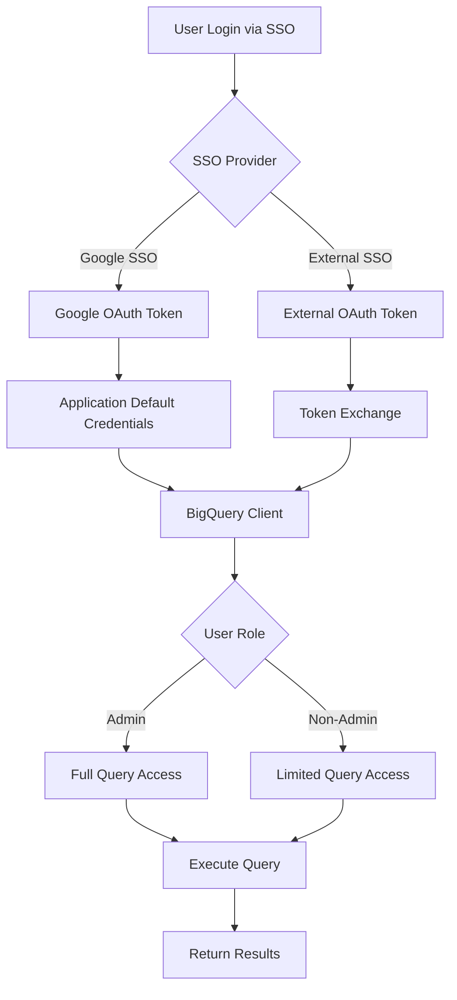

# BigQuery SSO Query Runner Architecture

## Overview

This document explains how to use SSO tokens (from Google OAuth or external providers) to execute queries in BigQuery for both admin and non-admin users, without touching the test connection functionality.

## Key Concepts

### SSO Token Flow for Query Execution



## Authentication Methods

### 1. Google SSO (Recommended for Google Cloud)

Uses Application Default Credentials (ADC) which automatically handles Google SSO:

```python
from google.auth import default
credentials, project = default(scopes=["https://www.googleapis.com/auth/bigquery"])
client = bigquery.Client(credentials=credentials)
```

**Setup Requirements:**
- User must authenticate via `gcloud auth application-default login`
- Or use service account with `GOOGLE_APPLICATION_CREDENTIALS`
- Proper IAM roles assigned in BigQuery

### 2. External SSO Tokens (Okta, Azure AD, etc.)

For external OAuth providers, exchange tokens for Google credentials:

```python
from google.oauth2.credentials import Credentials

credentials = Credentials(
    token=external_access_token,
    refresh_token=refresh_token,
    token_uri="https://oauth2.googleapis.com/token",
    client_id=client_id,
    client_secret=client_secret
)
```

**Setup Requirements:**
- Configure OAuth integration in external provider
- Map external identities to Google Cloud identities
- Set up workload identity federation (recommended)

## Query Execution Implementation

### Core Components

1. **BigQuerySSO Configuration**
   - Project ID
   - Location/Region
   - OAuth credentials
   - Scopes

2. **BigQueryQueryRunner Class**
   - Handles authentication
   - Manages BigQuery client
   - Executes queries with role-based access

3. **Permission Testing**
   - Validates user permissions
   - Determines admin vs non-admin status
   - Sets appropriate query configurations

### Role-Based Query Execution

```python
def execute_query(self, query: str, as_admin: bool = False):
    job_config = bigquery.QueryJobConfig()
    
    if as_admin:
        # Admin configuration
        job_config.priority = bigquery.QueryPriority.INTERACTIVE
        # No byte limit
    else:
        # Non-admin configuration
        job_config.priority = bigquery.QueryPriority.BATCH
        job_config.maximum_bytes_billed = 10485760  # 10 MB limit
    
    return self.client.query(query, job_config=job_config)
```

## SSO Configuration Requirements

### At the SSO Provider Level

1. **Google SSO Requirements:**
   - Enable BigQuery API
   - Configure OAuth consent screen
   - Set appropriate scopes:
     - `https://www.googleapis.com/auth/bigquery`
     - `https://www.googleapis.com/auth/cloud-platform`

2. **External SSO Requirements (Okta Example):**
   - Create OAuth 2.0 application
   - Configure authorization server
   - Add custom claims for Google identity mapping
   - Set redirect URIs

3. **Azure AD Requirements:**
   - Register application in Azure AD
   - Configure workload identity federation
   - Map Azure AD users to Google Cloud identities
   - Grant consent for required scopes

### At the BigQuery Level

1. **IAM Roles for Query Execution:**
   
   **Admin Users:**
   - `roles/bigquery.admin` or
   - `roles/bigquery.dataOwner` + `roles/bigquery.jobUser`
   
   **Non-Admin Users:**
   - `roles/bigquery.dataViewer` (read-only queries)
   - `roles/bigquery.jobUser` (run queries)
   - `roles/bigquery.user` (basic access)

2. **Dataset Permissions:**
   - Grant dataset-level access as needed
   - Use authorized views for restricted data access
   - Configure row-level security where applicable

## Testing Admin vs Non-Admin Access

### Test Script Usage

```bash
# Setup and run test
chmod +x setup_bigquery_sso.sh
./setup_bigquery_sso.sh

# Manual testing
python test_bigquery_sso_query_runner.py
```

### Permission Validation

The test script validates:
- Dataset listing capability
- Query execution rights
- INFORMATION_SCHEMA access (admin only)
- Public dataset access

### Example Output

**Admin User:**
```
✓ Can list datasets
✓ Can run queries
✓ Can access INFORMATION_SCHEMA (likely admin)
Permissions summary: {
  "can_list_datasets": true,
  "can_run_query": true,
  "can_access_information_schema": true,
  "is_admin": true
}
```

**Non-Admin User:**
```
✓ Can list datasets
✓ Can run queries
✗ Cannot access INFORMATION_SCHEMA
Permissions summary: {
  "can_list_datasets": true,
  "can_run_query": true,
  "can_access_information_schema": false,
  "is_admin": false
}
```

## Integration with OpenMetadata

To integrate this SSO query runner with OpenMetadata:

1. **Extend BigQueryConnection:**
   ```python
   # In connection.py
   def get_query_client(self, sso_token=None):
       if sso_token:
           credentials = self.authenticate_with_sso_token(sso_token)
       else:
           credentials = self.authenticate_with_application_default()
       return bigquery.Client(credentials=credentials)
   ```

2. **Add to Query Parser:**
   ```python
   # In query_parser.py
   def execute_user_query(self, query, user_token=None):
       client = self.get_query_client(sso_token=user_token)
       return client.query(query).result()
   ```

3. **Handle in REST API:**
   ```java
   // In QueryService.java
   public QueryResult executeQuery(String query, String userToken) {
       // Pass token to Python ingestion layer
       // Execute query with appropriate permissions
   }
   ```

## Security Considerations

### Before Committing to Version Control

**NEVER commit:**
- Actual project IDs (use placeholders like "your-project-id")
- OAuth tokens or access tokens
- Client IDs and secrets
- Service account key files
- Any `.env` files with real values
- Dataset or table names from production

**Safe to commit:**
- The `.py` and `.sh` scripts with placeholder values
- `.env.example` files showing required variables
- Requirements files
- Documentation

### Runtime Security

1. **Token Storage:**
   - Never store tokens in plain text
   - Use secure credential stores
   - Implement token rotation
   - Tokens stored by gcloud are in `~/.config/gcloud/` with restricted permissions

2. **Query Restrictions:**
   - Implement query cost limits for non-admins
   - Monitor query patterns for abuse
   - Log all query executions

3. **Data Access:**
   - Use BigQuery's built-in security features
   - Implement column-level security where needed
   - Audit data access regularly

## Troubleshooting

### Common Issues

1. **"Permission Denied" Errors:**
   - Check IAM roles in BigQuery
   - Verify OAuth scopes
   - Ensure project ID is correct

2. **"Invalid Credentials" Errors:**
   - Token may be expired
   - Refresh token if available
   - Re-authenticate with SSO

3. **"Quota Exceeded" Errors:**
   - Check BigQuery quotas
   - Implement query limits
   - Use batch priority for non-critical queries

### Debug Commands

```bash
# Check current authentication
gcloud auth list

# Verify BigQuery access
bq ls

# Test query execution
bq query --use_legacy_sql=false 'SELECT 1'

# Check IAM roles
gcloud projects get-iam-policy PROJECT_ID
```

## Next Steps

1. **Production Implementation:**
   - Add comprehensive error handling
   - Implement query caching
   - Add metrics and monitoring

2. **Advanced Features:**
   - Query history tracking
   - Cost estimation before execution
   - Query optimization suggestions

3. **Integration Testing:**
   - Test with various SSO providers
   - Validate with different user roles
   - Performance testing with large queries