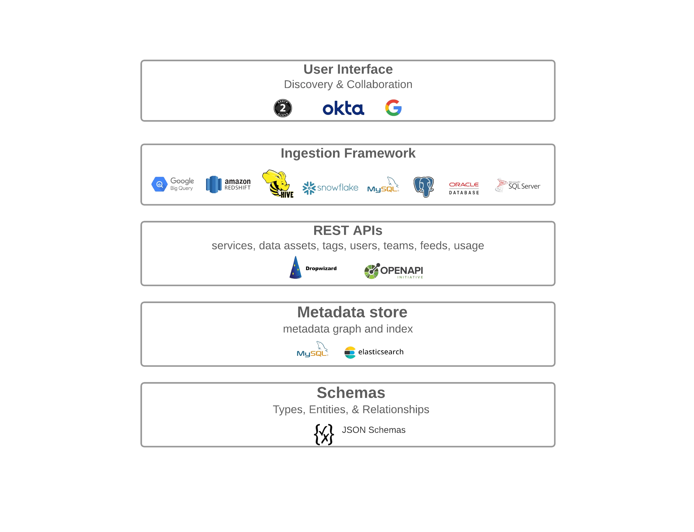

    
  

- [What is OpenMetadata?](#what-is-openmetadata)
  - [Features](#features)
  - [Try our Sandbox](#try-our-sandbox)
  - [Install and Run OpenMetadata](#install-and-run-openmetadata)
  - [Documentation and Support](#documentation-and-support)
  - [Contributors](#contributors)
  - [License](#license)

# What is OpenMetadata?
[OpenMetadata](https://open-metadata.org/) is an all-in-one platform for data discovery, data lineage, data quality, observability, governance, and team collaboration. It is one of the fastest growing open-source projects with a vibrant community and adoption by a diverse set of companies in a variety of industry verticals. Powered by a centralized metadata store based on Open Metadata Standards/APIs, supporting connectors to a wide range of data services, OpenMetadata enables end-to-end metadata management, giving you the freedom to unlock the value of your data assets.

OpenMetadata includes the following:
- **Metadata Schemas** - Defines core abstractions and vocabulary for metadata with schemas for Types, Entities, Relationships between entities. This is the foundation of the Open Metadata Standard. Also supports extensibility of entities and types with custom properties.

- **Metadata Store** - Stores metadata graph that connects data assets, user, and tool generated metadata.

- **Metadata APIs** - For producing and consuming metadata built on schemas for User Interfaces and Integration of tools, systems, and services.

- **Ingestion Framework** - A pluggable framework for integrating tools and ingesting metadata to the metadata store, supporting about 55 connectors. The ingestion framework supports well know data warehouses like Google BigQuery, Snowflake, Amazon Redshift, Apache Hive; databases like MySQL, Postgres, Oracle, MSSQL; dashboard services like Tableau, Superset, Metabase; messaging services like Kafka, Redpanda; and pipeline services like Airflow, Glue, Fivetran, Dagster, and many more.

- **OpenMetadata User Interface** - A single place for users to discover, and collaborate on all data.

## Features
Here are some of the supported features in a nutshell:
- **Data Collaboration** - Get event notifications with Activity feeds. Send alerts & notifications using webhooks. Add Announcements to notify the team of upcoming changes. Add Tasks to request descriptions, or glossary term approval workflows. Add user mentions and collaborate using conversation threads.

- **Data Quality and Profiler** - Standardizied tests and data quality metadata. Groups related tests as Test Suites. Supports custom SQL data quality tests. Has an interactive dashboard to drilldown to the details.

- **Data Lineage** - Supports rich column level lineage. Effectively filters queries to extract lineage. Edit lineage manually as required and connect the entities with a no-code editor.

- **Comprehensive Roles and Policies** - Handles complex access control use cases and hierarchical teams.

- **Webhooks** - Supports webhook integrations. Integrate with Slack, Microsoft Teams and Google Chat.

- **Connectors** - Supports 55 connectors to various databases, dashboards, pipelines and messaging services.

- **Glossary** - Add a Controlled Vocabulary to describe important concepts and terminologies within your organization. Add Glossaries, Terms, Tags, Descriptions, and Reviewers.

- **Data Security** - Supports Google, Okta, custom OIDC, Auth0, Azure, Amazon Cognito, and OneLogin as identity providers for SSO. Also, supports SAML-based authentication for AWS SSO and Google.

- **Secrets Manager Interface** - Communicates with any key management store.

- **And lots more...**

Check out for more [here](https://docs.open-metadata.org/overview/features) ✨

## Try our Sandbox

Take a look and play with sample data at [http://sandbox.open-metadata.org](http://sandbox.open-metadata.org)

## Install and Run OpenMetadata
Get up and running in a few minutes. See the OpenMetadata documentation for [installation instructions](https://docs.open-metadata.org/deploy/local-deployment).

## Documentation and Support

Check out [OpenMetadata documentation](https://docs.open-metadata.org/) for a complete description of OpenMetadata's features.

Join [our Slack Community](https://slack.open-metadata.org/) to get in touch with us, want to chat, need help, or want to discuss about a new feature requirement.

Or join the group at [https://groups.google.com/g/openmetadata-users](https://groups.google.com/g/openmetadata-users)

We're here to help and make OpenMetadata even better!

## Contributors

We ❤️ all contributions, big and small! Check out our [CONTRIBUTING](./CONTRIBUTING.md) guide to get started and let us know how we can help.

Don't want to miss anything? Give the project a ⭐ 🚀 

A HUGE THANK YOU to all our supporters!

## License
OpenMetadata is released under [Apache License, Version 2.0](http://www.apache.org/licenses/LICENSE-2.0)
