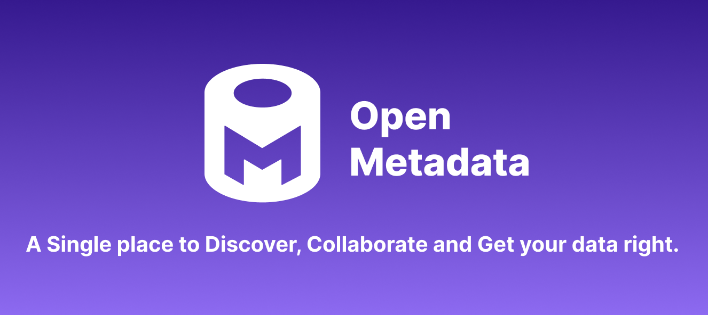

    
  

- [What is OpenMetadata?](#what-is-openmetadata )
- [Features](#features)
- [Try our Sandbox](#try-our-sandbox)
- [Install & Run](#install-and-run-openmetadata)
- [Roadmap](docs/roadmap.md)
- [Documentation and support](#documentation-and-support)
- [Contributors](#contributors)
- [License](#license)

# What is OpenMetadata?
[OpenMetadata](https://open-metadata.org/) is an Open Standard for Metadata. A Single place to Discover, Collaborate, and Get your data right.

OpenMetadata includes the following:
- **Metadata schemas** - defines core abstractions and vocabulary for metadata with schemas for Types, Entities, Relationships between entities. This is the foundation of the Open Metadata Standard.

- **Metadata store** - stores metadata graph that connects data assets, user, and tool generated metadata.

- **Metadata APIs** - for producing and consuming metadata built on schemas for User Interfaces and Integration of tools, systems, and services.

- **Ingestion framework** - a pluggable framework for integrating tools and ingesting metadata to the metadata store. Ingestion framework already supports well know data warehouses - Google BigQuery, Snowflake, Amazon Redshift, and Apache Hive, and databases - MySQL, Postgres, Oracle, and MSSQL.

- **OpenMetadata User Interface** - one single place for users to discover, and collaborate on all data.

## Features

Check all the supported features [here](https://docs.open-metadata.org/features) ✨

## Try our Sandbox

Take a look and play with sample data at [http://sandbox.open-metadata.org](http://sandbox.open-metadata.org)

## Install and run OpenMetadata
Get up and running in few minutes. See the OpenMetadata documentation for [installation instructions](https://docs.open-metadata.org/install/run-openmetadata).

## Documentation and Support

Check out [OpenMetadata documentation](https://docs.open-metadata.org/) for a complete description of OpenMetadata's features.

Join [our Slack Community](https://slack.open-metadata.org/) if you get stuck, want to chat, or are thinking of a new feature.

Or join the group at [https://groups.google.com/g/openmetadata-users](https://groups.google.com/g/openmetadata-users)

We're here to help - and make OpenMetadata even better!

## Contributors

We ❤️ all contributions, big and small! Check out our [CONTRIBUTING](./CONTRIBUTING.md) guide to get started and let us know how we can help.

Don't want to miss anything? Give the project a ⭐ 🚀 

Big thanks to all of you who already support us!

## License
OpenMetadata is released under [Apache License, Version 2.0](http://www.apache.org/licenses/LICENSE-2.0)
