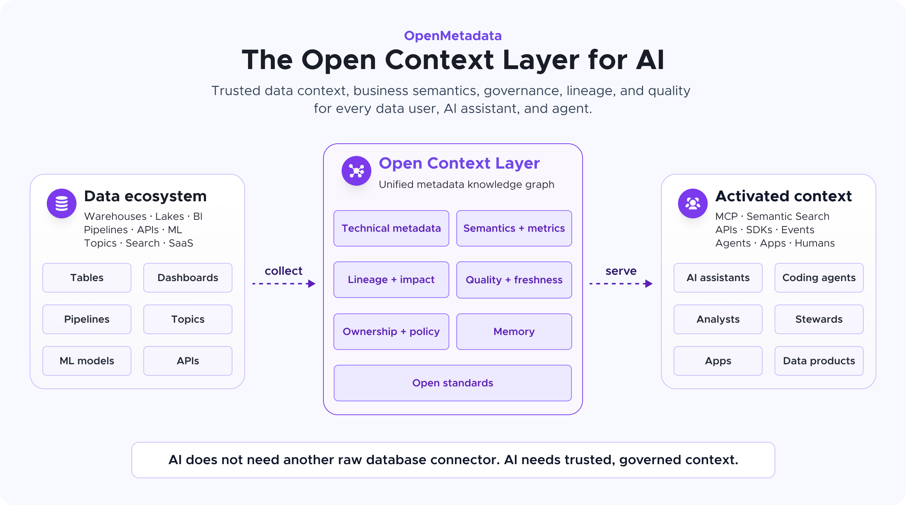
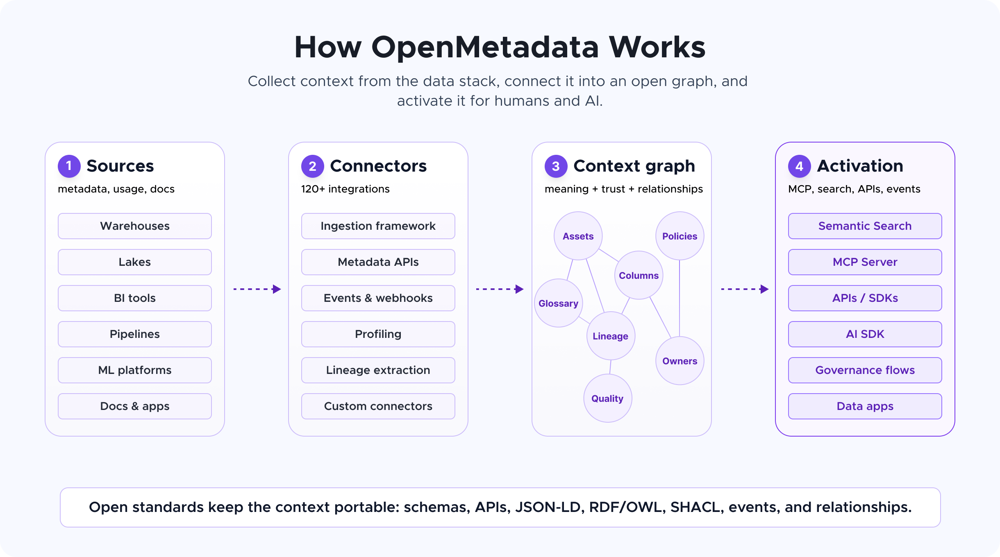
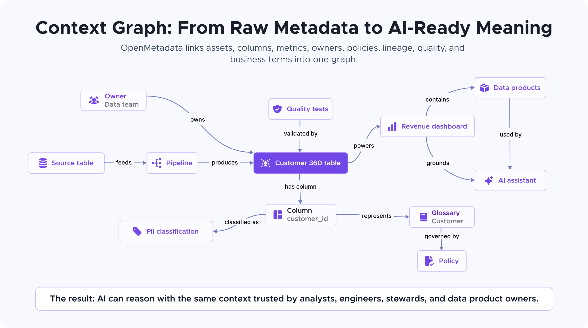

# OpenMetadata

 [](https://github.com/open-metadata/OpenMetadata/releases)

## The Open Context Layer for AI

OpenMetadata is the open platform for building trusted data context and business semantics for humans, AI assistants, and agents.

OpenMetadata connects technical metadata, data quality signals, lineage, column-level lineage, ownership, usage, policies, conversations, glossaries, classifications, metrics, domains, and data products into a unified metadata knowledge graph. With 120+ connectors, open metadata standards, semantic search, APIs, SDKs, and an MCP server, OpenMetadata gives every user and AI system the governed context it needs to discover, understand, trust, and use data.

**AI does not need another raw database connector. AI needs context.**



OpenMetadata provides that context:

- what data exists
- what it means
- who owns it
- how it is used
- where it came from
- where it flows
- whether it is fresh, tested, and trusted
- which business concepts, classifications, glossary terms, policies, and data products apply
- what downstream dashboards, pipelines, metrics, ML models, and applications depend on it

---

## Why OpenMetadata for AI?

AI systems need more than data access. They need governed context, business meaning, trust signals, lineage, usage, ownership, and operational awareness.

A direct connection to a warehouse, lake, dashboard, or pipeline exposes raw structures. It does not tell an AI assistant what the data means, whether it is certified, who owns it, which policies apply, or what breaks if it changes.

OpenMetadata is the open context layer that gives every data user and AI agent the full picture of enterprise data.

OpenMetadata brings together four capabilities:

1. **Context** — technical, operational, trust, usage, and lineage metadata from across the data ecosystem.
2. **Semantics** — business meaning through glossaries, metrics, classifications, domains, policies, and ontologies.
3. **Knowledge Graph** — relationships connecting assets, columns, people, teams, quality, lineage, policies, and business concepts.
4. **Activation** — MCP, Semantic Search, APIs, SDKs, events, and workflows that make context usable by AI assistants, agents, applications, and humans.

With OpenMetadata, users and AI agents can answer:

- What does this metric mean and how is it calculated?
- Which datasets power this dashboard?
- Who owns this data product?
- Is this dataset fresh, tested, certified, and trusted?
- Which downstream dashboards, pipelines, or ML models are affected by this column change?
- Which columns contain sensitive customer information?
- Which glossary terms, policies, and business concepts apply?

---

## The Context OpenMetadata Connects

OpenMetadata collects and connects the context AI needs to reason safely over enterprise data.

| Context type | What OpenMetadata captures | Why it matters for AI |
| --- | --- | --- |
| **Technical metadata** | Databases, schemas, tables, columns, topics, dashboards, charts, pipelines, APIs, search indexes, ML models, storage assets, data types, constraints, descriptions, joins, sample queries, service metadata, owners, teams, usage, domains, and data products | Helps AI discover what exists and understand how assets are structured |
| **Quality and trust** | Test cases, test suites, freshness checks, volume checks, null, uniqueness, distribution, custom tests, profiling results, observability signals, incidents, alerts, and quality history | Helps AI avoid treating every dataset as equally trustworthy |
| **Lineage and impact** | Upstream and downstream lineage, table lineage, column-level lineage, dashboard lineage, pipeline lineage, metric lineage, ML model lineage, API and topic dependencies | Helps AI explain where data came from, where it flows, and what changes may break |
| **Semantics** | Glossaries, business terms, synonyms, related terms, metrics, KPIs, classifications, tags, domains, data products, policies, personas, lifecycle states, and ontologies | Helps AI map technical names to business meaning |
| **Governance** | Owners, stewards, teams, policies, roles, classifications, access context, certification, review workflows, and lifecycle states | Helps AI act with policy-aware context |
| **Collaboration** | Conversations, tasks, announcements, documentation workflows, ownership workflows, and shared stewardship | Helps teams keep context current and explainable |

---

## How OpenMetadata Works



OpenMetadata is built around an open, schema-first metadata graph.

1. **Collect** metadata from warehouses, lakes, BI tools, pipelines, ML platforms, messaging systems, storage systems, APIs, search systems, SaaS applications, and metadata systems.
2. **Connect** technical metadata, quality signals, lineage, ownership, usage, policies, conversations, semantics, domains, and data products into one graph.
3. **Govern** context with open standards, classifications, policies, roles, data quality, review workflows, and stewardship.
4. **Activate** that context through Semantic Search, MCP, APIs, SDKs, events, webhooks, metadata applications, and AI workflows.

---

## Context Graph and Semantics



The OpenMetadata graph does not only store data assets. It stores the relationships between assets, columns, owners, teams, policies, quality tests, lineage, classifications, glossary terms, metrics, domains, and data products.

Example relationships:

```text
Table           ──hasColumn───────> Column
Column          ──classifiedAs────> PII
Column          ──represents──────> Customer Identifier
Table           ──ownedBy────────> Data Engineering Team
Table           ──partOf─────────> Customer 360 Data Product
Dashboard       ──dependsOn──────> Table
Metric          ──definedBy──────> Glossary Term
Pipeline        ──produces───────> Table
Column          ──flowsTo────────> Column
Test Case       ──validates──────> Table
Policy          ──governs────────> Classification
```

This graph gives AI systems the relationships and meaning they need to reason across the data estate.

---

## MCP, Semantic Search, APIs, and AI SDK

OpenMetadata makes context actionable through AI- and developer-friendly interfaces.

### MCP Server

OpenMetadata includes an MCP server that lets MCP-compatible assistants and agents interact with the metadata graph through natural language.

AI assistants can use OpenMetadata MCP to:

- search metadata
- run semantic search
- retrieve entity details
- inspect lineage
- update descriptions, tags, owners, and other metadata
- create glossary terms and lineage
- list and create data quality tests
- analyze root causes of data quality failures

Get started: [OpenMetadata MCP Server Documentation](https://docs.open-metadata.org/latest/how-to-guides/mcp)

### Semantic Search

Semantic Search lets users and AI assistants find data assets by meaning, not only exact keywords.

```text
Find tables related to customer purchase behavior and transaction history.
```

OpenMetadata can surface conceptually related assets even when names differ across domains, tools, and teams.

### APIs, SDKs, Events, and Webhooks

OpenMetadata exposes APIs, SDKs, events, and webhooks so teams can ingest, update, search, subscribe to, and automate metadata across their ecosystem.

Developers can use the AI SDK to build custom AI applications that use OpenMetadata context programmatically.

---

## What You Can Build

### AI Data Discovery
Ask natural-language questions over the metadata graph and find relevant assets even when names and keywords do not match exactly.

### Trusted AI Assistants
Ground AI responses in governed metadata: owners, descriptions, glossary terms, classifications, quality, freshness, usage, and lineage.

### Impact Analysis Agents
Ask what will break if a table, column, pipeline, dashboard, metric, ML feature, or data product changes.

### Governance Automation
Use agents to suggest descriptions, assign glossary terms, identify sensitive data, propose ownership, and manage stewardship workflows.

### Data Quality Automation
Use AI workflows to create tests, summarize failures, identify root causes, and recommend remediation steps.

### Developer and Coding Agent Workflows
Connect coding agents to OpenMetadata so they understand schemas, owners, lineage, business definitions, and quality expectations before generating SQL, dbt models, documentation, tests, migration plans, or impact analysis.

---

## OpenMetadata Standards

OpenMetadata is built on open metadata standards.

[OpenMetadata Standards](https://openmetadatastandards.org/) is the open-source home for schemas, APIs, ontologies, event models, and semantic specifications behind OpenMetadata.

It provides:

- 700+ JSON Schemas for metadata entities, APIs, configurations, events, and relationships
- RDF/OWL ontologies for semantic web, linked data, and knowledge graph use cases
- SHACL shapes for validation
- JSON-LD contexts for semantic interoperability
- standards for governance, lineage, quality, observability, teams, users, roles, policies, and events

These standards make OpenMetadata a foundation for interoperable semantic metadata, linked data, and enterprise knowledge graphs.

---

## Core Platform Capabilities

| Capability | Includes |
| --- | --- |
| **Discovery and Understanding** | asset search, semantic search, descriptions, sample data, usage, ownership, conversations, tasks, announcements |
| **Governance and Semantics** | glossaries, classifications, tags, metrics, KPIs, domains, data products, policies, roles, certification, lifecycle states |
| **Data Quality and Observability** | tests, profiling, freshness, volume, null, uniqueness, distribution checks, alerts, incidents, root-cause workflows |
| **Lineage and Impact Analysis** | table lineage, column-level lineage, dashboard lineage, pipeline lineage, metric lineage, ML model lineage, impact analysis |
| **Security and Access Control** | authentication, authorization, roles, policies, SSO, bot tokens, user tokens, MCP authentication, governed metadata actions |
| **Extensibility and Automation** | APIs, SDKs, webhooks, events, applications, ingestion framework, custom connectors, custom properties, MCP tools, AI SDK workflows |

---

## Quickstart

1. **Try OpenMetadata**: [OpenMetadata Sandbox](https://sandbox.open-metadata.org)
2. **Install OpenMetadata**: [Quickstart Guide](https://docs.open-metadata.org/latest/quick-start)
3. **Ingest Metadata** from a warehouse, BI tool, pipeline system, data quality tool, or lineage source.
4. **Build Context** with descriptions, owners, teams, domains, data products, quality tests, freshness, usage, and lineage.
5. **Add Semantics** with glossaries, classifications, tags, metrics, KPIs, policies, domains, and data products.
6. **Enable Semantic Search** so users and AI assistants can search by meaning.
7. **Connect an MCP Client** to give AI assistants and agents governed access to OpenMetadata context.
8. **Build AI Applications** using OpenMetadata APIs, SDKs, MCP tools, events, and AI SDK workflows.

---

## Documentation and Community

- Documentation: [docs.open-metadata.org](https://docs.open-metadata.org/)
- MCP Server: [OpenMetadata MCP Documentation](https://docs.open-metadata.org/latest/how-to-guides/mcp)
- OpenMetadata Standards: [openmetadatastandards.org](https://openmetadatastandards.org/)
- Website: [open-metadata.org](https://open-metadata.org/)
- Slack Community: [slack.open-metadata.org](https://slack.open-metadata.org/)
- Blog: [blog.open-metadata.org](https://blog.open-metadata.org/)

---

## Open Source and Enterprise AI

OpenMetadata is the open-source foundation for metadata, context, semantics, governance, quality, lineage, APIs, MCP, and AI SDK workflows.

For managed enterprise capabilities, AI agents, automation, AI Studio, enterprise MCP workflows, commercial support, and managed operations, see Collate:

- [Collate](https://www.getcollate.io/)
- [Collate AI](https://www.getcollate.io/collate-ai)

---

## Contributing

We welcome contributions from the community. You can help improve metadata schemas and standards, add connectors, improve ingestion workflows, enhance MCP tools, improve semantic search, add documentation, fix bugs, and improve the user experience.

See the contribution guide in this repository to get started.

- [How To Contribute](https://docs.open-metadata.org/v1.12.x/developers/contribute)
- [Development Environment Setup](https://docs.open-metadata.org/v1.12.x/developers/contribute/development-environment-setup)
- [Build Code & Run Tests](https://docs.open-metadata.org/v1.12.x/developers/contribute/build-code-and-run-tests)


---

## License

OpenMetadata is released under the [Apache License, Version 2.0](http://www.apache.org/licenses/LICENSE-2.0).
