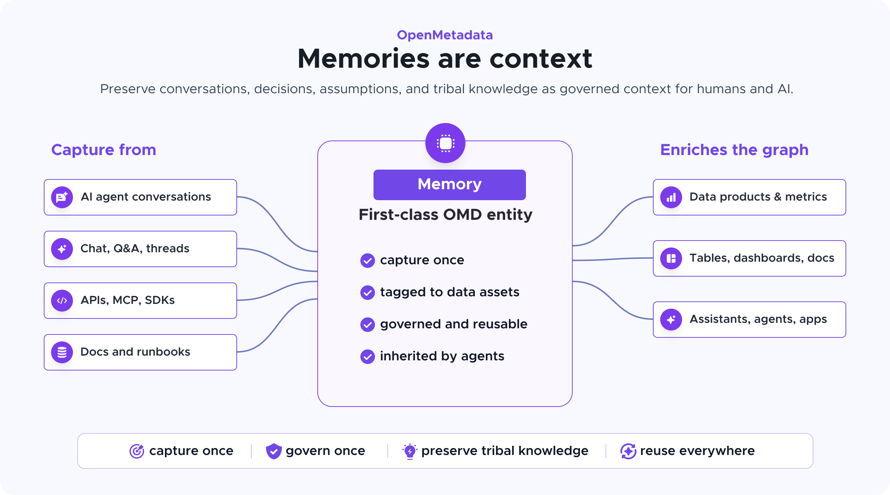

# OpenMetadata

 [](https://github.com/open-metadata/OpenMetadata/releases)

## The Open Context Layer for AI

**The largest and fastest-growing open-source project for AI context, data cataloging, and metadata management.**

OpenMetadata is the open platform for trusted data context, organizational memory, and business semantics for every data user, AI assistant, and agent.

OpenMetadata connects technical metadata, data quality signals, lineage, column-level lineage, ownership, usage, policies, conversations, memories, glossaries, classifications, metrics, domains, data contracts, and data products into a unified metadata knowledge graph. With **130+ connectors**, open metadata standards, semantic search, APIs, SDKs, and an MCP server, OpenMetadata gives every user and AI system the governed context it needs to discover, understand, trust, remember, and use data.

**AI does not need another raw database connector. AI needs context + memory.**


OpenMetadata provides the context AI needs to know:

- what data exists
- what it means
- who owns it
- how it is used
- where it came from
- where it flows
- whether it is fresh, tested, certified, and trusted
- which business concepts, classifications, glossary terms, policies, contracts, and data products apply
- what downstream dashboards, pipelines, metrics, ML models, and applications depend on it
- what conversations, decisions, assumptions, and memory nuggets have already been captured about it

---

## Why OpenMetadata for AI?

AI systems need more than data access. They need governed context, business meaning, trust signals, lineage, usage, ownership, standards, and organizational memory.

A direct connection to a warehouse, lake, dashboard, or pipeline exposes raw structures. It does not tell an AI assistant what the data means, whether it is certified, who owns it, which policies apply, what contract governs it, what breaks if it changes, or what the organization has already learned about it.

OpenMetadata is the open context layer that gives every data user and AI agent the full picture of enterprise data.

OpenMetadata brings together five capabilities:

1. **Context** — technical, operational, trust, usage, and lineage metadata from across the data ecosystem.
2. **Semantics** — business meaning through glossaries, metrics, classifications, domains, policies, ontologies, and data products.
3. **Knowledge Graph** — relationships connecting assets, columns, people, teams, quality, lineage, policies, memories, contracts, and business concepts.
4. **Memory** — conversations, AI threads, decisions, assumptions, runbooks, remediation notes, and reusable memory nuggets that preserve tribal knowledge.
5. **Activation** — MCP, Semantic Search, APIs, SDKs, events, and workflows that make context usable by AI assistants, agents, applications, and humans.

With OpenMetadata, users and AI agents can answer:

- What does this metric mean and how is it calculated?
- Which datasets power this dashboard?
- Who owns this data product?
- Which data contract applies?
- Is this dataset fresh, tested, certified, and trusted?
- Which downstream dashboards, pipelines, or ML models are affected by this column change?
- Which columns contain sensitive customer information?
- Which glossary terms, policies, standards, and business concepts apply?
- What decisions, assumptions, incidents, or conversations have already been captured about this asset?

---

## The Context OpenMetadata Connects

OpenMetadata collects and connects the context AI needs to reason safely over enterprise data.

| Context type | What OpenMetadata captures | Why it matters for AI |
| --- | --- | --- |
| **Technical metadata** | Databases, schemas, tables, columns, topics, dashboards, charts, pipelines, APIs, search indexes, ML models, storage assets, data types, constraints, descriptions, joins, sample queries, service metadata, owners, teams, usage, domains, and data products | Helps AI discover what exists and understand how assets are structured |
| **Quality and trust** | Test cases, test suites, freshness checks, volume checks, null, uniqueness, distribution, custom tests, profiling results, observability signals, incidents, alerts, and quality history | Helps AI avoid treating every dataset as equally trustworthy |
| **Lineage and impact** | Upstream and downstream lineage, table lineage, column-level lineage, dashboard lineage, pipeline lineage, metric lineage, ML model lineage, API and topic dependencies, and OpenLineage events | Helps AI explain where data came from, where it flows, and what changes may break |
| **Semantics** | Glossaries, business terms, synonyms, related terms, metrics, KPIs, classifications, tags, domains, data products, policies, personas, lifecycle states, and ontologies | Helps AI map technical names to business meaning |
| **Governance** | Owners, stewards, teams, policies, roles, classifications, access context, certification, review workflows, lifecycle states, and data contracts | Helps AI act with policy-aware context |
| **Memory and tribal knowledge** | Conversations, AI threads, decisions, assumptions, runbooks, remediation notes, incident learnings, and reusable memory nuggets attached to assets, users, teams, data products, and agent workflows | Helps humans and agents inherit what the organization already learned instead of rediscovering it in every conversation |
| **Standards and interoperability** | DCAT, DPROD, PROV-O, OpenLineage, ODCS, RDF/OWL, JSON-LD, SHACL, JSON Schema, APIs, events, and metadata schemas | Helps context move across tools, agents, catalogs, contracts, and knowledge graphs |

---

## Architecture: Context + Memory Graph


OpenMetadata is built around an open, schema-first metadata graph.

1. **Collect** metadata from warehouses, lakes, BI tools, pipelines, ML platforms, messaging systems, storage systems, APIs, search systems, SaaS applications, metadata systems, documents, conversations, and agent workflows through **130+ connectors**, ingestion APIs, events, and SDKs.
2. **Normalize** metadata with open schemas and standards so every asset, relationship, policy, contract, lineage event, and memory can be represented consistently.
3. **Connect** technical metadata, quality signals, lineage, ownership, usage, policies, conversations, memories, semantics, domains, contracts, and data products into one graph.
4. **Preserve Memory** by turning conversations, AI threads, decisions, assumptions, runbooks, and remediation notes into reusable governed memory nuggets tied to data assets and business context.
5. **Govern** context with open standards, classifications, policies, roles, data quality, review workflows, data contracts, and stewardship.
6. **Activate** that context through Semantic Search, MCP, APIs, SDKs, events, webhooks, metadata applications, and AI workflows.

Memory is part of the architecture, not a side channel. It lets engineers use APIs, SDKs, MCP, or AI workflows to preserve conversational context and convert tribal knowledge into reusable organizational knowledge.

---

## Context Graph, Semantics, and Memory


The OpenMetadata graph does not only store data assets. It stores the relationships between assets, columns, owners, teams, policies, quality tests, lineage, classifications, glossary terms, metrics, domains, data contracts, data products, conversations, and memory nuggets.

Example relationships:

```text
Table               ──hasColumn────────────> Column
Column              ──classifiedAs─────────> PII
Column              ──represents───────────> Customer Identifier
Table               ──ownedBy─────────────> Data Engineering Team
Table               ──partOf──────────────> Customer 360 Data Product
Dashboard           ──dependsOn───────────> Table
Metric              ──definedBy───────────> Glossary Term
Pipeline            ──produces────────────> Table
Column              ──flowsTo─────────────> Column
Test Case           ──validates───────────> Table
Policy              ──governs─────────────> Classification
Data Contract       ──appliesTo───────────> Table
OpenLineage Event   ──updatesLineageFor───> Pipeline
Agent Conversation  ──capturedAs──────────> Memory 
Memory              ──informs─────────────> Data Product
Memory              ──documentsDecisionFor> Metric
Memory              ──attachedTo──────────> Table / Column / Topic / Dashboard / Pipeline / API
```

This graph gives AI systems the relationships, meaning, memory, and governance they need to reason across the data estate.

---

## Memories: Organizational Context for Humans and Agents



Memories preserve the important context that usually disappears inside chats, tickets, meetings, notebooks, and AI agent threads.

A memory is an open, governed OpenMetadata entity that can be tied to data assets, users, teams, threads, domains, data products, metrics, policies, incidents, and workflows. Engineers can capture and retrieve memories through APIs, SDKs, MCP, chat, or AI applications.

Use memories to preserve:

- why a metric changed
- why a column was renamed
- what assumption was used in an analysis
- which remediation fixed a data quality issue
- which dashboard or data product a decision applies to
- what an AI agent learned while investigating an incident
- what a domain expert explained in a conversation

Memories unlock tribal knowledge by making it reusable, governed, searchable, and available to every human, assistant, and agent that touches your data.

---

## MCP, Semantic Search, APIs, AI SDK, and Memory

OpenMetadata makes context actionable through AI- and developer-friendly interfaces.

### MCP Server

OpenMetadata includes an MCP server that lets MCP-compatible assistants and agents interact with the metadata graph through natural language.

AI assistants can use OpenMetadata MCP to:

- search metadata
- run semantic search
- retrieve entity details
- inspect lineage
- understand data contracts and policy context
- retrieve or preserve memory nuggets
- update descriptions, tags, owners, and other metadata
- create glossary terms and lineage
- list and create data quality tests
- analyze root causes of data quality failures

Get started: [OpenMetadata MCP Server Documentation](https://docs.open-metadata.org/latest/how-to-guides/mcp)

### Semantic Search

Semantic Search lets users and AI assistants find data assets by meaning, not only exact keywords.

```text
Find trusted customer purchase datasets with known data quality issues and recent remediation notes.
```

OpenMetadata can surface conceptually related assets, metrics, glossary terms, data products, memory nuggets, and governance context even when names differ across domains, tools, and teams.

### APIs, SDKs, Events, and Webhooks

OpenMetadata exposes APIs, SDKs, events, and webhooks so teams can ingest, update, search, subscribe to, and automate metadata across their ecosystem.

Developers can use the AI SDK to build custom AI applications that use OpenMetadata context and memory programmatically.

---

## What You Can Build

### AI Data Discovery
Ask natural-language questions over the metadata graph and find relevant assets even when names and keywords do not match exactly.

### Trusted AI Assistants
Ground AI responses in governed metadata: owners, descriptions, glossary terms, classifications, quality, freshness, usage, lineage, policies, contracts, and memory.

### Agent Memory and Tribal Knowledge
Capture conversations, decisions, assumptions, runbooks, and agent learnings as governed memory nuggets that can be reused by every data user and AI agent.

### Impact Analysis Agents
Ask what will break if a table, column, pipeline, dashboard, metric, ML feature, contract, or data product changes.

### Governance Automation
Use agents to suggest descriptions, assign glossary terms, identify sensitive data, propose ownership, enforce contract context, and manage stewardship workflows.

### Data Quality Automation
Use AI workflows to create tests, summarize failures, identify root causes, preserve remediation memory, and recommend next actions.

### Developer and Coding Agent Workflows
Connect coding agents to OpenMetadata so they understand schemas, owners, lineage, business definitions, quality expectations, contracts, and memory before generating SQL, dbt models, documentation, tests, migration plans, or impact analysis.

---

## Open Standards and Interoperability

OpenMetadata is built on open metadata standards.

[OpenMetadata Standards](https://openmetadatastandards.org/) is the open-source home for schemas, APIs, ontologies, event models, and semantic specifications behind OpenMetadata.

It provides:

- 700+ JSON Schemas for metadata entities, APIs, configurations, events, and relationships
- RDF/OWL ontologies for semantic web, linked data, and knowledge graph use cases
- SHACL shapes for validation
- JSON-LD contexts for semantic interoperability
- standards for governance, lineage, quality, observability, teams, users, roles, policies, events, contracts, and data products

OpenMetadata supports and aligns with the standards that matter for AI context and data ecosystems:

| Standard | How OpenMetadata uses it |
| --- | --- |
| **DCAT / DPROD** | Represents catalog and data-product context in interoperable semantic models, including datasets, data services, distributions, domains, owners, input and output datasets, lifecycle state, purpose, and policies. |
| **PROV-O** | Uses W3C provenance semantics for lineage, generated/derived data, agents, activities, ownership, and explainable context. |
| **OpenLineage Support** | Accepts and connects OpenLineage-compatible lineage events so pipeline execution metadata can enrich the broader OpenMetadata graph. |
| **ODCS Support** | Supports Open Data Contract Standard 3.1 for interoperable data contracts, contract import/export, schema expectations, quality rules, SLAs, support channels, roles, and producer-consumer agreements. |
| **RDF/OWL, JSON-LD, SHACL** | Makes metadata graph-friendly, semantically interoperable, and validatable for linked data, knowledge graph, and AI use cases. |
| **JSON Schema, APIs, Events** | Keeps metadata portable, automation-friendly, and extensible across tools, agents, and custom applications. |

These standards make OpenMetadata a foundation for interoperable semantic metadata, linked data, data products, data contracts, lineage, provenance, and enterprise knowledge graphs.

---

## Core Platform Capabilities

| Capability | Includes |
| --- | --- |
| **AI Context and Memory** | memory nuggets, conversations, agent threads, decisions, assumptions, remediation notes, runbooks, context retrieval, and governed agent memory |
| **Discovery and Understanding** | asset search, semantic search, descriptions, sample data, usage, ownership, conversations, tasks, announcements |
| **Governance and Semantics** | glossaries, classifications, tags, metrics, KPIs, domains, data products, policies, roles, certification, lifecycle states |
| **Data Contracts and Standards** | ODCS 3.1 support, contract import/export, schema expectations, SLAs, terms of service, semantic relationships, data product context, DCAT/DPROD, PROV-O, RDF/OWL, JSON-LD, SHACL |
| **Data Quality and Observability** | tests, profiling, freshness, volume, null, uniqueness, distribution checks, alerts, incidents, root-cause workflows |
| **Lineage and Impact Analysis** | table lineage, column-level lineage, dashboard lineage, pipeline lineage, metric lineage, ML model lineage, OpenLineage support, impact analysis |
| **Security and Access Control** | authentication, authorization, roles, policies, SSO, bot tokens, user tokens, MCP authentication, governed metadata actions |
| **Extensibility and Automation** | 130+ connectors, APIs, SDKs, webhooks, events, applications, ingestion framework, custom connectors, custom properties, MCP tools, AI SDK workflows |

---

## Quickstart

1. **Try OpenMetadata**: [OpenMetadata Sandbox](https://sandbox.open-metadata.org)
2. **Install OpenMetadata**: [Quickstart Guide](https://docs.open-metadata.org/latest/quick-start)
3. **Ingest Metadata** from a warehouse, BI tool, pipeline system, data quality tool, lineage source, contract source, or memory-producing workflow.
4. **Build Context** with descriptions, owners, teams, domains, data products, quality tests, freshness, usage, lineage, and data contracts.
5. **Add Semantics** with glossaries, classifications, tags, metrics, KPIs, policies, domains, DCAT/DPROD-aligned data products, and PROV-O lineage context.
6. **Capture Memory** from conversations, AI threads, incidents, remediation notes, assumptions, and decisions.
7. **Enable Semantic Search** so users and AI assistants can search by meaning.
8. **Connect an MCP Client** to give AI assistants and agents governed access to OpenMetadata context and memory.
9. **Build AI Applications** using OpenMetadata APIs, SDKs, MCP tools, events, and AI SDK workflows.

---

## Documentation and Community

- Documentation: [docs.open-metadata.org](https://docs.open-metadata.org/)
- MCP Server: [OpenMetadata MCP Documentation](https://docs.open-metadata.org/latest/how-to-guides/mcp)
- OpenLineage Connector: [OpenMetadata OpenLineage Documentation](https://docs.open-metadata.org/latest/connectors/pipeline/openlineage)
- OpenMetadata Standards: [openmetadatastandards.org](https://openmetadatastandards.org/)
- Website: [open-metadata.org](https://open-metadata.org/)
- Slack Community: [slack.open-metadata.org](https://slack.open-metadata.org/)
- Blog: [blog.open-metadata.org](https://blog.open-metadata.org/)

---

## Open Source and Enterprise AI

OpenMetadata is the open-source foundation for AI context, metadata, organizational memory, semantics, governance, quality, lineage, data contracts, open standards, APIs, MCP, and AI SDK workflows.

For managed enterprise capabilities, AI agents, automation, AI Studio, enterprise MCP workflows, commercial support, and managed operations, see Collate:

- [Collate](https://www.getcollate.io/)
- [Collate AI](https://www.getcollate.io/collate-ai)

---

## Contributing

We welcome contributions from the community. You can help improve metadata schemas and standards, add connectors, improve ingestion workflows, enhance MCP tools, improve semantic search, add memory workflows, add documentation, fix bugs, and improve the user experience.

See the contribution guide in this repository to get started.

- [How To Contribute](https://docs.open-metadata.org/v1.12.x/developers/contribute)
- [Development Environment Setup](https://docs.open-metadata.org/v1.12.x/developers/contribute/development-environment-setup)
- [Build Code & Run Tests](https://docs.open-metadata.org/v1.12.x/developers/contribute/build-code-and-run-tests)

---

## License

OpenMetadata is released under the [Apache License, Version 2.0](http://www.apache.org/licenses/LICENSE-2.0).
