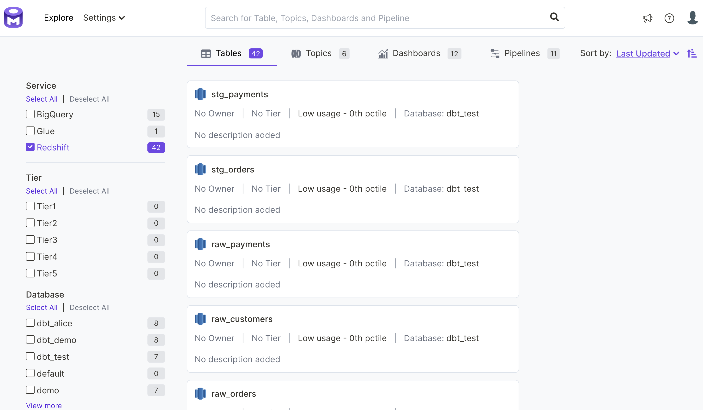

# Redshift (Revised)

## Requirements

Using the OpenMetadata Redshift connector requires supporting services and software. Please ensure your host system meets the requirements listed below. Then continue to the procedure for installing and configuring this connector.

### OpenMetadata (version 0.7.0 or greater)

To use this guide you must have a running deployment of OpenMetadata. OpenMetadata includes the following services.

* The OpenMetadata server supporting the metadata APIs and user interface
* Elasticsearch for metadata search and discovery
* MySQL as the backing store for all metadata
* Airflow for metadata ingestion workflows

If you have not already deployed OpenMetadata, please follow the guide, [Run OpenMetadata](../install/run-openmetadata.md) to get up and running.

### Python (version 3.8.0 or greater)

To check what version of Python you have, please use the following command.

```
python3 --version
```

### PostgreSQL (version 14.1 or greater)

To check what version of PostgreSQL you have, please use the following command.&#x20;

```
postgres --version
```

## Procedure

The following is an overview of the steps in this procedure. Please follow all steps relevant to your use case.

1. [Prepare a Python virtual environment](redshift-revised.md#1.-prepare-a-python-virtual-environment)
2. [Install the Python module for this connector](redshift-revised.md#install-from-pypi-or-source)
3. [Create a configuration file using template JSON](redshift-revised.md#4.-create-a-configuration-file-using-the-json-template)
4. [Configure service settings](redshift-revised.md#5.-configure-service-settings)
5. [Enable / disable the data profiler](redshift-revised.md#6.-configure-data-profiler-settings-optional)
6. [Install the data profiler Python module (optional)](redshift-revised.md#3.-install-the-data-profiler-python-module-optional)
7. [Configure data filters (optional)](redshift-revised.md#7.-configure-data-filters-optional)
8. [Configure sample data (optional)](redshift-revised.md#8.-configure-sample-data-optional)
9. [Configure DBT (optional)](redshift-revised.md#9.-configure-dbt-optional)
10. [Confirm sink settings](redshift-revised.md#10.-confirm-sink-settings)
11. [Confirm metadata\_server settings](redshift-revised.md#11.-confirm-metadata\_server-settings)
12. [Run Ingestion Workflow](redshift-revised.md#run-manually)

### 1. Prepare a Python virtual environment

In this step we will create a Python virtual environment. This will enable us to avoid conflicts with other Python installations and packages on your host system.&#x20;

In a later step you will install the Python module for this connector and its dependencies in this virtual environment.

#### 1a. Create a directory for openmetadata

Throughout the docs we use a consistent directory structure OpenMetadata server and connector installation. If you have not already done so by following another guide, please create an openmetadata directory now and change into that directory in your command line environment.

```
mkdir openmetadata; cd openmetadata
```

#### 1b. Create a directory for this connector

Run the following command to create a directory for this connector and change into that directory.

```bash
mkdir redshift; cd redshift
```

#### 1c. Create the virtual environment

Run the following command to create a Python virtual environment called, `env`.

```bash
python3 -m venv redshift-env
```

#### 1d. Activate the virtual environment

Run the following command to activate the virtual environment.&#x20;

```bash
source redshift-env/bin/activate
```

Once activated, you should see your command prompt change to indicate that your commands will now be executed in the environment named, `redshift-env`.

#### 1e. Upgrade pip and setuptools to the latest versions

Ensure you have the latest version of pip by running the following command. If you have followed the steps above, this will upgrade pip in your virtual environment.

```
pip3 install --upgrade pip setuptools
```

### 2. Install the Python module for this connector <a href="#install-from-pypi-or-source" id="install-from-pypi-or-source"></a>

With the virtual environment set up and activated as described in Step 1, run the following command to install the Python module for the Redshift connector.

```bash
pip3 install 'openmetadata-ingestion[redshift]'
```

### 3. Create a configuration file using template JSON

Create a new file called `redshift.json` in the current directory. Note that the current directory should be the `openmetadata/redshift` directory you created in Step 1.&#x20;

Copy and paste the configuration template below into the `redshift.json` file you created.


Note: The `source.config` field in the configuration JSON will include the majority of the settings for your connector. In the steps below we describe how to customize the key-value pairs in the `source.config` field to meet your needs.&#x20;



```json
{
  "source": {
    "type": "redshift",
    "config": {
      "host_port": "cluster.name.region.redshift.amazonaws.com:5439",
      "username": "username",
      "password": "strong_password",
      "service_name": "aws_redshift",
      "data_profiler_enabled": "false",
      "table_filter_pattern": {
        "excludes": ["[\\w]*event_vw.*"]
      },
      "schema_filter_pattern": {
        "excludes": ["information_schema.*"]
      }
    }
  },
  "sink": {
    "type": "metadata-rest",
    "config": {}
  },
  "metadata_server": {
    "type": "metadata-server",
    "config": {
      "api_endpoint": "http://localhost:8585/api",
      "auth_provider_type": "no-auth"
    }
  }
}
```


### 4. Configure service settings&#x20;

In this step, we will configure the Redshift service settings required for this connector. We will set values for the following fields in the `source.config` object in `redshift.json`.

* `host_port`
* `username`
* `password`
* `service_name`
* `database (optional)`

You will need to review and modify the values for each of the fields above in your `redshift.json` file. To configure metadata ingestion from your Redshift service, edit your `redshift.json` file following the guidance in the [Connector Service Settings](../install/connector-configuration.md#service-settings) documentation.&#x20;

### 5. Enable the data profiler (optional)

When enabled, the data profiler runs as part of metadata ingestion. Data profiling increases the amount of time metadata ingestion requires, but enables you to assess the frequency of use, reliability, and other details for data.&#x20;

**We have disabled the profiler in the configuration template provided.** If you want to enable the data profiler, update your configuration file as follows.&#x20;

```json
"data_profiler_enabled": "true"
```

See the [Connector Data Profiler Settings](../install/connector-configuration.md#data-profiler-settings) documentation for more information.

### 6. Install the data profiler Python module (optional)

If you enabled the data profiler in Step 5, run the following command to install the Python module for the data profiler. You will need this to run the ingestion workflow.

```bash
pip3 install 'openmetadata-ingestion[data-profiler]'
```


Installation for the data profiler takes several minutes to complete. While the installation process runs, continue through the remaining steps in this guide.


### 7. Configure data filters (optional)

You may configure your connector to include or exclude views, tables, and databases or schemas using the filtering options below.

* `include_views` - Include or exclude all views
* `include_tables` - Include or exclude all tables
* `table_filter_pattern` - Include or exclude tables by name using regular expressions
* `schema_filter_pattern` - Include or exclude schemas by name using regular expressions

By default, your connector will include all tables and views in metadata ingestion. **You only need to use the settings above if you want to limit the data considered during metadata ingestion.**

To configure data filter settings for your Redshift service, edit the `redshift.json` file following the guidance in the [Connector Data Filter Settings](../install/connector-configuration.md#data-filter-settings) documentation.

### 8. Configure sample data (optional)

By default, your connector will ingest sample data from each table and make it available in the OpenMetadata user interface. The default settings for sample data work well for most use cases. If you would like to disable sample data ingestion or configure how sample data is selected, please edit the `redshift.json` file following the guidance in the [Connector Sample Data Settings](../install/connector-configuration.md#sample-data-settings) documentation.

### 9. Configure DBT (optional)

DBT provides transformation logic that creates tables and views from raw data. OpenMetadata includes an integration for DBT that enables users to see the models used to generate a table from that table's details page in the OpenMetadata user interface.&#x20;

To include DBT models and metadata in your ingestion workflows, edit your `redshift.json` file to point to your DBT catalog and manifest files following the guidance in the [Connector DBT Settings](../install/connector-configuration.md#dbt-settings) documentation .

### 10. Confirm sink settings

You should not need to make any changes to the fields defined for `sink` in the template code you copied into `redshift.json` in Step 4. This part of your configuration file should be as follows.

```json
"sink": {
    "type": "metadata-rest",
    "config": {}
},
```

### 11. Confirm metadata\_server settings

You should not need to make any changes to the fields defined for `metadata_server` in the template code you copied into `redshift.json` in Step 4. This part of your configuration file should be as follows.

```json
"metadata_server": {
    "type": "metadata-server",
    "config": {
        "api_endpoint": "http://localhost:8585/api",
        "auth_provider_type": "no-auth"
    }
}
```

### 12. Run ingestion workflow <a href="#run-manually" id="run-manually"></a>

Your `redshift.json` configuration file should now be fully configured and ready to use in an ingestion workflow.

To run an ingestion workflow, execute the following command from the `openmetadata/redshift` directory you created in Step 1.

```bash
metadata ingest -c ./redshift.json
```

## Next Steps

As the ingestion workflow runs, you may observe progress both from the command line and from the OpenMetadata user interface. To view the metadata ingested from Redshift, visit [http://localhost:8585/explore/tables](http://localhost:8585/explore/tables). Select the Redshift service to filter for the data you have ingested using the workflow you configured and ran following this guide. See the figure below for an example.



## Troubleshooting

### Error: pg\_config executable not found

When attempting to install the `openmetadata-ingestion[redshift]` Python package in Step 2, you might encounter the following error.&#x20;

```
pg_config is required to build psycopg2 from source.  Please add the directory
containing pg_config to the $PATH or specify the full executable path with the
option:

    python setup.py build_ext --pg-config /path/to/pg_config build ...
    
or with the pg_config option in 'setup.cfg'.
    
If you prefer to avoid building psycopg2 from source, please install the PyPI
'psycopg2-binary' package instead.
```

The psycopg2 package is a dependency for the `openmetadata-ingestion[redshift]` Python package. To correct this problem, please install PostgreSQL on your host system.

Then re-run the install command in [Step 2](redshift-revised.md#install-from-pypi-or-source).

### ERROR: Failed building wheel for cryptography

When attempting to install the `openmetadata-ingestion[redshift]` Python package in Step 2, you might encounter the following error. The error might also include mention of a Rust compiler.

```
Failed to build cryptography
ERROR: Could not build wheels for cryptography which use PEP 517 and cannot be installed directly
```

This problem is usually due to running on older version of pip. Try upgrading pip as follows.

```bash
pip3 install --upgrade pip
```

Then re-run the install command in [Step 2](redshift-revised.md#install-from-pypi-or-source).

### requests.exceptions.ConnectionError

If you encounter the following error when attempting to run the ingestion workflow in Step 12, this is probably because there is no OpenMetadata server running at http://localhost:8585.&#x20;

```
requests.exceptions.ConnectionError: HTTPConnectionPool(host='localhost', port=8585): 
Max retries exceeded with url: /api/v1/services/databaseServices/name/aws_redshift 
(Caused by NewConnectionError('<urllib3.connection.HTTPConnection object at 0x1031fa310>: 
Failed to establish a new connection: [Errno 61] Connection refused'))
```

To correct this problem, please follow the steps in the [Run OpenMetadata](../install/run-openmetadata.md) guide to deploy OpenMetadata in Docker on your local machine.

Then re-run the metadata ingestion workflow in [Step 12](redshift-revised.md#run-manually).
