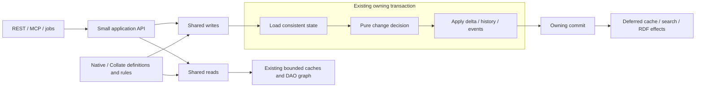

# Unified entity behavior: design options and recommendation

Status: accepted direction, first ownership slice implemented, 2026-09-14. The full
pilot remains open. The [composition document](entity-repository-composition.md)
describes the current code; [verification status](entity-repository-status.md) and
the [acceptance guide](entity-repository-acceptance.md) retain the existing release gates.

## Accepted direction

Use one shared implementation of each common operation across OpenMetadata and
Collate. Entity families declare their schema, relationships and actual exceptions.
They do not reproduce CRUD orchestration, common metadata updates, versioning,
transaction management, caching or the equivalent bulk/import algorithms.

The recommended option is a small application API over shared concrete read/write
services, a pure change calculator, the retained persistence infrastructure, and
typed entity definitions with narrow strategies. This is a design recommendation
based on this codebase, not a measured claim that an architectural pattern is faster.

## What the current code shows

Inspected at native `1f52c5930b` and companion `8c0096662a`:

| Observation | Consequence |
| --- | --- |
| Nine `EntityPolicy` parent interfaces supply 207 default methods | An entity inherits much of the shared implementation and internal access surface |
| `entity/` contains 209 production files and 23,239 physical lines | Removing the base file alone did not demonstrate a smaller implementation |
| Policy files account for 2,266 lines; startup/API files for 1,941 | Forwarders, service containers and assembly callbacks are concrete deletion candidates; these lines are not all redundant |
| Collate contains 113 constructions of `EntityReadService.Query` | Common read defaults and transport options are repeated at callers |
| Chart has separate single/bulk relationship-writing implementations | The same relationship knowledge can drift across execution paths |
| Ownership reconciliation records a change and immediately persists it | Consolidation cannot calculate the complete decision independently of writes |
| Table construction looks up global dependencies and registers before all setup finishes | Independent construction and startup visibility remain difficult to reason about |

Pure [version-policy tests](../openmetadata-service/src/test/java/org/openmetadata/service/entity/history/EntityVersionPolicyTest.java)
already exist. The missing separation concerns the complete update and consolidation
decision, not every version helper. Keep the measured SQL reductions, existing cache
behavior and transaction regressions while correcting the remaining boundaries.

## Three viable architectural options

| Option | Strengths | Costs and limitations | Assessment |
| --- | --- | --- | --- |
| A. Small Template Method base, delegating to shared services | Compact entity definitions, protected hooks, familiar navigation; DI and a pure diff are still possible | Retains subclass coupling and Java's single-inheritance constraint; needs a strict hook budget to prevent regrowth; reverses part of the current migration | Credible lower-migration alternative if the composed pilot cannot simplify the code |
| B. Shared concrete services plus typed entity definitions and narrow strategies | One implementation per common behavior; entity families supply differences; straightforward pure tests and injected infrastructure; application callers see a small API | Requires careful definition/SPI design and coordinated Collate migration; excessive callbacks could recreate the current problem | Recommended, subject to a measured pilot and deletion budget |
| C. Rich aggregate model and separate command handlers for each entity/use case | Strong domain ownership for genuinely distinct business workflows | Duplicates generated models or introduces extensive mapping; repeats handlers across many similar metadata entities; largest code and migration cost | Use locally for a complex domain operation, not as the universal repository model |

The decision favors B because the dominant variation here is entity metadata and
field rules, while the orchestration is shared. Simplicity, safety and measured
cost take precedence over removing inheritance as an end in itself.

The first slice extracts owner/domain decisions inside the existing shared service,
separates list comparison from recording, and removes separate import entry points.
It retains the existing writers, permission checks and special User/Team domain
hooks. This makes ownership deltas independently testable; it does not yet replace
the complete consolidation/revert algorithm, construction or public SPI.

The diagram shows a successful write attempt. Nested commands join the existing
owner; a failed attempt discards its plan and effects before the owner retries.

## Pattern assessment

The GoF patterns below are considered for their effect on this subsystem. Several
are already present; selecting a pattern does not require adding another class.

| Pattern(s) | Decision in this design |
| --- | --- |
| Factory Method, Abstract Factory | Retain startup/provider construction where implementations vary; do not add a factory per entity operation |
| Builder | Use only if assembling an entity definition becomes clearer than a small constructor; no per-request builder chain |
| Prototype | Keep necessary retry snapshots with explicit copy semantics; generated mutable entities are unsuitable for indiscriminate shallow cloning |
| Singleton | Keep application-scoped infrastructure; inject it into services and remove mutable global lookup/registration from business objects |
| Adapter | Retain DAO, search, Redis and external-client boundaries; Collate contributes definitions/strategies through the same SPI |
| Bridge | No additional parallel abstraction/implementation hierarchies; definition plus service composition is sufficient |
| Composite | Retain part-whole hierarchy handling for deletion/restoration; capability iteration needs only a simple ordered list |
| Decorator, Proxy | Preserve the existing cache and instrumentation boundaries; avoid a new wrapper stack around every call |
| Facade | Provide the public application API with common read/write options; expose no raw persistence or component container |
| Flyweight | Share immutable definitions, parsed configuration and stateless strategies at startup; never share mutable request entities |
| Chain of Responsibility | Keep operation ordering explicit; use an ordered capability pass where appropriate, without interceptors that can skip validation or own commits |
| Command | Use typed command inputs and common executors; avoid generating a handler class for every entity/verb combination |
| Interpreter | Do not introduce a runtime lifecycle DSL; keep business rules as typed Java and use existing RBAC evaluation |
| Iterator | Preserve bounded batch iteration and streaming; avoid materializing whole catalogs or recursive plans in memory |
| Mediator | No general command bus for direct in-process service calls; dependencies and control flow should be visible |
| Memento | Reuse explicit retry snapshots and discard failed-attempt changes/effects |
| Observer | Keep lifecycle handlers with their current ordering and acknowledgement/completion semantics |
| State | Use enums/records for finite version and operation decisions; add a state machine only where a domain lifecycle warrants it |
| Strategy | Use small, typed rules at genuine variation points; a strategy receives its inputs rather than the whole repository/updater |
| Template Method | Option A remains an alternative; the recommended common operation skeleton lives in a concrete service |
| Visitor | Avoid a visitor over all entity types, which would make Collate extensions change central dispatch code |

The architectural core combines an application service boundary and pure decision
code. A service boundary centralizes operations shared by different transports;
this is the role of the [Service Layer pattern](https://martinfowler.com/eaaCatalog/serviceLayer.html).
Separate calculation from effects using a [functional core and imperative shell](https://www.destroyallsoftware.com/screencasts/catalog/functional-core-imperative-shell),
and retain mapping/persistence behind the existing [Data Mapper boundary](https://martinfowler.com/eaaCatalog/dataMapper.html).

Read and write services remain in the same process against the same catalog.
Distributed CQRS, event sourcing, sagas and a new durable outbox are not needed to
remove the observed duplication; they would change the consistency and operational
problem. Fowler's [CQRS discussion](https://martinfowler.com/bliki/CQRS.html) describes
the additional complexity that must be justified. These are alternatives considered,
not hidden prerequisites of separating query and command code.

## What is shared, and what varies

| Shared once in native services | Supplied by an entity definition or a specific rule |
| --- | --- |
| ID/FQN reads, field selection, authorization reuse, hydration, paging and history | Entity class/DAO binding, default fields and exceptional projections |
| Relationship reads, deltas, batched persistence and cleanup | Relationship direction/type, accessors, include/inheritance behavior |
| Owners/domains/tags/certification behavior | Supported capabilities and documented exceptions |
| Create/PUT/PATCH validation orchestration, diff, version/history and events | Entity-specific normalization, validation and change decisions |
| Bulk/import orchestration and policies, preserving their separate response semantics | Import matching and genuine domain rules |
| Transaction ownership, retry restoration, cache/search effects | Existing infrastructure dependencies and permitted domain effects |

For Chart, one relationship definition must drive single reads/writes, bulk
reads/writes and cleanup. Single and batch executors may use different SQL shapes;
they must consume the same relationship meaning. The corresponding Collate
definition extends shared behavior without copying native lifecycle code.

Capability implementations are reusable values in definitions, not interfaces
that every repository must implement. A capability may compose a loader, a pure
rule and a writer; it supplies only phases it needs. Stable repeated relationship
shapes can use typed descriptors. Complex domain behavior stays explicit Java.
Schema-derived support remains sourced from the existing JSON Schemas.

Validate capability dependencies and ordering once at startup, including tags
before certification and domains before data products. Read plans must group
compatible relationship/extension requests before execution; looping over
capabilities must not turn a batched read into one SQL query per capability.

## Public API and safe extension boundary

Resources, MCP, jobs and workflows use a small API with common read conveniences
and explicit advanced options. Centralize include defaults, fields and href
handling; retain transport authorization and the existing loaded-entity reuse.
Do not add a facade class for each entity when the generic implementation suffices.

Entity definitions are constructed using injected dependencies, completed and
validated, then registered at the application composition root. Preserve Collate
registration priorities. Existing static entry points may resolve an application
service during migration; that does not license global lookups inside the engine.

The public API has no `persistence()`, raw `storeEntity`, preparation service or
mutable component-container accessor. Raw stores are internal concrete classes.
Use package-private access where practical and build-time dependency rules for
necessary cross-package seams; an `internal` package name alone is not enforcement.
The Collate SPI must remain public and narrow, with no whole-updater or whole-DAO
graph back-reference. Specialized legitimate writes use named application commands.

Pure rules receive loaded data and explicit policy decisions. Persistence adapters
receive only the transaction-scoped dependencies they need. This is a Java API
encapsulation requirement; it does not claim an existing REST authorization exploit.

## One semantic update engine

Calculate a data-only result from the current state, requested state, optional
session baseline, actor permissions and update policy. Normalize request-owned
data without mutating the current/baseline snapshots. The result describes:

- incremental changes from current state to requested state;
- consolidated history from session baseline to requested state;
- version/audit decisions and expected-version preconditions;
- the actual current-to-requested persistence delta and required domain effects.

The result contains data, not callbacks capturing mutable updater state. A record
does not make its contained POJOs immutable: ownership and copy boundaries must be
explicit. Capture only required snapshots and changed fields; avoid copying a
1,000-column entity once per capability or creating a command object per unchanged field.

The executor applies the persistence delta once per successful attempt. History
calculation does not revert database relationships. Shared semantic rules feed
single and batch persistence; bulk execution never becomes repeated single-entity
API calls. Preserve source-hash/no-op shortcuts before allocating a detailed plan.

Import, interactive edits, metadata override and optimistic updates use named
policies describing their existing differences. Characterize those differences
before unifying them, including change-event/history behavior. Removing duplicate
implementations must not silently add or remove observable effects from imports.

## Transaction, Redis and performance requirements

Retain `EntityUnitOfWork` and the existing DAO/Jdbi graph. Exactly one owner commits
each existing flush; nested work joins it. Keep existing batch/chunk transaction
boundaries and partial-result contracts. There is no transaction per capability.

Keep consistency-sensitive loading, decision validation and application within
the required transaction/lock scope. Moving decisions into pure code does not
move reads outside that scope. Retain optimistic version checks and refresh or
revalidate state according to the existing deadlock replay contract. Discard all
failed-attempt plans and deferred effects before replay.

Persist the existing row/history/event writes in their current required atomic
boundary. Publish cache/search/RDF effects only at the appropriate owning commit,
preserving ordering and synchronous read-your-write requirements. No new async
boundary, connection lifetime extension or extra commit is justified by this refactor.

Keep the bounded L1, Redis and request caches, negative hits, invalidation ordering,
partial-field coverage, failed-provider fallback and recovery. Reuse authorized
entities and canonical serialized JSON. Resolve component/capability wiring once
at startup, not per field or request. Keep temporary state bounded by the existing
request/chunk limits; do not introduce another entity cache inside a strategy.

Potential savings are fewer consolidation writes, duplicate loads and forwarding
objects. Validate them with SQL counts, connection wait/hold time, Redis operations,
allocation/GC, backlog and the existing per-API latency/load protocol. A simpler
source structure by itself establishes none of those performance results.

## Code-size and complexity acceptance

Before implementation, capture the affected production footprint in both repos,
including caller changes and new files/modules. Count native sources once, rather
than again through Collate's submodule. Compare against the preceding accepted
slice with unrelated base-branch updates accounted for separately.

Each accepted refactoring slice must have a net reduction in handwritten production
lines across that scope. Count physical and nonblank formatted lines; renames,
new folders, comments-only cuts, code generation or compressed formatting cannot
substitute for removing implementation. Tests and documentation have separate counts.
The ratchet is proposed here; no executable size gate has been added yet.

Require an accompanying deletion inventory: inherited defaults, forwarding
interfaces, component accessors, duplicate single/bulk/import algorithms and caller
boilerplate removed. Public internal access and inherited hook counts cannot grow.
Default methods used for a small public convenience are not equivalent to inheriting
an orchestration engine; review behavior and dependencies, not a blanket keyword ban.

Class/file count is diagnostic, not a reason to combine unrelated responsibilities.
An interface requires a real boundary or interchangeable behavior; one implementation
and one caller usually warrant a concrete class. Avoid mandatory interface/factory/
adapter/record bundles. Do not introduce a general framework to save a few local methods.

## Pilot and rollout decision

Prove option B using owners/domains on Table and Chart plus a Collate family. Use
Chart to prove one relationship definition handles single and batch operations.
Existing genuinely entity-specific behavior remains visible and explicit.

The pilot passes only when database-free tests cover incremental and consolidated
decisions for its selected capabilities and their version decisions; real
MySQL/PostgreSQL tests preserve JSON, relationships,
history, events, audit attribution, rollback, retry and Redis visibility; and
construction works independently without global mutation. Add build-time checks
for forbidden public/internal dependencies and the agreed size ratchet.

Exercise normal, bot-preserving, import, metadata-override, no-op and optimistic
paths. Verify SQL/commit budgets and allocation, then run repeatable baseline/candidate
latency comparisons for the affected workloads at widths 3/100/1,000. Keep the
[full coverage and performance gates](entity-repository-acceptance.md) unchanged.
The earlier unstable calibration does not establish acceptance for a new implementation.

After the pilot, compare its actual deletion, extension complexity and performance
with option A before migrating remaining capabilities. Replace the shared
implementation for the behavior covered by each slice, including its native and
Collate callers; a pilot must not introduce a permanent owners implementation per
repository. A temporary transition stays within the working slice. Complete
entity-wide pure decisions remain a requirement as the remaining capabilities
migrate. Full architectural, coverage and performance acceptance all remain open.
