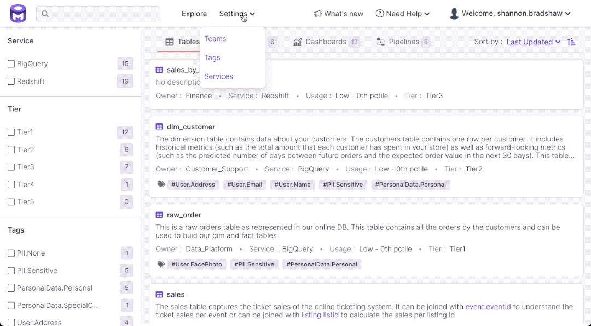

# Features

### All Your Data in One Place

OpenMetadata provides all the data context you need for different use cases in a single place.

### Discover Your Data

OpenMetadata enables you to discover your data using a variety of strategies, including: keyword search, data associations (e.g., frequently joined tables, lineage), and complex queries. Using OpenMetadata you can search across tables, topics, dashboards, pipelines, and services. The OpenMetadata standard and discovery UI provides for fine-grained and detailed metadata for assets and a their components (e.g., columns, charts), including support for complex data types such as arrays and structs.

#### Keyword Search

Find assets based on name, description, component metadata (e.g., for columns, charts), and the containing service.

#### Discover Data through Association

Discover assets through frequently joined tables and columns as measured by the data profiler. You can also discover assets through relationships based on data lineage.

#### Advanced Search

Find assets matching strict criteria on metadata properties and Boolean operators.

### Change Activity Feeds

The OpenMetadata home screen features a change activity feed that enables you view a summary of data change events. This feed shows all changes to data sorted with the most recent changes at the top. The entities in the activity feed are clickable including tables, dashboards, team names, etc. There are activity feeds for:&#x20;

* All data
* Data for which you are an owner
* Data you are following

### Know Your Data

Add descriptions and tags to tables, columns, and other assets. OpenMetadata indexes assets based on descriptions, tags, names, and other metadata to enable keyword, advanced search, and filtering to enable you and others in your organization to discover your data.

### Complex Data Types

Add descriptions and tags to nested fields in complex data types like arrays and structs. Locate these assets using keyword search or advanced search.

### Importance & Owners

Tier tags enable you to annotate assets with their importance relative to other assets. The Explore UI enables you to filter assets based on importance.

Use ownership metadata to determine the primary points of contact for any assets of interest in order to get help with any questions you might have.

#### Filter Assets by Importance

User Tier tags and usage data to identify the relative importance of data assets.

.gif>)

#### Identify Asset Owners

Identify owners who can help with questions about an asset.

### Data Lineage

Trace the path of data across tables, pipelines, and dashboards.

### DBT Integration

A DBT model provides transformation logic that creates a table from raw data. While lineage tells us broadly what data a table was generated from. A DBT model provides specifics. OpenMetadata includes an integration for DBT that enables you to see what models are being used to generate tables.

### Data Reliability

Build trust in your data by creating tests to monitor that the data is complete, fresh, and accurate.

#### Data Profiler

Enable the data profiler to capture table usage statistics over a period of time. This happens as part of metadata ingestion. Data profiles enable you to check for null values in non-null columns, for duplicates in a unique column, etc. You can gain a better understanding of column data distributions through descriptive statistics provided.

### Service Connectors

Integrate your database, dashboard, messaging, and pipeline services with OpenMetadata.

See the [Connectors](install/metadata-ingestion/connectors/) documentation for information on available connectors and how to integrate your services with OpenMetadata.

### Metadata Versioning & Events API

Starting in 0.6, OpenMetadata captures changes in both technical metadata (e.g., table schemas) and business metadata (e.g., tags, ownership, descriptions) as new versions of an entity. Metadata changes generate events that indicates which entity changed, who changed it, and how it changed. You may use these events to integrate metadata into other tools or trigger actions.

#### Metadata Versioning

OpenMetadata maintains the version history for all entities using a number with the format _major.minor_, starting with 0.1 as the initial version of an entity.

Changes in metadata result in version changes as follows:

* Backward **compatible** changes result in a Minor version change. A change in the description, tags, or ownership will increase the version of the entity metadata by 0.1 (e.g., from 0.1 to 0.2).
* Backward **incompatible** changes result in a Major version change. For example, when a column in a table is deleted, the version increases by 1.0 (e.g., from 0.2 to 1.2).

Metadata versioning helps **simplify debugging processes**. View the version history to see if a recent change led to a data issue. Data owners and admins can review changes and revert if necessary.

Versioning also helps in **broader collaboration** among consumers and producers of data. Admins can provide access to more users in the organization to change certain fields. Crowdsourcing makes metadata the collective responsibility of the entire organization.

#### Events API

Starting in the 0.6 release, OpenMetadata captures changes in both technical metadata (e.g., table schemas) and business metadata (e.g., tags, ownership, descriptions) as change events. This lays the groundwork for notifications. In an upcoming release we will add support for push based events, enabling applications to register webhooks to be notified of change events. We will also enable users to subscribe to notifications and alerts for assets of interest.

### One-Click Ingestion Pipelines

OpenMetadata provides a UI integration with Apache Airflow as a workflow engine to run ingestion, data profiling, data quality and other automation jobs. Admins can configure a service to run the OpenMetadata pipelines and add an ingestion schedule to automatically kick off the ingestion jobs directly from the OpenMetadata UI.

### Elasticsearch Integration

OpenMetadata supports SSL-enabled Elasticsearch (including self-signed certs). In prior versions of OpenMetadata it was necessary to run an indexing workflow following any ingestion workflow to make ingested entities available in the OpenMetadata UI. As of the 0.7 release, OpenMetadata automatically runs an indexing workflow as new entities are added or updated through ingestion workflows.

