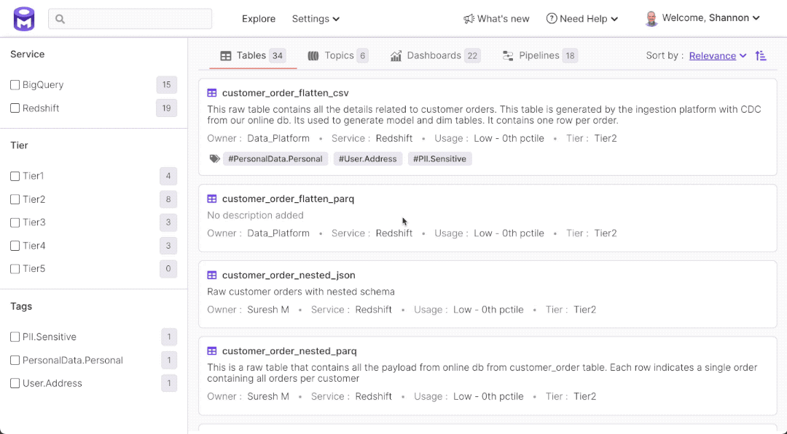

# Features

### Search across all assets

#### Find assets based on name, description, and component metadata (e.g., column name, description) and containing service

For more details see the [Asset Discovery](asset-discovery.md) documentation.

### Filter data assets based on importance; identify owners

#### User Tier tags and usage data to identify the relative importance of assets. Identify owners to locate key contacts for follow up questions.

### Use complex queries to pinpoint assets

#### Find assets matching strict criteria on metadata properties and Boolean operators.

For more details on asset metadata properties, please see the [Asset Discovery](asset-discovery.md) documentation.

### Search nested fields in complex data types

#### Add description and tags to nested fields in complex data types like structs and arrays. Locate these assets using keyword search or complex queries.

### Trace data lineage across assets

#### Trace the path of data across tables, pipelines, and dashboards.

### Assess data reliability based on profile metadata

#### Understand how many rows are being added to a table daily, unique count ratio, null count ratio, etc.

