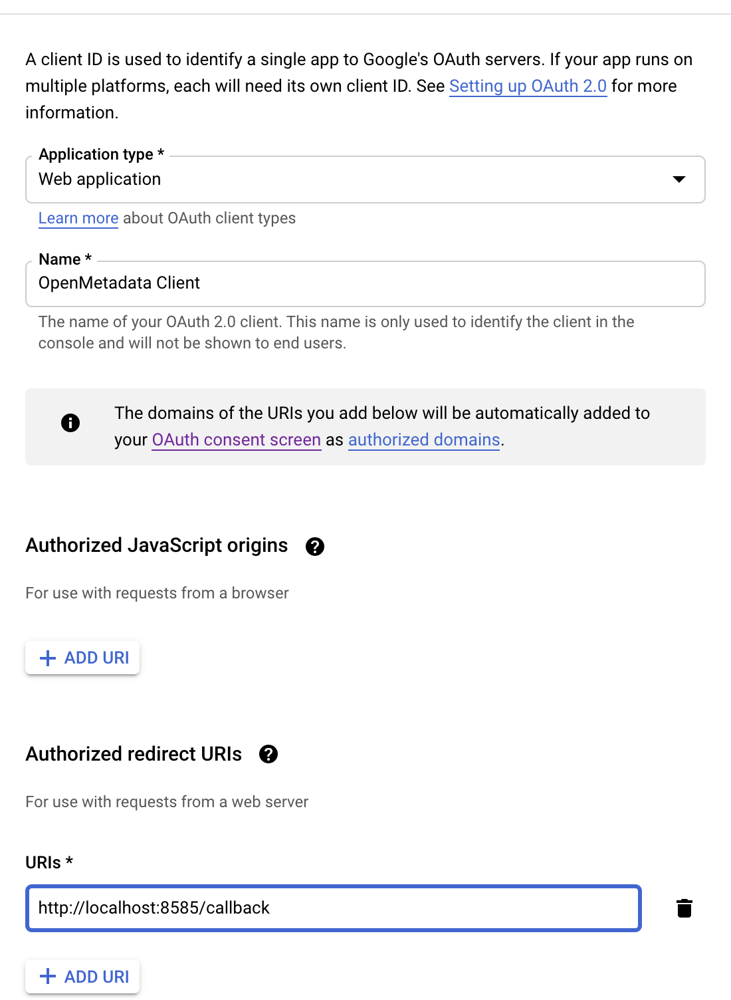

# Create Server Credentials

## Step 1: Create the account

* Go to [Create Google Cloud Account](https://console.cloud.google.com)
* Click on `Create Project`

  

## Step 2: Create a new project

* Enter the **Project name**.
* Enter the parent organization or folder in the **Location box**. That resource will be the hierarchical parent of the new project.

* Click **Create**.

## Step 3: How to configure OAuth consent

* Select the project you created above and Click on **APIs & Services** on the left-side panel.

* Click on the **OAuth Consent Screen** available on the left-hand side panel.
* Provide the User Type. Chose **External** if you are testing otherwise chose **Internal**

* Once the user type is selected, provide the **App Information** and other details. 

* Click **Save and Continue**.
* On the **Scopes Screen**, Click on **ADD OR REMOVE SCOPES** and select the scopes. Once done click on **Update**.

* Click **Save and Continue.**

* Click on **Back to Dashboard**.

## Step 4: Create credentials for the project:

* Once the OAuth Consent is configured, Click on **Credentials** available on the left-hand side panel.

* Click on **Create Credentials**

* Select **OAuth client ID** from the dropdown.
* Once selected, you will be asked to select the **Application Type** . Select **Web Application**

* After selecting the **Application Type**, name your project and give the authorized URIs

* Click **Create**
* You will get the credentials

## Step 5: Where to find the credentials

* Go to **Credentials**
* Click on the **pencil icon \(Edit OAuth Client\)** of the right side of the screen

* You will find the **client Id** and **client secret** in the top right corner

