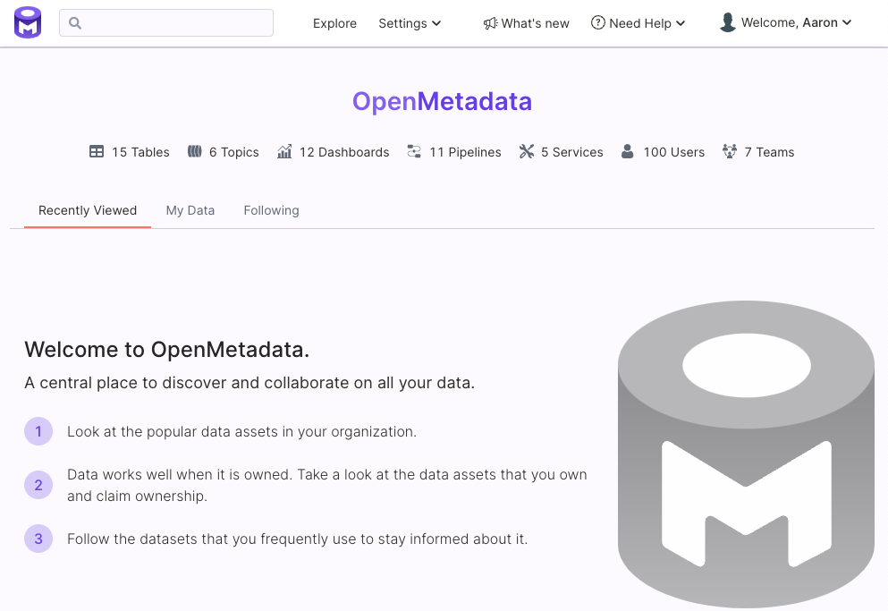

# Run OpenMetadata

## Requirements (OSX and Linux)

Please ensure your host system meets the requirements listed below. Then continue to the Procedure for installing OpenMetadata.

### Python (version 3.8.0 or greater)

To check what version of Python you have, please use the following command.

```
python3 --version
```

### pip (version 19.2.3 or greater)

The version of pip (pip3) that ships with Python 3.8.x is 19.2.3. You will need this version or later to install OpenMetadata. You can check what version of pip you have by running the following command.

```
pip3 --version
```

### Docker (version 20.10.0 or greater)

[Docker](https://docs.docker.com/get-started/overview/) is an open platform for developing, shipping, and running applications that enables you to separate your applications from your infrastructure so you can deliver software quickly using OS-level virtualization to deliver software in packages called containers.

To check what version of Docker you have, please use the following command.

```
docker --version
```

If you need to install Docker, please visit [Get Docker](https://docs.docker.com/get-docker/).  You also need the latest `docker-compose` installed, please visit [Install Docker Compose](https://docs.docker.com/compose/install/).


Note: You must **allocate at least 4GB of memory to Docker** in order to run OpenMetadata. To change the memory allocation for Docker, please visit:

Preferences -> Resources -> Advanced


## Procedure

### 1. Create a directory for OpenMetadata

Create a new directory for OpenMetadata and navigate into that directory.

```
mkdir openmetadata-docker && cd openmetadata-docker
```

### 2. Create a Python virtual environment

Create a virtual environment to avoid conflicts with other Python environments on your host system. A virtual environment is a self-contained directory tree that contains a Python installation for a particular version of Python, plus a number of additional packages.

In a later step you will install the openmetadata-ingestion Python module and its dependencies in this virtual environment.

```
python3 -m venv env
```

### 3. Activate the virtual environment

```
source env/bin/activate
```

### 3.1 Upgrade pip and setuptools

```
pip3 install --upgrade pip setuptools
```

### 4. Install the OpenMetadata Python module using pip

```
pip3 install --upgrade 'openmetadata-ingestion[docker]'
```

### 5. Ensure the module is installed and ready for use

```
metadata docker --help
```

After running the command above, you should see output similar to the following.

```
Usage: metadata docker [OPTIONS]

  Checks Docker Memory Allocation Run Latest Release Docker - metadata
  docker --run Run Local Docker - metadata docker --run -t local -p
  path/to/docker-compose.yml

Options:
  --start          Start release Docker containers
  --stop           Stop Docker containers (local and release)
  --clean          Prune unused containers, images, volumes and networks
  -t, --type TEXT  'local' - local type will start local build of OpenMetadata
                   docker

  -p, --path FILE  Path to Local docker-compose.yml
  --help           Show this message and exit.
```

### 6. Start the OpenMetadata Docker containers

```
metadata docker --start
```

This will create a docker network and four containers for the following services:

* MySQL to store the metadata catalog
* Elasticsearch to maintain the metadata index which enables you to search the catalog
* Apache Airflow which OpenMetadata uses for metadata ingestion
* The OpenMetadata UI and API server

After starting the Docker containers, you should see output similar to the following.

```
[2021-11-18 15:53:52,532] INFO     {metadata.cmd:202} - Running Latest Release Docker
[+] Running 5/5
 ⠿ Network tmp_app_net                  Created                                                                                                                                          0.3s
 ⠿ Container tmp_mysql_1                Started                                                                                                                                          1.0s
 ⠿ Container tmp_elasticsearch_1        Started                                                                                                                                          1.0s
 ⠿ Container tmp_ingestion_1            Started                                                                                                                                          2.1s
 ⠿ Container tmp_openmetadata-server_1  Started                                                                                                                                          2.2s
[2021-11-18 15:53:55,876] INFO     {metadata.cmd:212} - Time took to get containers running: 0:00:03.124889
.......
```

After starting the containers, `metadata` will launch Airflow tasks to ingest sample metadata and usage data for you to experiment with. This might take several minutes, depending on your system.


**Note:**

* `metadata docker --stop` will stop the Docker containers.
* `metadata docker --clean` will clean/prune the containers, volumes, and networks.


### 7. Wait for metadata ingestion to finish

Once metadata ingestion has finished and the OpenMetadata UI is ready for use, you will see output similar to the following.

```
[2021-11-18 15:54:51,165] INFO     {metadata.cmd:232} - Time took to get OpenMetadata running: 0:00:58.414548

✔ OpenMetadata is up and running

Head to http://localhost:8585 to play around with OpenMetadata UI.
                
To checkout Ingestion via Airflow, go to http://localhost:8080 
(username: admin, password: admin)
                
Need support? Get in touch on Slack: https://slack.open-metadata.org/
```

### 8. Log in to Airflow

Once metadata ingestion has finished and you see the message that OpenMetadata is up and running, visit the following url in your web browser.

```
http://localhost:8080
```

You will see a login prompt similar to the one in the figure below. Use the following credentials to log in to Airflow.

Username: `admin`

Password: `admin`


### 9. Begin using OpenMetadata

Finally, visit the following url to begin exploring OpenMetadata.

```
http://localhost:8585
```

You should see a page similar to the following as the landing page for the OpenMetadata server.



### Next Steps

1. Visit the [Features](../features.md) overview page and explore the OpenMetadata UI.
2. Visit the [Connectors](metadata-ingestion/connectors/) documentation to see what services you can integrate with OpenMetadata.
3. Visit the [API](../openmetadata-apis/apis/overview.md) documentation and explore the OpenMetadata APIs.

### Troubleshooting

#### Could not find a version that satisfied the requirement

```
pip3 install 'openmetadata-ingestion[docker]'
ERROR: Could not find a version that satisfies the requirement openmetadata-ingestion[docker] (from versions: none)
ERROR: No matching distribution found for openmetadata-ingestion[docker]
```

If you see the above when attempting to install OpenMetadata, this can be due to using older version of Python and pip. Please check the [Requirements](run-openmetadata.md#requirements) section above and confirm that you have supported versions installed.

If you need support please get in touch on Slack: [https://slack.open-metadata.org/](https://slack.open-metadata.org).

## Requirements (Windows)

### WSL2, Ubuntu 20.04, and Docker for Windows

1. Install [WSL2](https://ubuntu.com/wsl)
2. Install [Ubuntu 20.04](https://www.microsoft.com/en-us/p/ubuntu-2004-lts/9n6svws3rx71)
3. Install [Docker for Windows](https://www.docker.com/products/docker-desktop)

### In the Ubuntu terminal

```
cd ~
sudo apt update
sudo apt upgrade
sudo apt install python3-pip  python3-venv
```

Follow the [OSX instructions](run-openmetadata.md#1.-create-a-directory-for-openmetadata)
