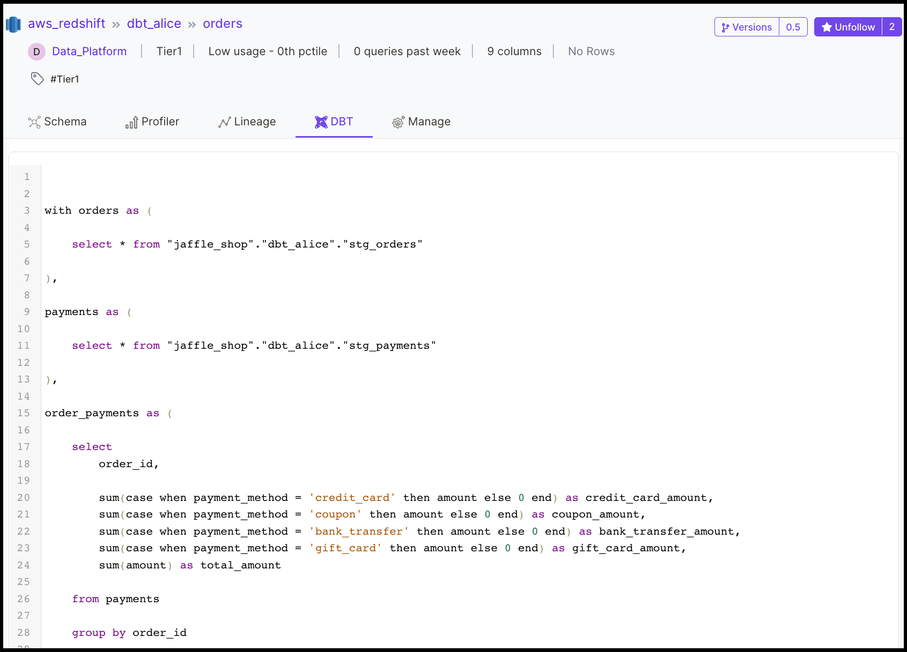

# BigQuery

1. [Requirements](./#1.-requirements)
2. [Install BigQuery Connector](./#2.-install-bigquery-connector)
3. [Configure BigQuery Connector](./#3.-configure-bigquery-connector)
4. [Run BigQuery Connector](./#4.-run-bigquery-connector)


[bigquery-usage.md](bigquery-usage.md)


## **1. Requirements**

Please ensure that your host system meets the requirements listed below.

### **OpenMetadata (version 0.9.0 or later)**

To deploy OpenMetadata, follow the procedure [Try OpenMetadata in Docker](../../../overview/run-openmetadata/).

### **Python (version 3.8.0 or later)**

Use the following command to check your Python version.

```
python3 --version
```

## 2. Install BigQuery Connector

### **2.1  Prepare a Python virtual environment**

In this step, we’ll create a Python virtual environment. Using a virtual environment enables us to avoid conflicts with other Python installations and packages on your host system.

In a later step, you will install the Python module for this connector and its dependencies in this virtual environment.

#### **1. Create a directory for openmetadata**

Throughout the docs, we use a consistent directory structure for OpenMetadata services and connector installation. If you have not already done so by following another guide, please create an openmetadata directory now and change into that directory in your command line environment.

```
mkdir openmetadata; cd openmetadata
```

#### **2. Create a virtual environment**

Run the following command to create a Python virtual environment called, `env`. You can try multiple connectors in the same virtual environment.

```
python3 -m venv env
```

#### **3. Activate the virtual environment**

Run the following command to activate the virtual environment.

```
source env/bin/activate
```

Once activated, you should see your command prompt change to indicate that your commands will now be executed in the environment named `env`.

#### **4. Upgrade pip and setuptools to the latest versions**

Ensure that you have the latest version of pip by running the following command. If you have followed the steps above, this will upgrade pip in your virtual environment.

```javascript
pip3 install --upgrade pip setuptools
```

### **2.2 Install the Python module for this connector**

Once the virtual environment is set up and activated as described in Step 1, run the following command to install the Python module for the BigQuery connector.

```javascript
pip3 install 'openmetadata-ingestion[bigquery]'
```

## 3. Configure BigQuery Connector

Please follow the steps relevant to your use case.

1. [Create a configuration file using template JSON](./#1.-create-a-configuration-file-using-template-json)
2. [Configure service settings](./#2.-configure-service-settings)
3. [Enable/disable the data profiler](./#3.-enable-disable-the-data-profiler)
4. [Install the data profiler Python module (optional)](./#4.-install-the-data-profiler-python-module-optional)
5. [Configure data filters (optional)](./#5.-configure-data-filters-optional)
6. [Configure sample data (optional)](./#8.-configure-sample-data-optional)
7. [Configure DBT (optional)](./#7.-configure-dbt-optional)
8. [Confirm sink settings](./#8.-confirm-sink-settings)
9. [Confirm metadata\_server settings](./#9.-confirm-metadata\_server-settings)

### **3.1 Create a configuration file using template JSON**

Create a new file called `bigquery.json` in the current directory. Note that the current directory should be the `openmetadata` directory you created in Step 1.

Copy and paste the configuration template below into the `bigquery.json` file you created.


Note: The `source.config` field in the configuration JSON will include the majority of the settings for your connector. In the steps below we describe how to customize the key-value pairs in the `source.config` field to meet your needs.



```javascript
{
  "source": {
    "type": "bigquery",
    "config": {
      "project_id": "project_id",
      "host_port": "bigquery.googleapis.com",
      "username": "username",
      "service_name": "gcp_bigquery",
      "data_profiler_enabled": "true",
      "data_profiler_offset": "0",
      "data_profiler_limit": "50000",
      "options": {
        "credentials_path": "examples/creds/bigquery-cred.json"
      },
      "table_filter_pattern": {
        "excludes": ["demo.*","orders.*"]
      },
      "schema_filter_pattern": {
        "excludes": [
          "[\\w]*cloudaudit.*",
          "[\\w]*logging_googleapis_com.*",
          "[\\w]*clouderrorreporting.*"
        ]
      }
    }
  },
  "sink": {
    "type": "metadata-rest",
    "config": {
      "api_endpoint": "http://localhost:8585/api"
    }
  },
  "metadata_server": {
    "type": "metadata-server",
    "config": {
      "api_endpoint": "http://localhost:8585/api",
      "auth_provider_type": "no-auth"
    }
  }
}
```


When adding the details for the credentials path, you can either choose to pass the `credentials file`, or add the `credentials_path`, or use a secure way to pass the credentials path using the environment variables, i.e., `Application Default Credentials` (ADC).

#### 3.1.1 Using Credentials File or Credentials Path


```javascript
{
  "type": "service_account",
  "project_id": "project_id",
  "private_key_id": "private_key_id",
  "private_key": "",
  "client_email": "gcpuser@project_id.iam.gserviceaccount.com",
  "client_id": "",
  "auth_uri": "https://accounts.google.com/o/oauth2/auth",
  "token_uri": "https://oauth2.googleapis.com/token",
  "auth_provider_x509_cert_url": "https://www.googleapis.com/oauth2/v1/certs",
  "client_x509_cert_url": ""
}
```


#### 3.1.2 Using Application Default Credentials (ADC)


```
export GOOGLE_APPLICATION_CREDENTIALS=<path-to-your-credentials-file>
```


Users can export the path to the credentials file. Using this option, you can export the env in terminal and run BigQuery config without providing `credentials_path`.

### **3.2 Configure service settings**

In this step we will configure the BigQuery service settings required for this connector. Please follow the instructions below to ensure that you’ve configured the connector to read from your BigQuery service as desired.

#### project\_id

Edit the value for `source.config.project_id` in `bigquery.json`. The `project_id` is a mandatory field.

```javascript
   "project_id": "project_id"
```

#### **host\_port**

Edit the value for `source.config.host_port` in `bigquery.json` for your BigQuery deployment. Use the `host:port` format illustrated in the example below.

```javascript
"host_port": "bigquery.googleapis.com"
```

Please ensure that your BigQuery deployment is reachable from the host you are using to run metadata ingestion.

#### **username**

Edit the value for `source.config.username` to identify your BigQuery user.

```javascript
"username": "username"
```


**Note:** The user specified should be authorized to read all databases you want to include in the metadata ingestion workflow.


#### **password**

Edit the value for `source.config.password` with the password for your BigQuery user.

```javascript
"password": "strong_password"
```

#### **service\_name**

OpenMetadata uniquely identifies services by their `service_name`. Edit the value for `source.config.service_name` with a name that distinguishes this deployment from other services, including other BigQuery services that you might be ingesting metadata from.

```javascript
"service_name": "bigquery"
```

#### **database (optional)**

If you want to limit metadata ingestion to a single database, include the `source.config.database` field in your configuration file. If this field is not included, the connector will ingest metadata from all databases that the specified user is authorized to read.

To specify a single database to ingest metadata from, provide the name of the database as the value for the `source.config.database` key as illustrated in the example below.

```javascript
"database": "bigquery_db"
```

### **3.3 Enable/disable the data profiler**

The data profiler ingests usage information for tables. This enables you to assess the frequency of use, reliability, and other details.

#### **data\_profiler\_enabled**

When enabled, the data profiler will run as part of metadata ingestion. Running the data profiler increases the amount of time it takes for metadata ingestion, but provides the benefits mentioned above.

You may disable the data profiler by setting the value for the key `source.config.data_profiler_enabled` to `"false"` as follows. We’ve done this in the configuration template provided.

```javascript
"data_profiler_enabled": "false"
```

If you want to enable the data profiler, update your configuration file as follows.

```javascript
"data_profiler_enabled": "true"
```


**Note:** The data profiler is enabled by default if no setting is provided for `data_profiler_enabled`


### **3.4 Install the data profiler Python module (optional)**

If you’ve enabled the data profiler in Step 3.3, run the following command to install the Python module for the data profiler. You’ll need this to run the ingestion workflow.

```javascript
pip3 install 'openmetadata-ingestion[data-profiler]'
```

The data profiler module takes a few minutes to install. While it installs, continue through the remaining steps in this guide.

### **3.5 Configure data filters (optional)**

#### **include\_views (optional)**

Use `source.config.include_views` to control whether or not to include views as part of metadata ingestion and data profiling.

Explicitly include views by adding the following key-value pair in the `source.config` field of your configuration file.

```javascript
"include_views": "true"
```

Exclude views as follows.

```javascript
"include_views": "false"
```


**Note:** `source.config.include_views` is set to true by default.


#### **include\_tables (optional)**

Use `source.config.include_tables` to control whether or not to include tables as part of metadata ingestion and data profiling.

Explicitly include tables by adding the following key-value pair in the `source.config` field of your configuration file.

```javascript
"include_tables": "true"
```

Exclude tables as follows.

```javascript
"include_tables": "false"
```


**Note:** `source.config.include_tables` is set to true by default.


#### **table\_filter\_pattern (optional)**

Use `source.config.table_filter_pattern` to select tables for metadata ingestion by name.

Use `source.config.table_filter_pattern.excludes` to exclude all tables with names matching one or more of the supplied regular expressions. All other tables will be included. See below for an example. This example is also included in the configuration template provided.

```javascript
"table_filter_pattern": {
"excludes": ["information_schema.*", "[\\w]*event_vw.*"]
}
```

Use `source.config.table_filter_pattern.includes` to include all tables with names matching one or more of the supplied regular expressions. All other tables will be excluded. See below for an example.

```javascript
"table_filter_pattern": {
"includes": ["corp.*", "dept.*"]
}
```

See the documentation for the[ Python re module](https://docs.python.org/3/library/re.html) for information on how to construct regular expressions.


You may use either `excludes` or `includes` but not both in `table_filter_pattern`.


#### **schema\_filter\_pattern (optional)**

Use `source.config.schema_filter_pattern.excludes` and `source.config.schema_filter_pattern.includes` field to select the schemas for metadata ingestion by name. The configuration template provides an example.

The syntax and semantics for `schema_filter_pattern` are the same as for [`table_filter_pattern`](./#table\_filter\_pattern-optional). Please check that section for details.

### **3.6 Configure sample data (optional)**

#### **generate\_sample\_data (optional)**

Use the `source.config.generate_sample_data` field to control whether or not to generate sample data to include in table views in the OpenMetadata user interface. The image below provides an example.


Explicitly include sample data by adding the following key-value pair in the `source.config` field of your configuration file.

```javascript
"generate_sample_data": "true"
```

If set to true, the connector will collect the first 50 rows of data from each table included in ingestion, and catalog that data as sample data, which users can refer to in the OpenMetadata user interface.

You can exclude the collection of sample data by adding the following key-value pair in the `source.config` field of your configuration file.

```javascript
"generate_sample_data": "false"
```


**Note:** `generate_sample_data` is set to true by default.


### **3.7 Configure DBT (optional)**

DBT provides transformation logic that creates tables and views from raw data. OpenMetadata’s integration for DBT enables you to view the models used to generate a table from that table's details page in the OpenMetadata UI. The image below provides an example.



To include DBT models and metadata in your ingestion workflows, specify the location of the DBT manifest and catalog files as fields in your configuration file.

#### **dbt\_manifest\_file (optional)**

Use the field `source.config.dbt_manifest_file` to specify the location of your DBT manifest file. See below for an example.

```javascript
"dbt_manifest_file": "./dbt/manifest.json"
```

#### **dbt\_catalog\_file (optional)**

Use the field `source.config.dbt_catalog_file` to specify the location of your DBT catalog file. See below for an example.

```javascript
"dbt_catalog_file": "./dbt/catalog.json"
```

### **3.8 Confirm sink settings**

You need not make any changes to the fields defined for `sink` in the template code you copied into `bigquery.json` in Step 4. This part of your configuration file should be as follows.

```javascript
"sink": {
    "type": "metadata-rest",
    "config": {}
},
```

### **3.9 Confirm metadata\_server settings**

You need not make any changes to the fields defined for `metadata_server` in the template code you copied into `bigquery.json` in Step 4. This part of your configuration file should be as follows.

```javascript
"metadata_server": {
    "type": "metadata-server",
    "config": {
        "api_endpoint": "http://localhost:8585/api",
        "auth_provider_type": "no-auth"
    }
}
```

****

## **4. Run BigQuery Connector**

Your `bigquery.json` configuration file should now be fully configured and ready to use in an ingestion workflow.

To run an ingestion workflow, execute the following command from the `openmetadata` directory you created in Step 1.

```
metadata ingest -c ./bigquery.json
```

### &#x20;**Setup BigQuery Connector in production (optional)**

If you already have a production Airflow instance on which you would like to schedule OpenMetadata ingestion workflows, follow the procedure [Ingest Metadata in Production](../../ingest-metadata-in-production.md).

## **Next Steps**

To view the metadata ingested from BigQuery, visit [http://localhost:8585/explore/tables](http://localhost:8585/explore/tables). Select the BigQuery service to filter for the data you’ve ingested using the workflow you configured and ran following this guide.


## **5. Troubleshooting**

### **ERROR: Failed building wheel for cryptography**

When attempting to install the `openmetadata-ingestion[bigquery]` Python package in Step 2, you might encounter the following error. The error might include a mention of a Rust compiler.

```
Failed to build cryptography
ERROR: Could not build wheels for cryptography which use PEP 517 and cannot be installed directly
```

```
pip3 install --upgrade pip setuptools
```

Then re-run the install command in [Step 2](./#2.-install-the-python-module-for-this-connector).

### **requests.exceptions.ConnectionError**

If you encounter the following error when attempting to run the ingestion workflow, this is probably because there is no OpenMetadata server running at http://localhost:8585.

```
requests.exceptions.ConnectionError: HTTPConnectionPool(host='localhost', port=8585): 
Max retries exceeded with url: /api/v1/services/databaseServices/name/bigquery 
(Caused by NewConnectionError('<urllib3.connection.HTTPConnection object at 0x1031fa310>: 
Failed to establish a new connection: [Errno 61] Connection refused'))
```

To correct this problem, follow the procedure [Try OpenMetadata in Docker](../../../overview/run-openmetadata/) to deploy OpenMetadata.

Then re-run the metadata ingestion workflow in[ Run BigQuery Connector](./#run-bigquery-ingestion-workflow)
