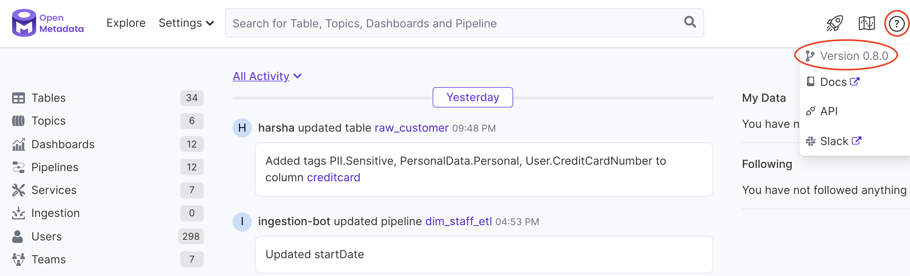

# Troubleshoot Connectors

## Contents

* [Ensure that your connector version and OpenMetadata version match](troubleshoot-connectors.md#ensure-that-your-connector-version-and-openmetadata-version-match)
* [ERROR: No matching distribution found for openmetadata-ingestion](troubleshoot-connectors.md#error-no-matching-distribution-found-for-openmetadata-ingestion)
* [ERROR: Failed building wheel for cryptography](troubleshoot-connectors.md#error-failed-building-wheel-for-cryptography)

## Ensure that your connector version and OpenMetadata version  match

Many errors in metadata ingestion can be the result of a version mismatch between your connector and the OpenMetadata server. Entities and other schemas evolve with each release of OpenMetadata.

Connector and OpenMetadata server versions are numbered using an `x.y.z` scheme. Where `x` is the major version, `y` is the minor version, and `z` is the patch version. Please ensure that your connector minor (`y`) version matches the minor version of your OpenMetadata deployment.

Run the following command to test your version of `openmetadata-ingestion`.

```bash
metadata --version
```

Use the information menu in your OpenMetadata deployment user interface to check the version of OpenMetadata. The figure below illustrates how to do this.



### To Upgrade Your Connector

Run the following command, replacing `<connector name>` with the appropriate name for your connector. See the documentation for your connector if you are not sure what name to use.

```javascript
pip3 install --upgrade 'openmetadata-ingestion[<connector name>]'
```

### To Upgrade OpenMetadata

See [Upgrade OpenMetadata](broken-reference) to upgrade production and production-like deployments.

See [Upgrade OpenMetadata (Local Deployment)](https://docs.open-metadata.org/install/run-openmetadata#upgrade-openmetadata) to upgrade a test version of OpenMetadata deployed following the instructions in Run OpenMetadata.

## ERROR: No matching distribution found for openmetadata-ingestion

If you receive the following errors when installing connectors:&#x20;

```
ERROR: Could not find a version that satisfies the requirement openmetadata-ingestion....
ERROR: No matching distribution found for openmetadata-ingestion...
```

Please ensure that your Python version is 3.8.0 or above.

## **ERROR: Failed building wheel for cryptography**

When attempting to install connector Python packages, you might encounter the following error. The error might include a mention of a Rust compiler.

```
Failed to build cryptography
ERROR: Could not build wheels for cryptography which use PEP 517 and cannot be installed directly
```

This error usually occurs due to an older version of pip. Try upgrading pip as follows.

```
pip3 install --upgrade pip setuptools
```

