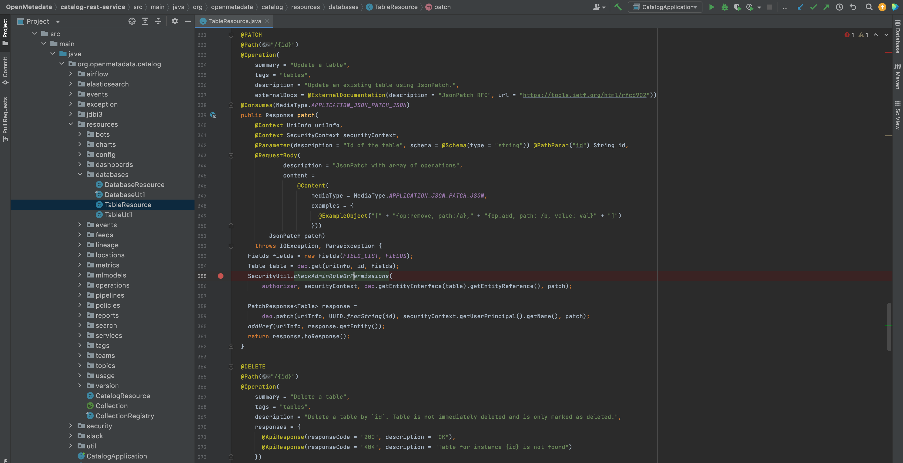
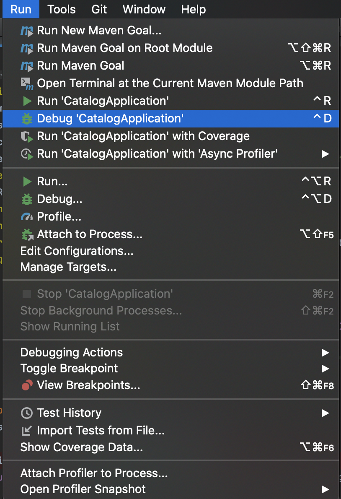
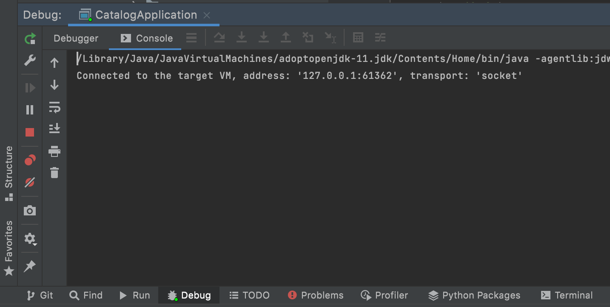
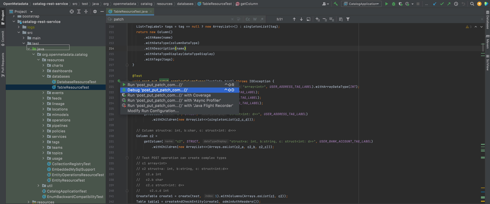
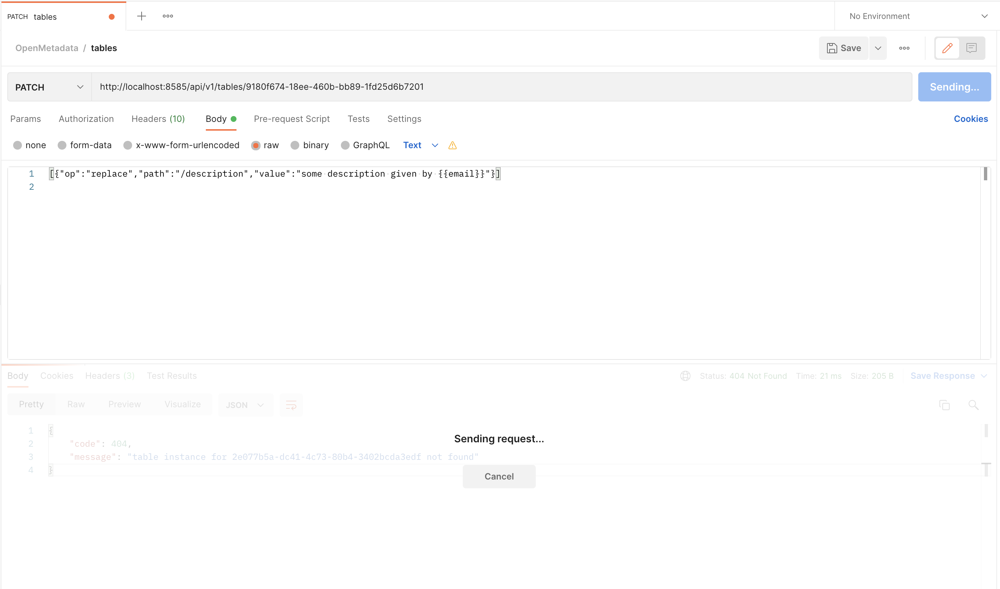
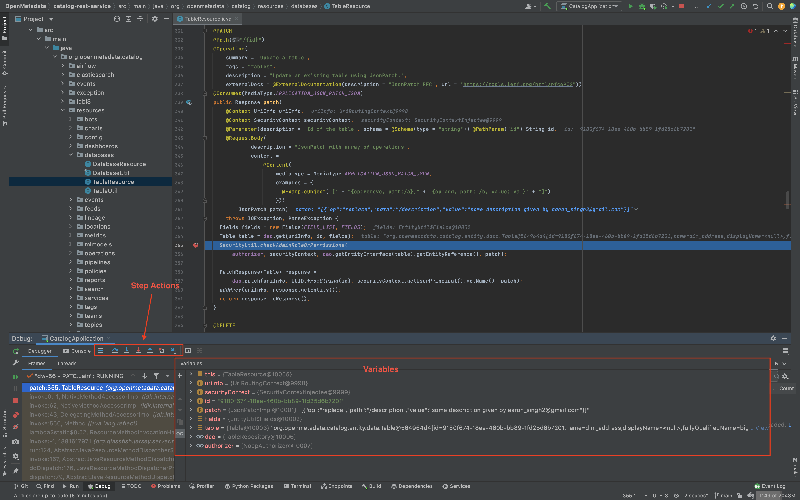

# Debugging

We primarily rely on IntelliJ for debugging backend codebase. 

The following steps will help you get up and running with IntelliJ. 
For learning advanced debugging skills with IntellJ, please refer IntelliJ's official [documentation](https://www.jetbrains.com/help/idea/debugging-code.html).

## Set up Breakpoints

Identify the statements of interest in the codebase and set up breakpoints, by clicking on the left margin (red dot indicates a break point).

You may add more breakpoints while the debugger is running.

## Run the App in Debug mode

Start the OpenMetadata CatalogApplication in Debug mode from the Run menu.

Check the bottom panel to ensure that the Debugger started successfully.

## Inspect the Codebase

Invoke the statement of interest through a preferable methodology (running unit test or through actual API call).

The debugger will pause execution as it encounters a breakpoint.
Use the Step actions as needed to step through the codebase.
Inspect variables in the variables tab to see if they have the expected values.

