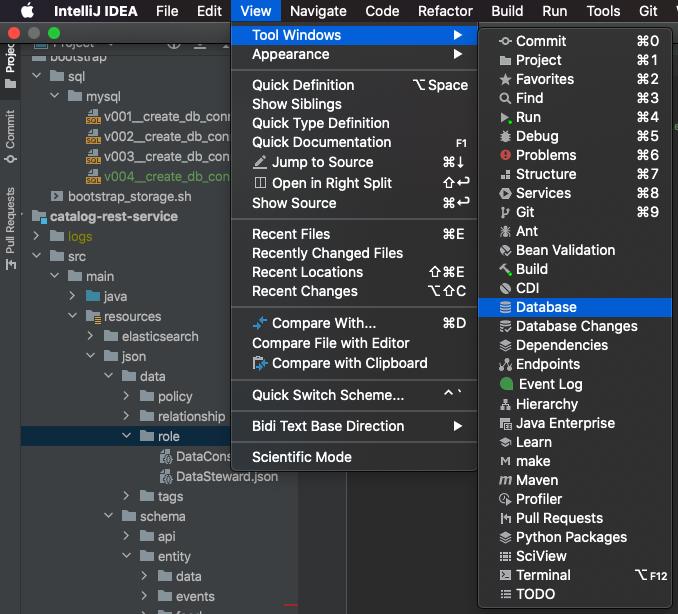
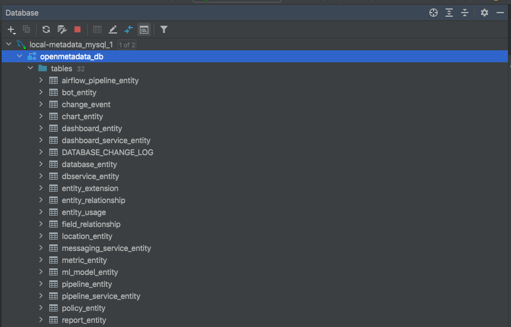
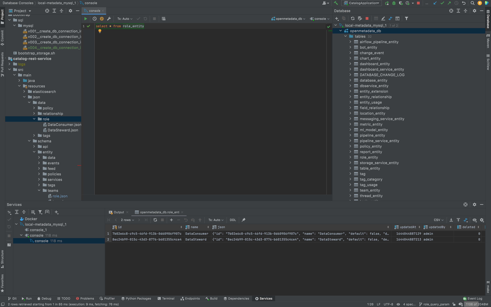

# Dev Environment Setup

This document guides you through setting up the dev environment for OpenMetadata backend. 

Most of us developers on OpenMetadata use [IntelliJ IDEA](https://www.jetbrains.com/idea/) for backend development.

## Setting up the Project

TODO

## Database Connection Setup

Ensure that the local mysql docker container is running from the previous step.

```bash
$ docker ps -a
CONTAINER ID   IMAGE                                                  COMMAND                  CREATED        STATUS                     PORTS                                                                                  NAMES
cb89f6085688   openmetadata/db:latest                                 "/entrypoint.sh mysq…"   17 hours ago   Up 17 hours (healthy)      0.0.0.0:3306->3306/tcp, :::3306->3306/tcp, 33060-33061/tcp                             local-metadata_mysql_1
```

Open the database tool from IntelliJ IDEA View menu.



Set up the data source using the [database credentials](https://github.com/open-metadata/OpenMetadata/blob/main/docker/local-metadata/mysql-script.sql) that was used to spin up the openmetadata/db docker container.
The configuration should look like the one described in the screenshot below:

Test Connection before proceeding to the next step.


After the data source is set up, you'll be able to see the tables in the IntelliJ Database tool.



With the data source setup, you are now able to run queries against OpenMetadata's local MySQL database.



Alternatively, you may log in to the docker container and run SQL queries directly with the mysql client:
```bash
$ docker exec -it local-metadata_mysql_1 bash -c 'mysql -uopenmetadata_user -popenmetadata_password -Dopenmetadata_db'

mysql>  SELECT COUNT(*) FROM role_entity;
+----------+
| COUNT(*) |
+----------+
|        2 |
+----------+
1 row in set (0.02 sec)
```
