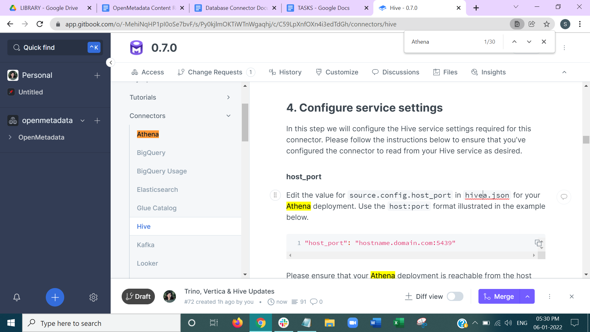

# Build the code & run tests

## Prerequisites

First of all, you need to make sure you are using maven 3.5.x or higher and JDK 11 or higher.

## Building

The following commands must be run from the top-level directory.

`mvn clean install`

If you wish to skip the unit tests you can do this by adding `-DskipTests` to the command line.

## Create a distribution \(packaging\)

You can create a _distribution_ as follows.

```text
$ mvn clean install

# Create the binary distribution.
$ cd dist && mvn package
```

The binaries will be created at:

```text
dist/target/open-metadata-<version>.pom
dist/target/open-metadata-<version>.tar.gz
```

## Run instance through IntelliJ IDEA

1. Add a new Run/Debug configuration like the below screenshot.



## Coding Style

1. [Refer to coding guidelines](https://github.com/open-metadata/OpenMetadata/blob/main/docs/open-source-community/developer/coding-style.md)
2. Configure IntelliJ to disable the \[wild-card imports\]

   \([https://www.jetbrains.com/help/idea/creating-and-optimizing-imports.html\#disable-wildcard-imports](https://www.jetbrains.com/help/idea/creating-and-optimizing-imports.html#disable-wildcard-imports)\)

