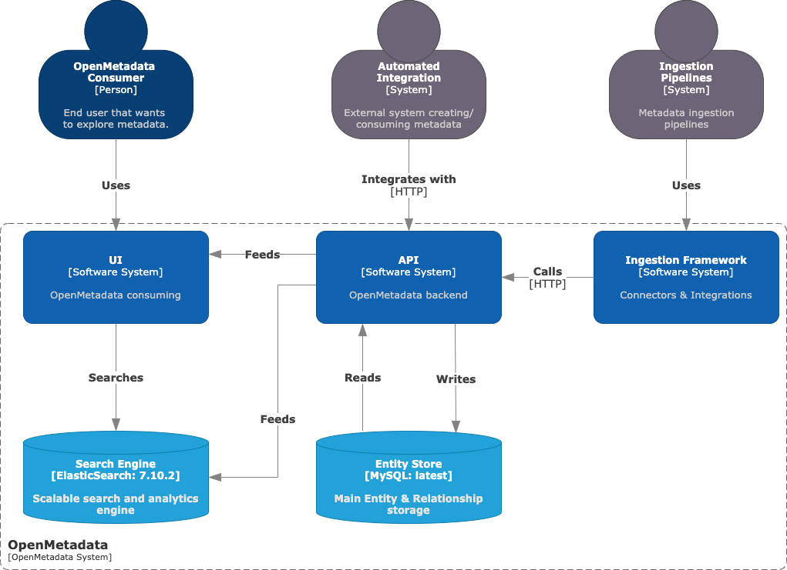
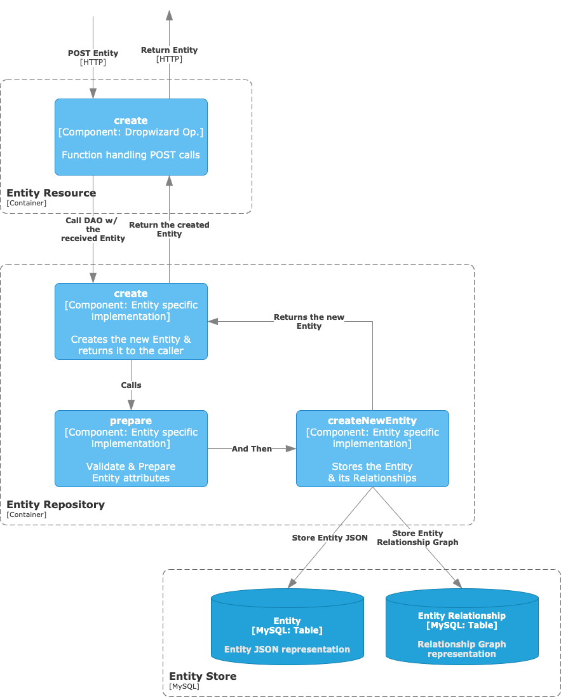

# Solution Design

We will start by describing the big picture of the software design of the application. Bit by bit we will get inside specific components, describing their behaviour and showing examples on how to use them.

## System Context

The goal of this first section is to get familiar with the high-level concepts and technologies involved. The learning objectives here are:

* Describe the elements that compose OpenMetadata and their relationships.
* How end-users and external applications can communicate with the system.

Here we have the main actors of the solution:

* **API:** This is the main pillar of OpenMetadata. Here we have defined how we can interact with the metadata **Entities**. It powers all the other components of the solution.
* **UI:** Discovery-focused tool that helps users keep track of all the data assets in the organisation. Its goal is enabling and fueling **collaboration**.
* **Ingestion Framework:** Based on the API specifications, this system is the foundation of all the **Connectors**, i.e., the components that define the interaction between OpenMetadata and external systems containing the metadata we want to integrate.
* **Entity Store:** MySQL storage that contains real-time information on the state of all the **Entities** and their **Relationships**.
* **Search Engine:** Powered by ElasticSearch, it is the indexing system for the UI to help users **discover** the metadata.

### JSON Schemas

If we abstract away from the Storage Layer for a moment, we then realize that the OpenMetadata implementation is the integration of three blocks:

1. The core **API,** unifying and centralising the communication with internal and external systems.
2. The **UI** for a team-centric metadata Serving Layer.
3. The **Ingestion Framework** as an Interface between OpenMetadata and external sources.

The only thing these components have in common is the **vocabulary** -> All of them are shaping, describing, and moving around metadata **Entities**.

OpenMetadata is based on a **standard definition** for metadata. Therefore, we need to make sure that in our implementation of this standard we share this definition in the end-to-end workflow. To this end, the main lexicon is defined as JSON Schemas, a readable and language-agnostic solution.

Then, when packaging the main components, we generate the specific programming classes for all the Entities. What we achieve is three views from the same source:

* Java Classes for the API,
* Python Classes for the Ingestion Framework and
* Javascript Classes for the UI,

each of them modelled after a single source of truth. Thanks to this approach we can be sure that it does not matter at which point we zoom in throughout the whole process, we are always going to find a univocal well-defined Entity.

## API Container Diagram

Now we are going to zoom inside the API Container. As the central Software System of the solution, its goal is to **manage calls** (both from internal and external sources, e.g., Ingestion Framework or any custom integration) and update the **state** of the metadata Entities.

While the data is stored in the MySQL container, the API will be the one fetching it and completing the necessary information, validating the Entities data and all the relationships.

Having a **Serving Layer** (API) decoupled from the Storage Layer allows users and integrations to ask for what they need in a simple language (REST), without the learning curve of diving into specific data models and design choices.

### Entity Resource

When we interact with most of our Entities, we follow the same endpoint structure. For example:

* `GET <url>/api/v1/<collectionName>/<id>` to retrieve an Entity instance by ID, or
* `GET <url>/api/v1/<collectionName>/name/<FQDN>` to query by its fully qualified domain name.

Similarly, we support other CRUD operations, each of them expecting a specific incoming data structure, and returning the Entity's class. As the foundations of OpenMetadata are the Entities definitions, we have this data contract with any consumer, where the backend will validate the received data, as well as the outputs.

The endpoint definition and datatype setting are what happens at the **Entity Resource**. Each metadata Entity is packed with a Resource class, which builds the API definition for the given Entity.

This logic is what then surfaces in the API [docs](https://sandbox.open-metadata.org/docs).

### Entity Repository

The goal of the Entity Repository is to perform Read & Write operations to the **backend database** to Create, Retrieve, Update and Delete Entities.

While the Entity Resource handles external communication, the Repository is in charge of managing how the whole process interacts with the Storage Layer, making sure that incoming and outcoming Entities are valid and hold proper and complete information.

This means that here is where we define our **DAO (Data Access Object)**, with all the validation and data storage logic.

As there are processes repeated across all Entities (e.g., listing entities in a collection or getting a specific version from an Entity), the Entity Repository extends an **Interface** that implements some basic functionalities and abstracts Entity specific logic.

Each Entity then needs to implement its **server-side processes** such as building the FQDN based on the Entity hierarchy, how the Entity stores and retrieves **Relationship** information with other Entities or how the Entity reacts to **Change Events**.

## Entity Storage Layer

In the _API Container Diagram,_ we showed how the Entity Repository interacts with three different Storage Containers (tables) depending on what type of information is being processed.

To fully understand this decision, we should first talk about the information contained by Entities instances.

An Entity has two types of fields: **attributes** (JSON Schema `properties`) and **relationships** (JSON Schema `href`_):_

* **Attributes** are the core properties of the Entity: the name and id, the columns for a table, or the algorithm for an ML Model. Those are **intrinsic** pieces of information of an Entity and their existence and values are what help us differentiate both Entity instances (Table A vs. Table B) and Entity definitions (Dashboard vs. Topic).
* **Relationships** are associations between two Entities. For example, a Table belongs to a Database, a User owns a Dashboard, etc. Relationships are a special type of attribute that is captured using **Entity** **References**.

### Entity and Relationship Store

Entities are stored as JSON documents in the database. Each entity has an associated table (`<entityName>_entity`) which contains the JSON defining the Entity **attributes** and other metadata fields, such as the `id`, `updatedAt` or `updatedBy`.

This JSON does not store any Relationship. E.g., a User owning a Dashboard is a piece of information that is materialised in a separate table `entity_relationship` as graph nodes, where the edge holds the type of the Relationship (e.g., `contains`, `uses`, `follows`...).

This separation helps us decouple concerns. We can process related entities independently and validate at runtime what information needs to be updated and/or retrieved. For example, if we delete a Dashboard being owned by a User, we will then clean up this row in `entity_relationship`, but that won't alter the information from the User.

Another trickier example would be trying to delete a Database that contains Tables. In this case, the process would check that the Database Entity is not empty, and therefore we cannot continue with the removal.

### Change Events Store

You might have already noticed that in all Entities definitions we have a `changeDescription` field. It is defined as _"Change that leads to this version of the entity_". If we inspect further the properties of `changeDescription`, we can see how it stores the differences between the current and last versions of an Entity.

This results in giving visibility on the last update step of each Entity instance. However, there might be times when this level of tracking is not enough.

One of the greatest features of OpenMetadata is the ability to track **all** **Entity versions**. Each operation that leads to a change (`PUT`, `POST`, `PATCH`) will generate a trace that is going to be stored in the table `change_event`.

Using the API to get events data, or directly exploring the different versions of each entity gives great debugging power to both data consumers and producers.

## API Component Diagram

Now that we have a clear picture of the main pieces and their roles, we will analyze the logical flow of a `POST` and a `PUT` calls to the API. The main goal of this section is to get familiar with the code organisation and its main steps.


To take the most out of this section, it is recommended to follow the source code as well, from the Entity JSON you'd like to use as an example to its implementation of `Resource` and `Repository`.


### Create a new Entity - POST

We will start with the simplest scenario: Creating a new Entity via a `POST` call. This is a great first point to review as part of the logic and methods are reused during updates.

#### Create

As we already know, the recipient of the HTTP call will be the `EntityResource`. In there, we have the `create` function with the `@POST` **annotation** and the description of the API endpoint and expected schemas.

The role of this first component is to receive the call and validate the request body and headers, but the real implementation happens in the `EntityRepository`, which we already described as the **DAO**.

For the `POST` operation, the internal flow is rather simple and is composed of two steps:

1. **Prepare**: Which validates the Entity data and computes some attributes at the server-side.
2. **Store**: This saves the Entity JSON and its Relationships to the backend DB.

#### Prepare

This method is used for **validating** an entity to be created during `POST`, `PUT`, and `PATCH` operations and **preparing** the entity with all the required attributes and relationships.

Here we handle, for example, the process of setting up the FQDN of an Entity based on its hierarchy. While all Entities require an FQDN, this is not an attribute we expect to receive in a request.

Moreover, this checks that the received attributes are being correctly informed, e.g., we have a valid `User` as an `owner` or a valid `Database` for a `Table`.

#### Store

The storing process is divided into two different steps (as we have two tables holding the information).

1. We strip the validated Entity from any `href` attribute (such as `owner` or `tags`) in order to just store a JSON document with the Entity intrinsic values.
2. We then store the graph representation of the Relationships for the attributes omitted above.&#x20;

At the end of these calls, we end up with a validated Entity holding all the required attributes, which have been validated and stored accordingly. We can then return the created Entity to the caller.

### Create or Update an Entity - PUT

Let's now build on top of what we learned during the `POST` discussion, expanding the example to a `PUT` request handling.

The first steps are fairly similar:

1. We have a function in our `Resource` annotated as `@PUT` and handling headers, auth and schemas.
2. The `Resource` then calls the DAO at the `Repository`, bootstrapping the data-related logic.
3. We validate the Entity and cook some attributes during the `prepare` step.

After processing and validating the Entity request, we then check if the Entity instance has already been stored, querying the backend database by its FQDN. If it has not, then we proceed with the same logic as the `POST` operation -> simple creation. Otherwise, we need to validate the updated fields.

#### Set Fields

We cannot allow all fields to be updated for a given Entity instance. For example, the `id` or `name` stay immutable once the instance is created, and the same thing happens to the `Database` of a `Table`.

The list of specified fields that can change is defined at each Entity's `Repository`, and we should only allow changes on those attributes that can naturally evolve throughout the **lifecycle** of the object.

At this step, we set the fields to the Entity that are either required by the JSON schema definition (e.g., the `algorithm` for an `MlModel`) or, in the case of a `GET` operation, that are requested as `GET <url>/api/v1/<collectionName>/<id>?fields=field1,field2...`

#### Update

In the `EntityRepository` there is an abstract implementation of the `EntityUpdater` interface, which is in charge of defining the generic update logic flow common for all the Entities.

The main steps handled in the `update` calls are:

1. Update the Entity **generic** fields, such as the description or the owner.
2. Run Entity **specific** updates, which are implemented by each Entity's `EntityUpdater` extension.
3. **Store** the updated Entity JSON doc to the Entity Table in MySQL.

#### Entity Spcific Updates

Each Entity has a set of attributes that define it. These attributes are going to have a very specific behaviour, so the implementation of the `update` logic falls to each Entity `Repository`.

For example, we can update the `Columns` of a `Table`, or the `Dashboard` holding the performance metrics of an `MlModel`. Both of these changes are going to be treated differently, in terms of how the Entity performs internally the update, how the Entity **version** gets affected, or the impact on the **Relationship** data.

For the sake of discussion, we'll follow a couple of `update` scenarios.

#### Example 1 - Updating Columns of a Table

When updating `Columns`, we need to compare the existing set of columns in the original Entity vs. the incoming columns of the `PUT` request.

If we are receiving an existing column, we might need to update its `description` or `tags`. This change will be considered a **minor** change. Therefore, the version of the Entity will be bumped by `0.1`, following the software release specification model.

However, what happens if a stored column is not received in the updated instance? That would mean that such a column has been deleted. This is a type of change that could possibly break integrations on top of the Table's data. Therefore, we can mark this scenario as a **major** update. In this case, the version of the Entity will increase by `1.0`.

Checking the Change Events or visiting the Entity history will easily show us the evolution of an Entity instance, which will be immensely valuable when debugging data issues.

#### Example 2 - Updating the Dashboard of an ML Model

One of the attributes for an `MlModel` is the `EntityReference` to a `Dashboard` holding its performance metrics evolution.

As this attribute is a reference to another existing Entity, this data is not directly stored in the `MlModel` JSON doc, but rather as a Relationship graph, as we have been discussing previously. Therefore, during the `update` step we will need to:

1. Insert the relationship, if the original Entity had no Dashboard informed,
2. Delete the relationship if the Dashboard has been removed, or
3. Update the relationship if we now point to a different Dashboard.

Note how during the `POST` operation we needed to always call the `storeRelationship` function, as it was the first time we were storing the instance's information. During an update, we will just modify the Relationship data if the Entity's specific attributes require it.

### Handling Events

During all these discussions and examples we've been showing how the backend API handles HTTP requests and what the Entities' data lifecycle is. Not only we've been focusing on the JSON docs and Relationships, but from time to time we have talked about Change Events.

Moreover, In the _API Container Diagram ****_ we drew a Container representing the Table holding the Change Event data, but yet, we have not found any Component accessing it.

This is because the API server is powered by **Jetty**, which means that luckily we do not need to make those calls ourselves! By defining a `ChangeEventHandler` and registering it during the creation of the server, this postprocessing of the calls happens transparently.

Our `ChangeEventHandler` will check if the Entity has been Created, Updated or Deleted and will store the appropriate `ChangeEvent` data from our response to the backend DB.
