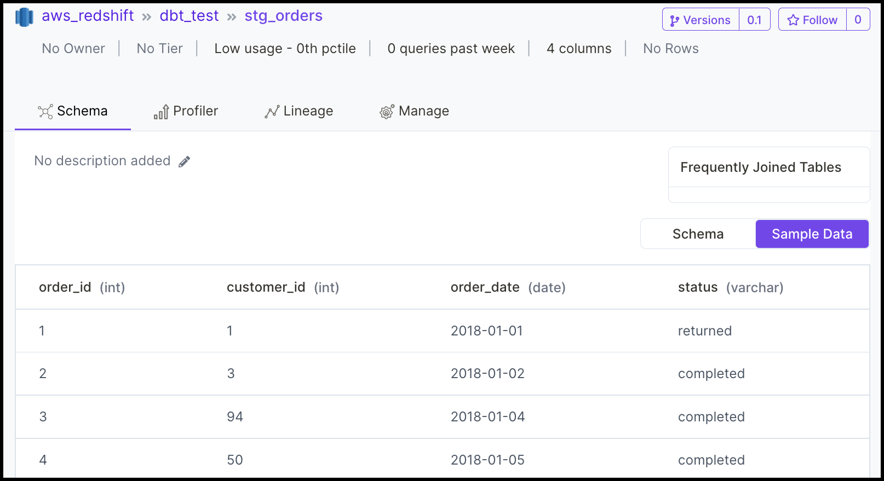
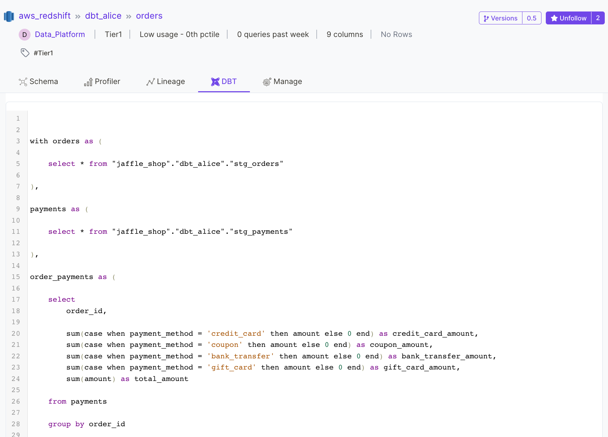

# MySQL

## Requirements

Using the OpenMetadata MySQL connector requires supporting services and software. Please ensure your host system meets the requirements listed below. Then continue to the procedure for installing and configuring this connector.

### OpenMetadata (version 0.7.0 or greater)

To use this guide you must have a running deployment of OpenMetadata. OpenMetadata includes the following services.

* The OpenMetadata server supporting the metadata APIs and user interface
* Elasticsearch for metadata search and discovery
* MySQL as the backing store for all metadata
* Airflow for metadata ingestion workflows

If you have not already deployed OpenMetadata, please follow the guide, [Run OpenMetadata](../../install/run-openmetadata.md) to get up and running.

### Python (version 3.8.0 or greater)

To check what version of Python you have, please use the following command.

```
python3 --version
```

## Procedure

The following is an overview of the steps in this procedure. Please follow all steps relevant to your use case.

1. [Prepare a Python virtual environment](mysql.md#1.-prepare-a-python-virtual-environment)
2. [Install the Python module for this connector](mysql.md#install-from-pypi-or-source)
3. [Create a configuration file using template JSON](mysql.md#4.-create-a-configuration-file-using-the-json-template)
4. [Configure service settings](mysql.md#5.-configure-service-settings)
5. [Enable / disable the data profiler](mysql.md#6.-configure-data-profiler-settings-optional)
6. [Install the data profiler Python module (optional)](mysql.md#3.-install-the-data-profiler-python-module-optional)
7. [Configure data filters (optional)](mysql.md#7.-configure-data-filters-optional)
8. [Configure sample data (optional)](mysql.md#8.-configure-sample-data-optional)
9. [Configure DBT (optional)](mysql.md#9.-configure-dbt-optional)
10. [Confirm sink settings](mysql.md#10.-confirm-sink-settings)
11. [Confirm metadata\_server settings](mysql.md#11.-confirm-metadata\_server-settings)
12. [Run Ingestion Workflow](mysql.md#run-manually)

### 1. Prepare a Python virtual environment

In this step we will create a Python virtual environment. Using a virtual environment will enable us to avoid conflicts with other Python installations and packages on your host system.&#x20;

In a later step you will install the Python module for this connector and its dependencies in this virtual environment.

#### 1a. Create a directory for openmetadata

Throughout the docs we use a consistent directory structure OpenMetadata server and connector installation. If you have not already done so by following another guide, please create an openmetadata directory now and change into that directory in your command line environment.

```
mkdir openmetadata; cd openmetadata
```

#### 1b. Create a directory for this connector

Run the following command to create a directory for this connector and change into that directory.

```bash
mkdir mysql; cd mysql
```

#### 1c. Create the virtual environment

Run the following command to create a Python virtual environment called, `mysql-env`.

```bash
python3 -m venv mysql-env
```

#### 1d. Activate the virtual environment

Run the following command to activate the virtual environment.&#x20;

```bash
source mysql-env/bin/activate
```

Once activated, you should see your command prompt change to indicate that your commands will now be executed in the environment named, `mysql-env`.

#### 1e. Upgrade pip and setuptools to the latest versions

Ensure you have the latest version of pip by running the following command. If you have followed the steps above, this will upgrade pip in your virtual environment.

```
pip3 install --upgrade pip setuptools
```

### 2. Install the Python module for this connector <a href="#install-from-pypi-or-source" id="install-from-pypi-or-source"></a>

With the virtual environment set up and activated as described in Step 1, run the following command to install the Python module for the MySQL connector.

```bash
pip3 install 'openmetadata-ingestion[mysql]'
```

### 3. Create a configuration file using template JSON

Create a new file called `mysql.json` in the current directory. Note that the current directory should be the `openmetadata/mysql` directory you created in Step 1.&#x20;

Copy and paste the configuration template below into the `mysql.json` file you created.


Note: The `source.config` field in the configuration JSON will include the majority of the settings for your connector. In the steps below we describe how to customize the key-value pairs in the `source.config` field to meet your needs.&#x20;



```json
{
  "source": {
    "type": "mysql",
    "config": {
      "username": "openmetadata_user",
      "password": "openmetadata_password",
      "database": "openmetadata_db",
      "service_name": "local_mysql",
      "data_profiler_enabled": "false",
      "table_filter_pattern": {
        "excludes": ["[\\w]*event_vw.*"]
      },
      "schema_filter_pattern": {
        "excludes": ["mysql.*", "information_schema.*", "performance_schema.*", "sys.*"]
      }
    }
  },
  "sink": {
    "type": "metadata-rest",
    "config": {}
  },
  "metadata_server": {
    "type": "metadata-server",
    "config": {
      "api_endpoint": "http://localhost:8585/api",
      "auth_provider_type": "no-auth"
    }
  }
}  
```


### 4. Configure service settings&#x20;

In this step we will configure the MySQL service settings required for this connector. Please follow the instructions below to ensure you have configured the connector to read from your MySQL service as desired.

#### host\_port

Edit the value for `source.config.host_port` in `mysql.json` for your MySQL deployment. Use the `host:port` format illustrated in the example below.&#x20;

```json
"host_port": "hostname.domain.com:5439"
```

Please ensure your MySQL deployment is reachable from the host you are using to run metadata ingestion.

#### username

Edit the value for `source.config.username` to identify your MySQL user.

```json
"username": "username"
```


Note: The user specified should be authorized to read all databases you want to include in the metadata ingestion workflow.


#### password

Edit the value for `source.config.password` with the password for your MySQL user.

```json
"password": "strong_password"
```

#### service\_name

OpenMetadata uniquely identifies services by their `service_name`. Edit the value for `source.config.service_name` with a name that distinguishes this deployment from other services, including other MySQL services that you might be ingesting metadata from.

```json
"service_name": "local_mysql"
```

#### database (optional)

If you want to limit metadata ingestion to a single database, include the  `source.config.database` field in your configuration file. If this field is not included, the connector will ingest metadata from all databases the specified user is authorized to read.&#x20;

To specify a single database to ingest metadata from, provide the name of the database as the value for the `source.config.database` key as illustrated in the example below.

```json
"database": "mysql_db"
```

### 5. Enable / disable the data profiler

The data profiler ingests usage information for tables. This enables you to assess frequency of use, reliability, and other details.&#x20;

#### data\_profiler\_enabled

When enabled, the data profiler will run as part of metadata ingestion. Running the data profiler increases the amount of time metadata ingestion requires, but provides the benefits described above.

You may disable the data profiler by setting the value for the key `source.config.data_profiler_enabled` to `"false"` as follows. We have done this in the configuration template provided.

```json
"data_profiler_enabled": "false"
```

If you want to enable the data profiler, update your configuration file as follows.&#x20;

```json
"data_profiler_enabled": "true"
```


Note: The data profiler is enabled by default if no setting is provided for `data_profiler_enabled`.


### 6. Install the data profiler Python module (optional)

If you enabled the data profiler in Step 5, run the following command to install the Python module for the data profiler. You will need this to run the ingestion workflow.

```bash
pip3 install 'openmetadata-ingestion[data-profiler]'
```

The data profiler module takes a few minutes to install. While it installs, continue through the remaining steps in this guide.

### 7. Configure data filters (optional)

#### include\_views (optional)

Use `source.config.include_views` to control whether or not to include views as part of metadata ingestion and data profiling.

Explicitly include views by adding the following key-value pair in the `source.config` field of your configuration file.

```json
"include_views": "true"
```

Exclude views as follows.

```json
"include_views": "false"
```


Note: `source.config.include_views` is set to `true` by default.


#### include\_tables (optional)

Use `source.config.include_tables` to control whether or not to include tables as part of metadata ingestion and data profiling.

Explicitly include tables by adding the following key-value pair in the `source.config` field of your configuration file.

```json
"include_tables": "true"
```

Exclude tables as follows.

```json
"include_tables": "false"
```


Note: `source.config.include_tables` is set to `true` by default.


#### table\_filter\_pattern (optional)

Use `source.config.table_filter_pattern` to select tables for metadata ingestion by name.&#x20;

Use `source.config.table_filter_pattern.excludes` to exclude all tables with names matching one or more of the supplied regular expressions. All other tables will be included. See below for an example. This example is also included in the configuration template provided.

```json
"table_filter_pattern": {
    "excludes": ["information_schema.*", "[\\w]*event_vw.*"]
}
```

Use `source.config.table_filter_pattern.includes` to include all tables with names matching one or more of the supplied regular expressions. All other tables will be excluded. See below for an example.

```json
"table_filter_pattern": {
    "includes": ["corp.*", "dept.*"]
}
```

See the documentation for the [Python re module](https://docs.python.org/3/library/re.html) for information on how to construct regular expressions.


You may use either `excludes` or `includes` but not both in `table_filter_pattern.`


#### schema\_filter\_pattern (optional)

Use `source.config.schema_filter_pattern.excludes` and `source.config.schema_filter_pattern.includes` field to select schemas for metadata ingestion by name. The configuration template provides an example.

The syntax and semantics for `schema_filter_pattern` are the same as for [`table_filter_pattern`](mysql.md#table\_filter\_pattern-optional). Please see that section for details on use.

### 8. Configure sample data (optional)

#### generate\_sample\_data (optional)

Use the `source.config.generate_sample_data` field to control whether or not to generate sample data to include in table views in the OpenMetadata user interface. See the figure below for an example.



Explicitly include sample data by adding the following key-value pair in the `source.config` field of your configuration file.

```json
"generate_sample_data": "true"
```

If set to true, the connector will collect the first 50 rows of data from each table included in ingestion and catalog that data as sample data to which users can refer in the OpenMetadata user interface.

You can exclude collection of sample data by adding the following key-value pair in the `source.config` field of your configuration file.

```json
"generate_sample_data": "false"
```


Note: `generate_sample_data` is set to `true` by default.


### 9. Configure DBT (optional)

DBT provides transformation logic that creates tables and views from raw data. OpenMetadata includes an integration for DBT that enables you to see the models used to generate a table from that table's details page in the OpenMetadata user interface. See the figure below for an example.



To include DBT models and metadata in your ingestion workflows, specify the location of the DBT manifest and catalog files as fields in your configuration file.

#### dbt\_manifest\_file (optional)

Use the field `source.config.dbt_manifest_file` to specify the location of your DBT manifest file. See below for an example.

```json
"dbt_manifest_file": "./dbt/manifest.json"
```

#### dbt\_catalog\_file (optional)

Use the field `source.config.dbt_catalog_file` to specify the location of your DBT catalog file. See below for an example.

```json
"dbt_catalog_file": "./dbt/catalog.json"
```

### 10. Confirm sink settings

You should not need to make any changes to the fields defined for `sink` in the template code you copied into `mysql.json` in Step 4. This part of your configuration file should be as follows.

```json
"sink": {
    "type": "metadata-rest",
    "config": {}
},
```

### 11. Confirm metadata\_server settings

You should not need to make any changes to the fields defined for `metadata_server` in the template code you copied into `mysql.json` in Step 4. This part of your configuration file should be as follows.

```json
"metadata_server": {
    "type": "metadata-server",
    "config": {
        "api_endpoint": "http://localhost:8585/api",
        "auth_provider_type": "no-auth"
    }
}
```

### 12. Run Ingestion Workflow <a href="#run-manually" id="run-manually"></a>

Your `mysql.json` configuration file should now be fully configured and ready to use in an ingestion workflow.

To run an ingestion workflow, execute the following command from the `openmetadata/mysql` directory you created in Step 1.

```bash
metadata ingest -c ./mysql.json
```

## Next Steps

As the ingestion workflow runs, you may observe progress both from the command line and from the OpenMetadata user interface. To view the metadata ingested from MySQL, visit [http://localhost:8585/explore/tables](http://localhost:8585/explore/tables). Select the MySQL service to filter for the data you have ingested using the workflow you configured and ran following this guide. See the figure below for an example.

## Troubleshooting

### ERROR: Failed building wheel for cryptography

When attempting to install the `openmetadata-ingestion[mysql]` Python package in Step 2, you might encounter the following error. The error might also include mention of a Rust compiler.

```
Failed to build cryptography
ERROR: Could not build wheels for cryptography which use PEP 517 and cannot be installed directly
```

This problem is usually due to running on older version of pip. Try upgrading pip as follows.

```bash
pip3 install --upgrade pip setuptools
```

Then re-run the install command in [Step 2](mysql.md#install-from-pypi-or-source).

### requests.exceptions.ConnectionError

If you encounter the following error when attempting to run the ingestion workflow in Step 12, this is probably because there is no OpenMetadata server running at http://localhost:8585.&#x20;

```
requests.exceptions.ConnectionError: HTTPConnectionPool(host='localhost', port=8585): 
Max retries exceeded with url: /api/v1/services/databaseServices/name/local_mysql 
(Caused by NewConnectionError('<urllib3.connection.HTTPConnection object at 0x1031fa310>: 
Failed to establish a new connection: [Errno 61] Connection refused'))
```

To correct this problem, please follow the steps in the [Run OpenMetadata](../../install/run-openmetadata.md) guide to deploy OpenMetadata in Docker on your local machine.

Then re-run the metadata ingestion workflow in [Step 12](mysql.md#run-manually).
