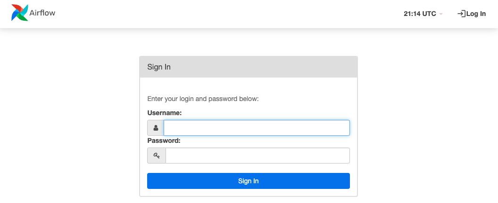

# Try OpenMetadata in Docker

## Requirements (OSX and Linux)

Please ensure your host system meets the requirements listed below. Then continue to the Procedure for installing OpenMetadata.

### Python (version 3.8.0 or greater)

To check what version of Python you have, please use the following command.

```
python3 --version
```

### Docker (version 20.10.0 or greater)

[Docker](https://docs.docker.com/get-started/overview/) is an open platform for developing, shipping, and running applications that enables you to separate your applications from your infrastructure so you can deliver software quickly using OS-level virtualization to deliver software in packages called containers.

To check what version of Docker you have, please use the following command.

```
docker --version
```

If you need to install Docker, please visit [Get Docker](https://docs.docker.com/get-docker/).&#x20;


Note: You must **allocate at least 6GB of memory to Docker** in order to run OpenMetadata. To change the memory allocation for Docker, please visit:

Preferences -> Resources -> Advanced


### `compose` command for Docker (version v2.1.1 or greater)

The Docker `compose` package enables you to define and run multi-container Docker applications. The `compose` command integrates compose functions into the Docker platform, making them available from the Docker command-line interface (CLI). The Python packages you will install in the procedure below use `compose` to deploy OpenMetadata.&#x20;

**MacOS X**: Docker on MacOS X ships with compose already available in the Docker CLI.&#x20;

**Linux**: To install compose on Linux systems, please visit the [Docker CLI command documentation](https://docs.docker.com/compose/cli-command/#install-on-linux) and follow the instructions.

To verify that the `docker compose` command is installed and accessible on your system, run the following command.

```bash
docker compose version
```

Upon running this command you should see output similar to the following.

```bash
Docker Compose version v2.1.1
```


Note: In previous releases of Docker compose functions were delivered with the `docker-compose` tool. OpenMetadata uses Compose V2. Please see the paragraphs above for instructions on installing Compose V2.


### Install Docker Compose Version 2.0.0 on Linux

Follow the [instructions here](https://docs.docker.com/compose/cli-command/#install-on-linux) to install docker compose version 2.0.0

1. Run the following command to download the current stable release of Docker Compose

```
DOCKER_CONFIG=${DOCKER_CONFIG:-$HOME/.docker}
mkdir -p $DOCKER_CONFIG/cli-plugins
curl -SL https://github.com/docker/compose/releases/download/v2.2.3/docker-compose-linux-x86_64 -o $DOCKER_CONFIG/cli-plugins/docker-compose
```

This command installs Compose V2 for the active user under `$HOME` directory. To install Docker Compose for all users on your system, replace `~/.docker/cli-plugins` with `/usr/local/lib/docker/cli-plugins`.

2\. Apply executable permissions to the binary

```
chmod +x $DOCKER_CONFIG/cli-plugins/docker-compose
```

3\. Test your installation

```
docker compose version
Docker Compose version v2.2.3
```

## Procedure

### 1. Create a directory for OpenMetadata

Create a new directory for OpenMetadata and navigate into that directory.

```
mkdir openmetadata-docker && cd openmetadata-docker
```

### 2. Create a Python virtual environment

Create a virtual environment to avoid conflicts with other Python environments on your host system. A virtual environment is a self-contained directory tree that contains a Python installation for a particular version of Python, plus a number of additional packages.

In a later step you will install the openmetadata-ingestion Python module and its dependencies in this virtual environment.

```
python3 -m venv env
```

### 3. Activate the virtual environment

```
source env/bin/activate
```

### 4. Upgrade pip and setuptools

```
pip3 install --upgrade pip setuptools
```

### 5. Install the OpenMetadata Python module using pip

```
pip3 install --upgrade 'openmetadata-ingestion[docker]'
```

### 6. Ensure the module is installed and ready for use

```
metadata docker --help
```

After running the command above, you should see output similar to the following.

```
Usage: metadata docker [OPTIONS]

  Checks Docker Memory Allocation Run Latest Release Docker - metadata
  docker --run Run Local Docker - metadata docker --run -t local -p
  path/to/docker-compose.yml

Options:
  --start          Start release Docker containers
  --stop           Stop Docker containers (local and release)
  --clean          Prune unused containers, images, volumes and networks
  -t, --type TEXT  'local' - local type will start local build of OpenMetadata
                   docker

  -p, --path FILE  Path to Local docker-compose.yml
  --help           Show this message and exit.
```

### 7. Start the OpenMetadata Docker containers

```
metadata docker --start
```

This will create a docker network and four containers for the following services:

* MySQL to store the metadata catalog
* Elasticsearch to maintain the metadata index which enables you to search the catalog
* Apache Airflow which OpenMetadata uses for metadata ingestion
* The OpenMetadata UI and API server

After starting the Docker containers, you should see an output similar to the following.

```
[2021-11-18 15:53:52,532] INFO     {metadata.cmd:202} - Running Latest Release Docker
[+] Running 5/5
 ⠿ Network tmp_app_net                  Created                                                                                                                                          0.3s
 ⠿ Container tmp_mysql_1                Started                                                                                                                                          1.0s
 ⠿ Container tmp_elasticsearch_1        Started                                                                                                                                          1.0s
 ⠿ Container tmp_ingestion_1            Started                                                                                                                                          2.1s
 ⠿ Container tmp_openmetadata-server_1  Started                                                                                                                                          2.2s
[2021-11-18 15:53:55,876] INFO     {metadata.cmd:212} - Time took to get containers running: 0:00:03.124889
.......
```

After starting the containers, `metadata` will launch Airflow tasks to ingest sample metadata and usage data for you to experiment with. This might take several minutes, depending on your system.


**Note:**

* `metadata docker --stop` will stop the Docker containers.
* `metadata docker --clean` will clean/prune the containers, volumes, and networks.


### 8. Wait for metadata ingestion to finish

Once metadata ingestion has finished and the OpenMetadata UI is ready for use, you will see output similar to the following.

```bash
✅ OpenMetadata is up and running

Open http://localhost:8585 in your browser to access OpenMetadata..
                
To checkout Ingestion via Airflow, go to http://localhost:8080 
(username: admin, password: admin)
                
We are available on Slack , https://slack.open-metadata.org/ . Reach out to us if
you have any questions.
                
If you like what we are doing, please consider giving us a star on github at 
https://github.com/open-metadata/OpenMetadata. 

It helps OpenMetadata reach wider audience and helps our community.
```

### 9. Log in to Airflow

Once metadata ingestion has finished and you see the message that OpenMetadata is up and running, visit the following url in your web browser.

```
http://localhost:8080
```

You will see a login prompt similar to the one in the figure below. Use the following credentials to log in to Airflow.

Username: `admin`

Password: `admin`



### 10. Begin using OpenMetadata

Finally, visit the following url to begin exploring OpenMetadata.

```
http://localhost:8585
```

You should see a page similar to the following as the landing page for the OpenMetadata server.


### Next Steps

1. Visit the [Features](../features.md) overview page and explore the OpenMetadata UI.
2. Visit the [Connectors](../../integrations/connectors/) documentation to see what services you can integrate with OpenMetadata.
3. Visit the [API](../../openmetadata-apis/apis/overview.md) documentation and explore the OpenMetadata APIs.

### Troubleshooting

#### Could not find a version that satisfied the requirement

```
pip3 install 'openmetadata-ingestion[docker]'
ERROR: Could not find a version that satisfies the requirement openmetadata-ingestion[docker] (from versions: none)
ERROR: No matching distribution found for openmetadata-ingestion[docker]
```

If you see the above when attempting to install OpenMetadata, this can be due to using older version of Python and pip. Please check the [Requirements](./#requirements) section above and confirm that you have supported versions installed.

If you need support please get in touch on Slack: [https://slack.open-metadata.org/](https://slack.open-metadata.org).

## Requirements (Windows)

### WSL2, Ubuntu 20.04, and Docker for Windows

1. Install [WSL2](https://ubuntu.com/wsl)
2. Install [Ubuntu 20.04](https://www.microsoft.com/en-us/p/ubuntu-2004-lts/9n6svws3rx71)
3. Install [Docker for Windows](https://www.docker.com/products/docker-desktop)

### In the Ubuntu terminal

```
cd ~
sudo apt update
sudo apt upgrade
sudo apt install python3-pip  python3-venv
```

Follow the [OSX instructions](./#1.-create-a-directory-for-openmetadata)

## Upgrade OpenMetadata

If you would like to upgrade your OpenMetadata deployment installed following the procedure above, this procedure will guide you through the upgrade process.

### 1. Ensure your Python virtual environment is activated

The procedure for [installing OpenMetadata](./#procedure) asks you to create a new directory and Python virtual environment. The procedure then asks you to install the `openmetadata-ingestion[docker]` Python module in this virtual environment.

In your command-line environment, please navigate to the directory where you installed `openmetadata-ingestion[docker]` and activate the virtual environment by running the following command.

```
source env/bin/activate
```

### 2. Check the current version you have installed

To check the version of `openmetadata-ingestion[docker]` that you have installed, run the following command.

```bash
metadata --version
```

Upon running this command you should see output similar to the following.

```bash
metadata, version metadata 0.5.0 from /Users/om/openmetadata-docker/env/lib/python3.8 (python 3.8)
```

### 3. Check available versions

To confirm that there is a later version of `openmetadata-ingestion[docker]` available and identify the version you want to install, please run the following command.

```
pip3 install 'openmetadata-ingestion[docker]'==
```

Upon running this command, you should see output similar to the following.

```
ERROR: Could not find a version that satisfies the requirement 
openmetadata-ingestion[docker]== (from versions: 0.2.0, 0.2.1, 0.2.2, 0.2.3, 0.2.4,
0.3.0, 0.3.2, 0.4.0.dev0, 0.4.0.dev6, 0.4.0, 0.4.1.dev6, 0.4.1, 0.4.2.dev1, 0.4.2, 
0.4.2.1, 0.4.3.dev1, 0.4.3.dev2, 0.4.3.dev3, 0.4.3.dev4, 0.4.3, 0.4.4, 0.4.5, 0.4.7,
0.4.8.dev0, 0.4.8.dev2, 0.4.8, 0.4.9, 0.4.10, 0.4.11, 0.5.0rc0, 0.5.0rc1, 0.5.0, 
0.5.1.dev0, 0.6.0.dev0, 0.7.0.dev1, 0.7.0.dev2, 0.7.0.dev3, 0.7.0.dev4)
ERROR: No matching distribution found for openmetadata-ingestion[docker]==
```

The error messages are expected. This is the accepted means of checking available versions for a Python module using `pip`.

The output provides a complete list of available versions and enables you to determine whether there are release versions later than the version you currently have installed. Release versions have the form `x.x.x`. Examples of release versions in the above output include, `0.2.0`, `0.4.2`, and `0.5.0`.

From this output you can also find patch releases (e.g., `0.4.2.1`), release candidates (`0.5.0rc1`), and development releases (e.g., `0.7.0.dev4`).

### 4. Stop your currently running deployment

Before upgrading, if you are currently running an OpenMetadata deployment, please stop the deployment by running the following command.

```bash
metadata docker --stop
```

### 5. Install the version of your choice

#### Option 1. Install the latest release version

You may install the latest release version by running the following command.

```bash
pip3 install --upgrade 'openmetadata-ingestion[docker]'
```

#### Option 2. Install a specific release, patch, or development version

You may install a specific version of `openmetadata-ingestion[docker]`by running the following command, specifying the version you want to install in place of `<version>`.

```bash
pip3 install --upgrade 'openmetadata-ingestion[docker]'==<version>
```

For example, if you want to install the `0.7.0.dev4` release, you would run the following command.

```bash
pip3 install --upgrade 'openmetadata-ingestion[docker]'==0.7.0.dev4
```

### 6. Restart your deployment

Once you have successfully installed your preferred version of `openmetadata-ingestion[docker]`, restart your deployment using the new version, by running the following command.

```bash
metadata docker --start
```
