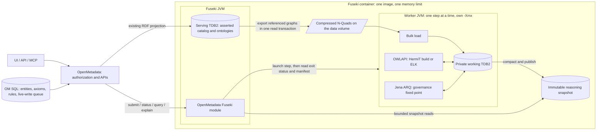

# Reasoning inside the OpenMetadata Fuseki image

Status: proposed design and phased implementation plan; phases 0 and 2 are implemented. Date:
2026-10-07. Revised the same day after a review that checked each current-state claim against the
code, and again to package all reasoning in the existing image without a sidecar;
[Open decisions](#open-decisions) lists what remains.

## Decision and requirements

OpenMetadata owns authoring, authorization, scheduling, and presentation; it submits jobs and reads
results over HTTP. All reasoning ships in the existing custom Apache Jena Fuseki image: **no new
service, container, port, or sidecar.** Heavy work runs in short-lived **reasoner worker** JVM
processes that the Fuseki module launches inside the same container. No production inference path
may construct an in-memory catalog or invoke a reasoner in the OM JVM.

The confirmed scope is **catalog metadata and ontology mappings to assets**, with **all currently
authorable ontology semantics** as enumerated in the [coverage table](#ontologies-and-asset-associations).
Underlying source records are outside this version's scope. Governance deductions and ontology
entailments must be available through OM APIs and read-only MCP capabilities, with provenance and
explicit freshness.

| Work | Engine | Runs in | Working data |
|---|---|---|---|
| HTTP operations, job queue, input export, snapshot publication and reads | Fuseki module | Fuseki JVM | Serving TDB2 (read transaction); published snapshots |
| Governance rules, mapping expansion, catalog discovery | Jena ARQ, semi-naive fixed point | Worker JVM | Private on-disk TDB2 working dataset |
| Consistency, classification, entailment checks, justifications | OWLAPI `OWLReasonerFactory`: our maintained HermiT build for full OWL 2 DL, ELK for closures in the OWL 2 EL profile | Worker JVM | One ontology import closure in the worker's heap |

Serving SPARQL, live-write replay, and blue/green rebuilds all run in the Fuseki JVM, and a
same-JVM thread has no hard private heap limit: an ontology or rule pass that exhausted heap there
would take them all down. Jena 6.2.0 itself fixed TDB robustness “after a system level error
(e.g. OOME elsewhere in the JVM)”. A separate process gives the reasoner a hard `-Xmx`, kill-based
cancellation, a fresh heap per step, and a classpath that never touches the server's. The memory
budget in [Packaging and sizing](#packaging-and-sizing) keeps a worker's out-of-memory a Java error
inside the worker, never a kernel OOM kill of the container.

This is a custom OM reasoning capability that reuses existing algorithms; building a new
description-logic solver would add substantial work and correctness risk. Jena's built-in
OWL/Mini/Micro engines are incomplete; wrapping them in an endpoint cannot meet the full-expression
requirement. [Jena inference documentation](https://jena.apache.org/documentation/inference/)

**Disk storage does not make full OWL reasoning memory-free.** Keep the catalog out of every
inference model and all reasoner memory outside OM. The DL engine still needs memory for its
logical closure and search state, and completion for every ontology under a fixed heap/time limit
cannot be guaranteed. Report limit exhaustion; never translate it into “no inference.”

### Engine choice and ownership

No actively maintained, freely licensed, complete OWL 2 DL reasoner exists (checked 2026-10-07):

| Engine | Coverage | Licence | State |
|---|---|---|---|
| [HermiT](https://github.com/owlcs/hermit-reasoner) | Full OWL 2 DL, Java, OWLAPI | LGPL-3.0 | Last release `1.4.5.519` (Feb 2020). Upstream still merges fixes (most recently 2026-10-03), and unreleased `master` drops the abandoned Trove4j dependency. Bundled by Protégé and ROBOT |
| JFact, Konclude | Full OWL 2 DL | LGPL | No commits since 2022; Konclude is C++ |
| Openllet | Full OWL 2 DL | AGPL-3.0 | Not acceptable for a network service |
| [ELK](https://github.com/liveontologies/elk-reasoner) | OWL 2 EL profile only | Apache-2.0 | Maintained; `0.6.0` (2024) |
| Whelk | OWL 2 EL and extras | BSD-3-Clause | Maintained; `1.2.1` (2024) |

**Decision:** adopt HermiT as an engine we own, and route closures inside the EL profile to ELK.
- **Why not extend ELK or Whelk:** their calculus is fast because it excludes universal
  restrictions, union, and cardinality. Adding those is a different algorithm, not an extension.
- **Why not write a new engine:** it would cost years and add correctness risk.

Ownership means:

1. **Build from source.** Fork `owlcs/hermit-reasoner` to `open-metadata/hermit-reasoner`, and build
   current `master` on Java 21 against the maintained OWLAPI 5.x line, with CI. Publish our build's
   artifact and source.
2. **Upstream first.** Send every fix as a pull request to `owlcs/hermit-reasoner` and request
   releases. The fork carries only patches not yet merged, rebased onto upstream.
3. **A regression net before any engine change:** HermiT's own tests,
   [the W3C OWL 2 conformance test cases](https://www.w3.org/TR/owl2-test/), this design's coverage
   fixtures, and scale fixtures. They gate every engine patch and every OWLAPI or Java upgrade.
4. **Change the engine only on evidence:** a failing fixture, or a profiled slowdown on real
   ontology shapes. Inherent worst cases, such as nominals combined with cardinality, are contained
   by the worker's time and memory budgets and reported `INCOMPLETE`, not "fixed".
5. **Put production safety around the engine, in our Apache-2.0 worker code:**
   - code only against OWLAPI `OWLReasoner`/`OWLReasonerFactory`;
   - profile routing: an `OWL2ELProfile` check sends the closure to ELK, and any axiom ELK does
     not support falls back to HermiT, never silently ignored;
   - OWLAPI locality-based modules to shrink the input of targeted checks;
   - digest-based result reuse;
   - interrupt-then-kill cancellation;
   - bounded justifications.
6. **Name an owner** with description-logic experience for engine-level fixes. Most of the work
   around the engine needs none.

**Licence:**
- HermiT is **LGPL-3.0**. Shipping it as a separate jar on the worker classpath is compatible with
  the image's Apache-2.0 code, provided modifications to HermiT itself are published under the
  LGPL with source. Legal sign-off is a phase 1 gate.
- ELK is Apache-2.0, and OWLAPI is dual LGPL/Apache-2.0.
- Phase 1 is go/no-go on: Java 21 loading, every coverage construct, a conflict-free OWLAPI
  dependency set, interrupt and timeout latency, and memory on conformance and scale fixtures.

## Current implementation and gaps

These observations describe the code before phase 0, not the proposed system:

| Current path | Behavior | Required change |
|---|---|---|
| [RdfRepository](../../openmetadata-service/src/main/java/org/openmetadata/service/rdf/RdfRepository.java) `buildInferenceModel`, [InferenceEngine](../../openmetadata-service/src/main/java/org/openmetadata/service/rdf/reasoning/InferenceEngine.java) | Unbounded `CONSTRUCT ?s ?p ?o` over the union graph (inferred graphs included) parsed into OM and wrapped in RDFS, OWL Mini, or nine hard-coded rules. Explicit requests ignore the default setting; `custom` builds it whenever the materializer is off, the default | Remove local execution, `InferenceEngine`, and the model cache |
| Default `executeSparqlQuery` with `inferenceEnabled=true` | Internal callers inherit the in-OM build: `LineagePathFinder`, `RdfInsightsService`, `CentralityComputation`, `CommunityComputation`, `OntologyLoader`, MCP `FindByTagTool` and `EntityNeighborhoodTool`. [RdfGraphService](../../openmetadata-service/src/main/java/org/openmetadata/service/rdf/RdfGraphService.java) `fullLineage` hard-codes `custom` although its query already uses property paths | Query asserted data; route inference to snapshots |
| `maxInMemoryInferenceTriples` (100,000) | Above it, returns asserted-only results with a warning that internal callers discard | Explicit unavailable/`NOT_READY`; never asserted-only labeled inferred |
| Configured `OWL_LITE`/`OWL_DL` defaults | The request mapper knows only `rdfs/owl/custom`, so these silently mean no inference; `owl` means OWL Mini; `OWL_DL` is unreachable | Explicit migration (see [Rollout](#rollout-and-alternatives)) |
| [OntologySparqlQueryService](../../openmetadata-service/src/main/java/org/openmetadata/service/rdf/OntologySparqlQueryService.java) | Builds one glossary's model **from SQL**, documented to work with RDF off; applies RDFS/OWL Mini in OM | Keep the SQL path for asserted queries; `rdfs`/`owl` requests read a Fuseki snapshot and return unavailable when RDF is off |
| [InferenceMaterializer](../../openmetadata-service/src/main/java/org/openmetadata/service/rdf/inference/InferenceMaterializer.java) | Runs in Fuseki; each rule once by priority; each clears its own graph then inserts over the union. PII spreads one hop and reads other rules' previous-run output. `markMaterialized` clears the dirty flag unconditionally | Fixed point from asserted input only; captured-revision compare-and-set |
| Rule-input projection | Reindex writes column lineage through `addLineageWithDetails` as FQN literals; the translator's IRI-emitting `addColumnLineage` runs only when lineage appears in entity JSON; live lineage writes entity edges only. Entity `domains` become `om:domains`, not the `om:belongsToDomain` the domain rule reads | Fix in phase 0 |
| [OntologyExpressionRdfWriter](../../openmetadata-service/src/main/java/org/openmetadata/service/rdf/OntologyExpressionRdfWriter.java), [GlossaryOntologyExporter](../../openmetadata-service/src/main/java/org/openmetadata/service/rdf/GlossaryOntologyExporter.java) | Export is not OWL 2 DL-valid (see [Semantic projection](#semantic-projection-into-jena)). The live projection stores axioms as literals (`om:expressions` JSON) in the shared knowledge graph | DL-valid projection with per-axiom graphs |
| [config.ttl](../../docker/rdf-store/config.ttl), [shiro.ini.template](../../docker/rdf-store/shiro.ini.template) | `tdb2:unionDefaultGraph` includes `graph/inferred/*`, so “no inference” is not asserted-only. The in-repo image allows anonymous `/sparql` and `/query`; the published image does not | Move derived data off serving datasets; run OM on the published image |
| [OpenMetadataFusekiModule](../../docker/rdf-store/src/main/java/org/openmetadata/fuseki/OpenMetadataFusekiModule.java) | Registers only the bounded Graph Store. The same four classes live in the fork's `openmetadata/fuseki/extension/`, where the published image compiles them with `javac` against `fuseki-server.jar`; no third-party jars | Add operations in the fork; package the reasoner as a separate worker classpath |
| [InferenceExplanationService](../../openmetadata-service/src/main/java/org/openmetadata/service/rdf/inference/InferenceExplanationService.java) | Finds which graphs contain a triple whose subject belongs to a glossary; cannot explain any starter-rule output | Snapshot-based explanations |

The current materializer does not load the catalog into OM; the query-time paths above do.
Disabling the materializer or its scheduler alone would leave them available.

## Architecture



The Fuseki module, a `FusekiAutoModule`, orchestrates. It owns the bounded queue, durable job
manifests, input export, worker launch, and snapshot publication, and it serves snapshot queries.
Jena's own code needs no changes: the module and the worker are additions in the
[image build](#where-the-image-is-built).
[Fuseki modules](https://jena.apache.org/documentation/fuseki2/fuseki-modules.html)

A worker is a batch program, not a service: no network listener, no credentials, no access to OM.
For each job step (load, classify one closure, run rules, explain, compact) the module starts
`java` with the worker classpath and a step file, waits with a deadline, then reads the exit status
and a result manifest from the job directory on the data volume. The worker opens only the private
working TDB2 dataset; the serving datasets stay exclusively in the Fuseki JVM, which TDB2's
single-process lock enforces. Fuseki opens a snapshot only after the worker that wrote it has
exited.

Reuse OM's rule repository, `RdfInferenceApp` scheduler, live-write queue, and RDF
projection/rebuild infrastructure. No scheduler, broker, database, or deployable is added.

Start with one catalog reasoning snapshot per serving dataset generation. Scope queries to an
ontology or asset; do not create a catalog copy per table or user. Targeted ontology checks use
the same queue and reference that snapshot.

## Semantics and useful answers

### Governance

Reuse the [starter rules](../../openmetadata-service/src/main/resources/rdf/inference-rules/),
with their dependencies tested as a complete rule set. The first and third answers need the phase 0
projection fixes; today they match nothing.

| Question | Derived answer |
|---|---|
| Which downstream columns may carry PII? | Follow column lineage from asserted PII classifications; identify the source classification and path |
| Which columns inherit classifications from their schema/table? | Apply the configured inheritance rule through containment |
| Which columns belong to a table's domain? | Derive membership from domain assignment and column containment |
| Why is this asset in an impact analysis? | Return the supporting lineage path and rule/version |

Label derived classifications as inferred. They do not automatically write authoritative tags,
change access policy, or prove that a transformation preserves sensitive values. An explicit
governance workflow may act on these findings later.

Full all-pairs lineage closure is output-limited: a chain of 10,000 assets has 49,995,000 ordered
ancestor/descendant pairs. The starter `transitive-lineage-closure` rule materializes exactly that,
so phase 0 ships it disabled; answer with property-path queries anchored to the requested assets.

### Ontologies and asset associations

“Authorable” means everything a user can create through the schemas below, not only expressions.

| Construct | Source | Required semantics |
|---|---|---|
| Named classes; subclass, equivalence, pairwise disjointness | [axiom](../../openmetadata-spec/src/main/resources/json/schema/entity/data/ontologyAxiom.json) | Classification, satisfiability, consistency, entailment |
| Intersection, union, `ONE_OF` named individuals | [expression](../../openmetadata-spec/src/main/resources/json/schema/type/ontologyExpression.json) | Nested expressions in any class axiom or assertion |
| `SOME`, `ONLY`, `VALUE` (individual or typed literal) | expression | Existential, universal, has-value restrictions |
| `MIN`, `MAX`, `EXACT`, with/without a filler | expression | Qualified/unqualified; object (`owl:onClass`) or data (`owl:onDataRange`) |
| Class, object-property, and data-property assertions | axiom | Explicitly modeled individuals and typed values |
| Transitive, symmetric, asymmetric, functional, inverse-functional, reflexive, irreflexive | [relationship type](../../openmetadata-spec/src/main/resources/json/schema/entity/data/relationshipType.json) | Property axioms under OWL 2 DL simple-role restrictions |
| Domain, range, inverse, property chain, property disjointness | relationship type | Property axioms; chain regularity |
| Term attributes; identifier attributes | glossary term | Datatype properties; functional; OWL 2 datatype map |
| Concept mappings, including `owl:sameAs` | [conceptMapping](../../openmetadata-spec/src/main/resources/json/schema/type/conceptMapping.json) | Annotation unless both IRIs are individuals in the closure; never class equivalence |
| Annex: imported constructs stored as N-Quads | [OntologyAnnexService](../../openmetadata-service/src/main/java/org/openmetadata/service/ontology/OntologyAnnexService.java) | See [Open decisions](#open-decisions) |

Not authorable, so out of scope: complement, `HasSelf`, data ranges and facets, inverse property
expressions, class expressions as a subclass subject, `AllDisjointClasses`/`DisjointUnion`, same/
different individuals, negative assertions, `HasKey`, and subproperty axioms.

Preserve every construct through RDF projection and OWLAPI parsing. Validate each complete import
closure with OWLAPI's OWL 2 DL profile checker in addition to the per-axiom
[OwlProfileGuard](../../openmetadata-service/src/main/java/org/openmetadata/service/ontology/OwlProfileGuard.java).
The guard never sees relationship-type, attribute, or annex triples. Its class/individual punning
check spans all glossaries rather than an import closure and is stricter than OWL 2 DL; scope it
per closure. Its declared `TRANSITIVE_CARDINALITY` and `PROPERTY_CHAIN_REGULARITY` codes are never
emitted. An invalid combination or datatype produces a report with offending axiom IDs; never
silently drop a construct to make classification succeed.

Provide consistency, unsatisfiable classes, inferred named class hierarchy, equivalences, named
individual types/property assertions, and requested entailment checks. An unsatisfiable class can
exist in a consistent ontology. An inconsistent ontology must not publish arbitrary logical
consequences as useful facts.

For example, using abbreviated IRIs:

```turtle
:RetailCustomer rdfs:subClassOf :Customer .
:Customer rdfs:subClassOf :Party .
:RetailCustomer om:mappedTo :retail_customers_table .
:retail_customers_table a om:Table .
```

“Find tables containing Party data” returns `retail_customers_table`, with the subclass chain and
explicit mapping as its explanation. Evaluate this bridge at read time, as
`?c rdfs:subClassOf* :Party . ?c om:mappedTo ?asset`, over the persisted classified hierarchy rather
than materializing a mapping fact per ancestor. A primary store for C does not become the unique
primary store for every ancestor class.

Complex expressions also affect discovery. Suppose `CustomerWithEmail` is equivalent to
`Customer AND (hasContact SOME EmailAddress)`, and `RegisteredCustomer` is a subclass of that
intersection. The DL engine classifies `RegisteredCustomer` under `CustomerWithEmail`; mapped
tables become discoverable through that inferred hierarchy, without importing source rows.

| Association | Interpretation |
|---|---|
| `asset om:hasGlossaryTerm concept` | Annotation; not an OWL class assertion |
| `concept om:mappedTo asset`, with a realization role | Asset stores/represents data for the concept; not `asset rdf:type concept`. Roles exist (`realizedIn`); phase 0 projects each as `om:hasPrimaryStore`, `om:hasDerivedAsset`, or `om:hasReplica` beside `om:mappedTo` |
| Explicit ontology `CLASS_ASSERTION` | Resource is an individual of that class; include in logical reasoning |

Realization targets must be entities, and columns are not entities, so column-level mappings are
new schema work (see [Open decisions](#open-decisions)).

Assets may be explicit individuals of metadata classes such as Dataset or SensitiveColumn. A table
storing Customer rows is not itself a Customer. Operational catalog triples do not all become OWL
assertions automatically; explicit assertions and declared semantic projections define that
boundary.

Cardinality uses open-world semantics: a missing asserted value does not alone prove a violation,
and different IRIs are not automatically different individuals. A table mapping cannot establish
whether its rows satisfy an ontology. Closed-world metadata requirements belong in a separately
labeled validation result, using existing SHACL support where applicable.
[OWL semantics and examples](https://www.w3.org/TR/owl2-primer/)

### Combining the engines

Classify ontologies first, then run governance/mapping rules over the finite output and catalog
assertions. Governance rules may consume ontology conclusions but must not create OWL axioms or
assertions that feed back into the DL engine during the run.

Store DL results in named graphs identified by root ontology and import-closure digest. A query
selects that context; a governance rule declares which ontology context it consumes. Do not union
independent ontology contexts and treat the result as a newly classified ontology. Test overlapping
IRIs with different imported axioms to prevent conclusions leaking between contexts.

Persist named class relationships, supported entailed assertions over named entities, and
governance facts. Do not materialize anonymous existential witnesses as invented catalog entities.
SPARQL over this finite projection is not complete OWL conjunctive-query answering. Questions about
arbitrary authored expressions use the DL check operation.

Distinguish `ENTAILED`, `NOT_ENTAILED`, `INCONSISTENT`, and `INCOMPLETE`. `NOT_ENTAILED` requires a
completed check and does not mean the negation was proven.

## Semantic projection into Jena

Extend the existing projection instead of exporting a whole glossary for every job:

1. **Make the output OWL 2 DL-valid.** Today the exporter declares each relationship type's
   predicate an `owl:ObjectProperty` with its characteristics, so the seeded types produce
   `rdfs:subClassOf a owl:TransitiveProperty` and a symmetric `rdfs:seeAlso`. Map reserved-vocabulary
   types to their RDFS meaning instead. Type cardinalities `xsd:nonNegativeInteger` (currently
   `xsd:int`), use `owl:onDataRange` for data restrictions, emit declarations, and map DATE
   attributes into the OWL 2 datatype map (`xsd:date` is not in it). Gate this with OWLAPI round-trip
   and profile tests; today's writer test checks only predicate presence.
2. **Own each axiom's triples.** Write each axiom into `graph/axiom/{id}` and replace it with a Graph
   Store `PUT` through the existing bounded handler. Today's predicate-scoped deletes in the shared
   knowledge graph leave restriction blank nodes and RDF lists behind.
3. **Project property and attribute axioms and explicit assertions.** Preserve datatypes; verify
   round trips against OWLAPI.
4. **Use one class-IRI rule on every path.** Use `term.iri` when set, otherwise the entity IRI. The
   live projection uses the UUID IRI with `term.iri` as a literal, while the exporter uses
   `term.iri`. Do not add blanket `owl:sameAs` between metadata records and OWL classes.
5. **Project realization roles in the live projection,** not only `om:mappedTo`.
6. **Activate by lifecycle.** Production activation includes Approved axioms only. Axioms default
   to Draft, so a fresh deployment's closure may be empty; report the included-axiom count in
   status. Define which glossary-term statuses contribute classes. Check Draft/In Review changes
   as an isolated candidate, using `ontologyChangeSet`. Do not inherit the exporter's
   all-nondeleted policy.
7. **Add imports and versions; both are new.** `ontologyConfiguration.imports` references glossaries
   by ID without a version and is layer-validated, with cycles rejected at write time, but nothing
   emits `owl:imports`, and glossaries have no `owl:versionIRI` or activation state. Emit imports,
   pin imported versions at activation, and fail activation on a missing import. The core
   vocabulary imports DCAT, PROV, and SKOS by URL: ship local copies in `/jena-fuseki/reasoner/` or
   exclude the core vocabulary from DL input. Never fetch `owl:imports` over the network.
8. **Keep SKOS hierarchy distinct from subclass semantics.** The exporter emits both
   `skos:broader` and `rdfs:subClassOf` for every hierarchy link; assert subclass only where concept
   type and authored semantics justify it.

DL input is the requested ontology's complete import closure and the explicit logical assertions
in it, including cross-resource assertions. Ontologies intended to interact declare their imports;
unrelated ontologies are not silently combined. Do not substitute a one-hop neighborhood for a
logical closure. If the closure exceeds admission limits, reject it explicitly instead of
truncating it into unsound answers.

## Execution, storage, and consistency

### Refresh lifecycle

1. **Capture identity.** Record the durable serving generation, the live-write watermark sent by
   OM, ontology/import versions, engine versions, and rule-bundle digest. Reused `_a`/`_b` dataset
   names are not generation identifiers.
2. **Capture input on disk.** In the Fuseki JVM, within one serving read transaction, stream only
   the graphs and predicates referenced by the rule bundle's parsed algebra, plus activated
   ontology, axiom, and mapping graphs, to a compressed N-Quads file in the job directory. Exclude
   all derived, provenance, and control graphs, and close the read transaction. A worker step then
   bulk-loads the file into a fresh private TDB2 location. It has no concurrent readers, and small
   write transactions would grow TDB2 by copying index pages.
3. **Classify ontologies.** Run one worker step per import closure; it writes its finite
   entailments into the working dataset. Reuse identical results from the retained snapshot by
   content digest; do not cache live engines.
4. **Run rules to a fixed point, semi-naively, in a worker step.** Pass 1 evaluates every rule
   over the input. Each later pass binds at least one body atom to the previous pass's new facts.
   Spool candidates to a size-limited disk file, apply them in large write transactions, and let
   TDB2 deduplicate; the genuinely new facts become the next delta. Stop when a pass adds nothing.
   No in-memory candidate set, no nested read-to-write upgrades.
5. **Complete or fail.** Record outcomes, counts, budgets, and provenance. Invalid, inconsistent,
   or incomplete required ontologies block publication; retain their diagnostic reports.
   Time/space/pass exhaustion never publishes partial results as complete.
6. **Publish.** A final worker step compacts the working dataset and exits. The module then opens
   it read-only and atomically updates a small local manifest to point to it. Queries pin the
   snapshot until completion. Failure leaves the prior complete snapshot available with its
   original input versions and freshness.

This trades disk and a sequential copy for consistent input and isolation from the serving
dataset's writer. Start with full refreshes; incremental, deletion-aware truth maintenance is a
later optimization driven by measurements.

**Disk budget.** The scale validation's 27.0 M-triple catalog occupies 10.7 GiB compacted, and
production guidance already provisions `3 × live × 2.5` for blue/green
([rdf-production-setup](../rdf-production-setup.md), [rdf-scale-validation](../rdf-scale-validation.md)).
With `c` the captured fraction and `D` the derived volume, steady state adds `c × live + D` for the
current snapshot, and a refresh adds a working copy plus loading and compaction headroom. A
previous snapshot persists only while a reader lease holds it. At `c = 1` the volume requirement
nearly doubles, which is why capture is predicate-scoped. Measure `c` and `D` on scale fixtures
before setting the quota.

TDB2 supports concurrent readers with one active writer per dataset. Separate working datasets
keep rule writes off the serving writer but still share process resources, disk, and page cache.
Only this Fuseki JVM opens their files. Each open TDB2 dataset has its own node caches; open
snapshots with explicit, small store parameters.
[TDB2 transactions](https://jena.apache.org/documentation/tdb/tdb_transactions.html)

Snapshots, manifests, and provenance are not registered datasets and never enter the serving union
graph; both the published image and [config.ttl](../../docker/rdf-store/config.ttl) enable
`tdb2:unionDefaultGraph`. The reasoning endpoint explicitly selects the snapshot's asserted and
derived graphs. Preserve original named graphs; expose provenance through explanation operations.

A snapshot belongs to the serving generation it captured. Blue/green promotion makes it `STALE`,
and promotion already marks rules dirty, so a refresh follows. The old snapshot stays readable as
stale until a new one publishes.

### Mutations, generations, and freshness

OM already serializes live projection. `rdf_live_write_queue` has monotonic IDs, one fenced writer
across servers, and dead letters. `rdf_projection_health` records failures, and the rebuild
journal replays writes into a blue/green target. Reuse these instead of a Fuseki commit hook:

- **Source revision** is `(serving generation, live-write watermark)`. OM sends the acknowledged
  watermark read just before submission: the highest queue ID below which every write has been
  applied or dead-lettered (the lowest pending ID minus one, or the enqueued watermark when nothing
  is pending). Capture happens afterwards, so the snapshot contains at least those writes, and the
  label is conservative.
- **Durable serving generation.** `rdf_active_dataset.generation` gets a new UUID at every
  promotion, even when the physical dataset name repeats, and servers assign one on startup to a
  pointer written before the column existed. Send the expected generation with every operation,
  and publish with compare-and-set against generation and job order, so late jobs cannot become
  current. See
  [RdfDatasetManager](../../openmetadata-service/src/main/java/org/openmetadata/service/rdf/rebuild/RdfDatasetManager.java)
  and [RdfRebuildStore](../../openmetadata-service/src/main/java/org/openmetadata/service/rdf/rebuild/RdfRebuildStore.java).
- **Writers outside the queue** that touch captured graphs take the next queue ID without leaving a
  row to deliver (`RdfLiveWriteStore.recordUntrackedWrite`), which makes earlier results `STALE`;
  a write that cannot be recorded marks the projection degraded, which makes them `UNKNOWN`. The
  admin SPARQL Update, pipeline-status provenance writes, and in-place reindex runs (before their
  first write and after their last) record themselves. Derived graphs (rule output and insights)
  are never captured, `OntologyLoader` reloads identical content and is covered by the ontology
  digest, and blue/green builds get a new generation at promotion. Direct Fuseki writes that bypass
  OM are unsupported for freshness.
- **Freshness** is `UNKNOWN` while projection health is degraded, since a refresh cannot repair a
  graph that is missing writes. Otherwise it is `CURRENT` only when generations match, the snapshot
  watermark covers the highest *enqueued* queue ID, and ontology/rule digests match, and `STALE`
  when any of them does not. The metadata commit and queue insert are separate transactions, so a
  crash between them is invisible to freshness, exactly as it is to projection; a full rebuild
  repairs both.
- **Dirty flags** use a captured-revision compare-and-set instead of the unconditional
  `markMaterialized`. Changes during a run stay pending and coalesce into the next refresh.

On removal of a tag, mapping, lineage edge, axiom, import, or rule, recompute from asserted input.
Old deductions never seed a new generation, preventing circular self-support after deletion.

### Reads and retention

Default reasoning queries use the latest completed snapshot and return its source revision/time
and `CURRENT`, `STALE`, or `UNKNOWN` freshness. Query its assertions and deductions together, never
live assertions mixed with old conclusions. `requireCurrent=true` rejects stale/unknown results with
refresh-required status; it does not block an OM request while computing. No complete snapshot
means `NOT_READY`. Never silently return asserted-only answers as inferred.

Queries without inference use the serving dataset, which after cutover contains asserted data
only. Retain the current snapshot and at most one working dataset under a total disk quota; keep
a previous snapshot only under a reader lease, and bound leases with query deadlines. If the quota
cannot be respected, stop admitting work. Targeted check artifacts share that quota.

After restart, mark unfinished jobs interrupted and discard unpublished work. The same request ID
returns existing job status rather than creating duplicate work, within bounded job-history
retention.

## HTTP and MCP contract

Logical Fuseki operations, relative to the selected serving dataset. Fuseki dispatches by endpoint
name and may not route path parameters such as `/jobs/{id}`. Phase 4 chooses between
query-parameter dispatch on one registered endpoint and a servlet registered by the module.

| Operation | Contract |
|---|---|
| `GET /reasoning/capabilities` | Protocol, engine/coverage versions, memory budget (required and available), limits, readiness |
| `POST /reasoning/jobs` | Submit `REFRESH`, `CHECK`, or `EXPLAIN`; bounded body; idempotency key; `202` with ID |
| `GET /reasoning/jobs/{id}` | Durable state, progress, input versions, result location, structured errors |
| `DELETE /reasoning/jobs/{id}` | Request cancellation; report cancelled only after execution stops |
| `POST /reasoning/query` | Bounded SELECT/ASK over a completed snapshot, with scope and freshness requirements |
| `GET /reasoning/results/{id}` | Bounded/paginated check or explanation result |

Cancellation sends the running worker `SIGTERM`, then `SIGKILL` after a short grace period. On
startup the module kills or cleans up any worker recorded in an unfinished job directory before
marking that job interrupted.

A refresh request, as in the contract test's `rdf/reasoning/refresh-request.json`; IDs and digest
are examples:

```json
{
  "requestId": "c90c9724-b9d7-448a-af2f-f3c8ae4c54d2",
  "operation": "REFRESH",
  "sourceRevision": {
    "datasetGeneration": "9d72cf3b-3657-4ee3-809c-5bc70b9308bd",
    "liveWriteWatermark": 18442
  },
  "ontologySelection": "APPROVED",
  "ruleBundleDigest": "sha256:4f53cda18c2baa0c0354bb5f9a3ecbe5ed12ab4d8e11ba873c2f11161202b945",
  "rules": []
}
```

The digests are OM's identities for its ontology and rule input; the store records them with the
result without interpreting them, and OM compares them when it computes freshness.

Synchronize the bounded rule bundle from OM's rule repository. A `CHECK` selects an ontology/import
version and a typed consistency, satisfiability, subsumption, or entailment request using the
existing expression schema. It does not accept arbitrary files, remote URLs, or Java code.

OM retains the public API and authorization boundary. Adapt the inference status, glossary SPARQL,
and explanation endpoints to this contract. Separate execution state from freshness: `SUCCEEDED`
alone does not imply `CURRENT`.

Reuse MCP `sparql_query` for published deductions and include snapshot metadata. Provide read-only
`explain_inference` and typed ontology-check capabilities under the REST quotas/permissions. Agents
do not need materialization, rule-editing, SPARQL Update, or dataset-admin tools.

Keep the admin restriction on raw RDF/SPARQL MCP tools initially. Broader access requires
authorizing results and explanation premises first; glossary permission alone is insufficient. No
current path, including the agent SPARQL endpoint, filters results by asset.

In the published image's `shiro.ini`, every path except `/$/ping` requires the admin role, so the
new routes are admin-only, and OpenMetadata connects as admin. The in-repo
[shiro.ini.template](../../docker/rdf-store/shiro.ini.template) differs in two ways:
- It has an `openmetadata` writer account, which would need a reasoning role.
- It allows anonymous `/sparql` and `/query`, which bypasses OM authorization.

Both disappear once OpenMetadata runs on the published image (see
[Open decisions](#open-decisions)).

## Explanations

Every derived result identifies its snapshot, source assertion/axiom versions, rule or ontology
engine, and whether it is asserted, an OWL entailment, or a governance deduction.

For governance, store one bounded witness per new fact on disk, with premise references and rule
version. Traverse explanations with cycle, depth, and output limits. Property-path rules must
record or reconstruct a supporting path against the same snapshot, marking truncation explicitly.

For OWL conclusions, record input axiom identity and engine version, then compute one bounded
justification on demand in a worker step through the OWLAPI explanation integration. Queue this
work: justification may cost more than classification. An engine name or rule label alone is
provenance, not a proof. A justification timeout is separate from the entailment outcome. Do not
enumerate all proofs.

## Packaging and sizing

### Where the image is built

The published image `openmetadata/fuseki` is built in the
[open-metadata/jena](https://github.com/open-metadata/jena) fork, not in this repository.

- **Branches.** Its `main` tracks upstream unchanged. Each `release/<fuseki-version>` branch is cut
  from the matching upstream tag and adds only the self-contained `openmetadata/fuseki/` directory
  and the `openmetadata-fuseki-image` workflow.
- **Build.** The Dockerfile downloads the released Fuseki distribution, checks its SHA-512, and
  compiles the extension against that exact `fuseki-server.jar`. Jena itself is not rebuilt or
  patched.
- **Tags.** The workflow tests the extension, smoke-tests the image, and publishes `linux/amd64`
  and `linux/arm64` as `<version>` (moving) and `<version>-<commit>` (immutable).

All reasoning code and packaging below goes on the release branch, next to the existing extension,
and is carried forward when a new release branch is cut. This repository's `docker/rdf-store/`
is a diverged copy:

| Difference | `docker/rdf-store/` | Fork |
|---|---|---|
| Datasets | Fixed in `config.ttl` | From `FUSEKI_DATASETS` |
| Lucene text index | Yes | No |
| Shiro accounts | `openmetadata` writer and anonymous `/sparql`/`/query` | Admin only |
| Paths | `/fuseki-data` | `/jena-fuseki` and a `/fuseki` volume |
| PID 1 | Fuseki | `tini` |

Integration tests and Compose files still build and run the in-repo copy, which phase 1 resolves.

### Image layout

| Path in the image | Contents | Loaded by |
|---|---|---|
| `/jena-fuseki/fuseki-server.jar` | Released Fuseki 6.2.0, SHA-512 pinned (unchanged) | Fuseki and worker |
| `/jena-fuseki/extensions/openmetadata-fuseki-extensions.jar` | Module: operations, queue, export, launcher, snapshots; Jena and JDK only | Fuseki, via the existing `/fuseki/extra` symlink |
| `/jena-fuseki/reasoner/` | Worker jar, OWLAPI, our pinned HermiT build, ELK, licences, notices, and HermiT source offer | Worker only |

- **Extension.** The module code goes in `openmetadata/fuseki/extension/`. It keeps the existing
  `javac` stage, because it needs no third-party jars.
- **Reasoner.** A new `openmetadata/fuseki/reasoner/` project mirrors the extension's standalone
  `pom.xml`, built by a new Maven stage in the same Dockerfile.
  - Jena is `provided`, so the worker runs on the exact Jena in `fuseki-server.jar`, and TDB2 format
    and ARQ behaviour always match the server.
  - Pin versions and fail the build on checksum mismatch, as the Fuseki download does.
  - Run both builder stages with `--platform=$BUILDPLATFORM`. Jars are architecture-independent,
    so the arm64 publish need not compile under emulation.
- **No stale jars, no conflicts.** Reasoner jars stay inside the image, never in `/fuseki/extra`
  on the volume. Upgrades cannot leave stale versions, and OWLAPI's dependencies never load into the
  server. Conflicts with libraries inside `fuseki-server.jar` on the worker classpath are resolved
  in phase 1, by relocation if necessary.
- **Workflow.** The image workflow adds a `mvn -B -ntp verify` step for the reasoner project, and
  `test/smoke-test.sh` adds a reasoning job and a forced worker OOM under `docker run --memory`.

Each step is launched as follows. `choom`, `nice`, and `ionice` ship in the base image; `tini`, the
image's PID 1, forwards signals and reaps exited processes. The worker gets its own JVM flags, never
the server's `JVM_ARGS`.

```bash
choom -n 1000 -- nice -n 10 ionice -c2 -n7 \
  java -Xms"$H_W" -Xmx"$H_W" -Xss1m -XX:MaxMetaspaceSize=256m -XX:ReservedCodeCacheSize=128m \
       -XX:MaxDirectMemorySize=64m -XX:ActiveProcessorCount="$CPUS" -XX:+UseParallelGC \
       -XX:+ExitOnOutOfMemoryError \
       -cp '/jena-fuseki/fuseki-server.jar:/jena-fuseki/reasoner/*' \
       org.openmetadata.reasoner.Main "$STEP_FILE"
```

The image applies the union default graph (`-Dtdb2:unionDefaultGraph=true`) and the query/update
timeouts server-wide. Those settings therefore also reach snapshot datasets opened in the Fuseki
JVM, so snapshot queries name their graphs explicitly and set their own deadlines.

### Configuration

New variables follow the image's existing contract: validated by the entrypoint, with an invalid
value stopping the container with an `ERROR` naming the variable. Reasoning requires
`OPENMETADATA_EXTENSION_ENABLED=true`, since the module hosts the launcher. `FUSEKI_HEAP` (default
`4g`) remains the Fuseki heap `H_f`.

| Variable | Default | Effect |
|---|---|---|
| `OPENMETADATA_REASONING_ENABLED` | `false` | Admits reasoning jobs once the memory budget below fits |
| `OPENMETADATA_REASONER_HEAP` | `2g` | Worker `-Xms`/`-Xmx` (`H_w`) |
| `OPENMETADATA_REASONER_CPUS` | half the container's CPUs, at least 1 | Worker `-XX:ActiveProcessorCount` |
| `OPENMETADATA_REASONER_PAGE_CACHE_FLOOR` | 50% of the serving datasets' size on disk | Page cache kept free for serving (`C_min`) |

### Containing a worker out-of-memory

There are two distinct failures, and the design permits only the first:

- **Java heap exhaustion** is the expected failure for an ontology too hard for its budget. The
  worker reaches `-Xmx`, throws `OutOfMemoryError`, and `-XX:+ExitOnOutOfMemoryError` exits it with
  status 3. The module marks the step `INCOMPLETE` with a memory-budget reason. Fuseki's heap,
  threads, and serving datasets are untouched, and the previous snapshot keeps serving.
- **A kernel OOM kill** happens when the container reaches its cgroup limit, and it must never
  happen. On Kubernetes 1.28+ with cgroup v2, the kubelet sets `memory.oom.group`, so the kernel
  kills every process in the container, Fuseki included, unless the cluster enables
  `singleProcessOOMKill` (1.32+). Elsewhere `choom -n 1000` makes the worker the kernel's first
  victim; treat that only as a backstop.

The guarantee therefore rests on an invariant that the module checks, not one it trusts from
configuration: every JVM region is capped, and capped anonymous memory plus a page-cache floor
fits under the container limit with margin. Page cache is reclaimable, so it is the only flexible
term; TDB2 performance, not survival, depends on it.

| Term | Meaning | Starting value |
|---|---|---|
| `H_f` | Fuseki `-Xmx`, from the existing capacity table | 2, 4, or 8 GiB |
| `O_f` | Fuseki off-heap: metaspace, code cache, thread stacks, GC, NIO | 1 GiB (1.5 GiB with an 8 GiB heap) until measured |
| `H_w` | Worker heap, `OPENMETADATA_REASONER_HEAP` | 2 GiB |
| `O_w` | Worker off-heap, capped by the launch flags | 512 MiB |
| `C_min` | Serving page-cache floor, `OPENMETADATA_REASONER_PAGE_CACHE_FLOOR` | 50% of the serving dataset's size on disk |
| `S` | Safety margin | 10% of the container limit |

**Requirement:** `container memory limit ≥ (H_f + O_f + H_w + O_w + C_min) / 0.9`.

- **Readiness check:** at startup and before every step, the module reads the cgroup limit
  (`/sys/fs/cgroup/memory.max`, or physical memory when unlimited) and the container's current
  anonymous memory (`memory.stat`).
  - If the static budget does not fit, capabilities report reasoning `NOT_READY` with required
    and available bytes, and no job is admitted.
  - If Fuseki's off-heap has outgrown `O_f`, the step waits or fails instead of launching.
  - Serving is unaffected either way.
- **No tmpfs:** keep job directories, spills, and exports under `/fuseki/reasoning` on the data
  volume. Memory-backed tmpfs, including Kubernetes `emptyDir` with `medium: Memory`, counts
  against the same limit.
- **Admission follows the heap.** Closure limits (axioms, individuals, expression depth) are set so
  the largest admitted fixture classifies within `H_w` with headroom. Rule passes open TDB2 with
  small cache parameters and use ARQ's spill-to-disk thresholds, so catalog-sized intermediate
  results go to the data volume, not the heap. Raising `H_w` admits larger ontologies only when the
  readiness check confirms the container limit was raised with it.
- **CPU and I/O:** one worker runs at a time, at lower CPU and I/O priority, with
  `OPENMETADATA_REASONER_CPUS` processors, so serving queries keep priority.

### Starting sizes

These are computed from the formula and today's capacity table. Phases 1 and 8 replace them with
measurements: Native Memory Tracking for `O_f` and `O_w`, and conformance/scale fixtures for `H_w`.

| Live triples | Serving TDB2 | `H_f` | `H_w` | Minimum container memory | Recommended | Today, without reasoning |
|---:|---:|---:|---:|---:|---:|---:|
| 1 M | 0.25 GB | 2 GB | 2 GB | 7 GB | 8 GB | 4–8 GB |
| 10 M | 2.5 GB | 4 GB | 2 GB | 10 GB | 16 GB | 8–16 GB |
| 27 M (scale fixture) | 10.7 GiB | 4 GiB | 2 GiB | 15 GiB | 16–24 GiB | 16 GiB in validation |
| 50 M | 12.5 GB | 8 GB | 4 GB | 23 GB | 32–48 GB | 24–48 GB |

Disk follows the [disk budget](#refresh-lifecycle): the export file, working dataset, spills, and
snapshots all count toward the reasoning quota.

### Deployment settings

- **Kubernetes:** set `resources.requests.memory` equal to `limits.memory` (Guaranteed QoS) at or
  above the minimum, and size the PVC from the disk budget.
- **Compose:** give the Fuseki service an explicit memory limit. With a 1.5 GB `FUSEKI_HEAP`, as in
  development, and a 1 GiB worker heap, that is about 5 GB.
- **Image smoke test:** run the container with `--memory` set to the minimum, then force a worker
  OOM with a tiny `OPENMETADATA_REASONER_HEAP`, and assert Fuseki keeps answering.
- **OpenMetadata integration tests:** today's Fuseki container has no memory limit, and its data
  directory is an 8 GB tmpfs that consumes host memory, so set both heaps explicitly.
- **Enablement:** set `OPENMETADATA_REASONING_ENABLED=true` only after capabilities report that the
  budget fits.

## Resource and latency contract

OM's and Fuseki's heaps are both isolated from all reasoning. The worker still shares CPU, disk
bandwidth, and page cache with serving; its priority settings and the page-cache floor limit the
impact, which must be measured. The image's `-Xmx4g` is a configured ceiling, not a measurement;
no production memory or latency number is claimed here.

| Resource | Initial policy |
|---|---|
| Execution | One worker process at a time per container; queue at most 16 jobs, then `429` |
| Catalog working data | Private TDB2, bulk-loaded, compacted before publish; bounded disk spools on the data volume |
| Reasoning memory | Worker `-Xmx` plus capped off-heap, inside the checked [memory budget](#containing-a-worker-out-of-memory); heap exhaustion exits only the worker and fails the step as `INCOMPLETE` |
| Admission | Mandatory limits on closure axioms, individuals, expression depth, imports, time, output, disk |
| Queries | Deadlines for every ARQ query and DL check; snapshot queries do not inherit the 50 s serving-dataset timeouts implicitly |
| Rule passes | Bounded passes and new facts; reaching a limit fails as incomplete |
| Retention | Current snapshot plus one working dataset; leased previous snapshot; disk quota; bounded job history |
| Caches | No new heap cache; snapshot TDB2 stores open in Fuseki with explicit cache sizes, counted in `H_f` |

Concurrency, queue, and batch values are starting settings, not benchmark results. Choose
closure/time/disk limits from conformance and scale fixtures before production activation; missing
required limits fail capability readiness.

Validate governance queries with Jena's parsed algebra. Allow a positive, finite rule subset;
prohibit external calls, dataset escapes, fresh blank-node construction, nondeterministic term
creation, and unrestricted negation/aggregation. OWL expressiveness belongs to the DL engine, not
the governance rule grammar. Rule heads use existing bound RDF terms or fixed rule constants;
recursive functions that generate new literals or IRIs are prohibited even if deterministic.
Today's
[InferenceRuleValidator](../../openmetadata-service/src/main/java/org/openmetadata/service/rdf/inference/InferenceRuleValidator.java)
rejects much less, so on upgrade validate stored custom rules, disable non-conforming ones with a
recorded reason, and report them; never rewrite them silently.

Streaming results does not bound every ARQ operator's internal state. Audit joins, paths, sorting,
and distinct operations on actual workloads; enforce deadlines/output limits rather than treating
streaming iterators as a heap guarantee.
[ARQ evaluation](https://jena.apache.org/documentation/query/arq-query-eval.html)

Submission is quick; classification and materialization are asynchronous; ordinary inference
queries read persisted results. Complex entailment and explanation requests are also asynchronous.
Refresh duration and staleness depend on ontology complexity, graph shape, volume, and write rate.
Measure with concurrent serving traffic before promising latency improvements or a refresh SLA.

## Phased implementation plan

Phases 0 and 2 are implemented; the others are **planned**. Each phase ends with a working, verified
capability; split its numbered tasks into focused changes rather than one PR for the whole phase.
Phase 0 corrects existing behavior and can ship on its own. The first complete reasoning release
includes both governance and full authorable ontology semantics; intermediate governance-only
execution is a development milestone, not a reduction of that requirement.

| Phase | Deliverable | Depends on | Completion evidence |
|---|---|---|---|
| 0. Rule-input correctness | Correct rule inputs, catalog-wide in-OM inference removed, converging materializer | None | Per-starter-rule fixture output; no whole-store pull in OM |
| 1. Reasoner feasibility | Our maintained HermiT build plus ELK, packaged as a licensed worker in the Fuseki image | None | HermiT CI and W3C conformance, OOM containment, memory measurements, packaging, and licence report |
| 2. Contracts and versioning | Typed protocol and reliable input identity | 0 | Generated contracts; watermark, restart, and promotion tests |
| 3. Semantic projection | DL-valid, versioned ontologies and asset mappings in TDB2 | 2 | Author/edit/delete/import fixtures pass the OWL 2 DL profile check |
| 4. Fuseki execution | Bounded jobs, private disk snapshots, atomic publication | 2 | Lifecycle, isolation, quota, auth, and recovery tests |
| 5. Governance reasoning | Rule fixed point over snapshots, with supporting witnesses | 0, 4 | Chained deductions converge and retract correctly |
| 6. Ontology reasoning | Worker classification, mapped-asset discovery, justifications | 1, 3, 4, 5 | Complex ontology-to-asset scenarios pass end to end |
| 7. OM and MCP cutover | Every inference path calls Fuseki | 6 | REST/MCP coverage; no production reasoner in OM |
| 8. Capacity and rollout | Measured limits and deployable release | 7 | Load, recovery, upgrade, and rollback evidence |

Phases 0 and 1 can start immediately and in parallel. Phases 3 and 4 can progress independently
after phase 2. Dataset generation and watermark tracking deliberately precede snapshot
publication. Keep remote reasoning disabled for normal users through phase 6, and do not advertise
production-ready full-expression coverage before its tests pass.

### Phase 0 — Correct rule inputs and remove catalog-wide in-OM inference

**Outcome:** the existing governance rules produce correct, converged results, and no request
can pull the catalog into the OM heap. No new engine is involved.

1. Project column lineage as column IRIs on both reindex and live lineage writes: make
   `rdf/RdfRepository.java` `addLineageWithDetails` reuse the translator's `addColumnLineage`/
   `linkColumn` encoding (IRI plus FQN literal), and project column lineage from
   `jdbi3/LineageRepository.java`. Map entity `domains` to `om:belongsToDomain`, and emit
   realization roles live. Update [rdf-ontology-contract.md](../rdf-ontology-contract.md); existing
   graphs need a rebuild.
2. Remove `rdf/reasoning/InferenceEngine.java`, `buildInferenceModel` and its cache, inference on
   the internal callers, and the hard-coded `custom` in `RdfGraphService.fullLineage`. Requests that
   previously built a catalog model return explicit unavailable until phase 7. The glossary-scoped
   RDFS/OWL Mini in `OntologySparqlQueryService` stays until phase 7 replaces it.
3. In `rdf/inference/InferenceMaterializer.java`, compute one fixed point per run: empty every
   rule graph, then apply the enabled rules in passes over the union default graph until a pass
   derives nothing new, failing the run after a pass budget. Emptying first gives each run only
   asserted input and its own output without `USING` clauses; with two or more `USING` graphs Jena
   evaluates over an in-memory, deduplicating union. `custom` queries therefore see an incomplete
   closure while a run is in progress, until phase 4 publishes snapshots. Hold a cluster-wide SQL
   lease so runs never interleave. Add the dirty-flag compare-and-set (`dirtyVersion`) in
   `jdbi3/RdfInfraDAOs.java`, ship `transitive-lineage-closure` disabled, and disable stored rules
   that fail the stricter validator, recording the reason. Deleting a rule does not wait for a run;
   a run in progress leaves the deleted rule's graph for the next run, which empties every rule
   graph ever stored.

**Exit:** each starter rule produces non-empty, correct output on a fixture, including multi-hop
PII through inherited tags; changes during a run stay pending; no OM path issues an unbounded
`CONSTRUCT` for inference. **Checks:** both RDF lanes; extend
[RdfInferenceMaterializationIT](../../openmetadata-integration-tests/src/test/java/org/openmetadata/it/tests/RdfInferenceMaterializationIT.java)
and `RdfInferenceGuardrailTest`.

### Phase 1 — Prove the reasoner worker in the Fuseki image and capture a baseline

**Outcome:** establish that the selected DL engine runs correctly and within its memory budget as a
worker process inside the existing Java 21 Fuseki image, that a worker out-of-memory cannot affect
Fuseki, and that the engine may be distributed, before building integration around it.

1. Stand up `open-metadata/hermit-reasoner`, following the
   [ownership model](#engine-choice-and-ownership). Build current upstream `master` on Java 21
   against the maintained OWLAPI 5.x line, and run HermiT's tests and the W3C OWL 2 conformance
   cases in CI. Publish the artifact and its source, and record which upstream commits it contains.
   Open upstream pull requests for any fix it needs.
2. On the fork's release branch, add the standalone `openmetadata/fuseki/reasoner/` Maven project.
   It pins OWLAPI, our HermiT build, and ELK, with Jena `provided`. Add the Maven builder stage, the
   `/jena-fuseki/reasoner/` layout, and `OPENMETADATA_REASONER_*` entrypoint validation to
   `openmetadata/fuseki/`, and add the reasoner `verify` step to the image workflow. Record
   dependency notices and obtain the licence decision. Implement the step-file contract (bulk
   load, classify one closure, explain, compact) and the EL-profile routing.
3. Add a conformance fixture/test in that project covering every construct in the coverage table,
   combinations, imports, inconsistency, and open-world counterexamples. Run every EL-profile
   fixture through both engines and require identical classifications. Run it through the built
   image, using the real launch command and classpath, from `test/smoke-test.sh`.
4. Make OpenMetadata test against the published image. Teach `TestSuiteBootstrap` the image's
   environment contract (`ADMIN_PASSWORD`, `FUSEKI_DATASETS`, union, timeouts, extension) and pin
   an immutable `<version>-<commit>` tag through `-DrdfContainerImage`. Then reconcile or retire
   `docker/rdf-store/`, its Compose files, and
   [rdf-fuseki-image-release.md](../rdf-fuseki-image-release.md) (see
   [Open decisions](#open-decisions)).
5. Implement the launcher's memory-budget readiness check, then prove containment in a container
   run with `--memory`. Force a worker OOM with a tiny heap, an infinite classification, and a kill
   during a write. In each case assert that Fuseki keeps answering queries, its heap and serving
   datasets are unaffected, and the step reports `INCOMPLETE` or `INTERRUPTED`. Confirm readiness
   refuses an undersized container.
6. Measure peak worker heap per fixture, off-heap with Native Memory Tracking (both JVMs), elapsed
   time, and cancellation latency. Include a small justification probe. Record baseline OM/Fuseki
   serving metrics using [rdf-scale-validation.md](../rdf-scale-validation.md), with reasoning
   disabled.

**Exit:**
- Our HermiT build passes its own tests and the W3C conformance cases in CI, and its patches are
  upstream or tracked as upstream pull requests.
- Engine versions and packaging are reproducible and licence-approved.
- Required constructs produce correct results, and ELK and HermiT agree on every EL-profile
  fixture.
- Worker OOM, timeout, and kill never disturb Fuseki.
- OpenMetadata's RDF lane passes against a pinned published image.
- `O_f`, `O_w`, and a provisional `H_w`/admission envelope are measured and replace the starting
  values in [Packaging and sizing](#packaging-and-sizing).

If our HermiT build fails a required case, fix it (upstream first) or resolve the engine choice
before proceeding; do not silently replace full semantics with an approximation.

**Checks:** the HermiT build's CI, plus the Extension, Reasoner, and Image commands below. Retain the
fixtures for phase 6 rather than building a separate prototype framework.

### Phase 2 — Define contracts and reliable input versions

**Outcome:** every job and result can identify exactly which catalog, ontology, and rules it used.

1. Define the store protocol under `openmetadata-spec/src/main/resources/json/schema/api/rdf/`:
   `rdfReasoningJobRequest.json`, `rdfReasoningJob.json` (state, outcome, structured problems),
   `rdfReasoningCapabilities.json`, and `rdfReasoningSnapshot.json` (source revision, input
   identity, freshness). Reuse `type/ontologyExpression.json`, `type/rdfStatement.json`, and
   `inferenceRule.json`; regenerate models before Java consumers. Examples under
   `openmetadata-service/src/test/resources/rdf/reasoning/` pin the wire format for the fork.
   The OM-facing fields move to phase 7, which implements them: a `requireCurrent` flag that the
   server accepted but ignored would let clients believe stale answers were rejected.
2. Add a durable serving-generation identity through
   [RdfInfraDAOs.java](../../openmetadata-service/src/main/java/org/openmetadata/service/jdbi3/RdfInfraDAOs.java),
   `RdfDatasetManager.java`, and `RdfRebuildStore.java`, with append-only MySQL/Postgres changes in
   the unreleased 2.1.0 migration. Physical dataset reuse always receives a new generation UUID.
3. Expose the live-write watermark from `rdf/RdfLiveWriteStore.java` (acknowledged and enqueued).
   Make each writer outside the queue that touches captured graphs record itself, or mark the
   projection degraded when it cannot. Encode the freshness rule in
   `rdf/reasoning/ReasoningFreshness.java` for the phase 7 consumers.

**Exit:** the watermark passes a write only once it is applied or dead-lettered; restart preserves
identity; old-generation jobs cannot become current; a mutation during a job remains pending;
untracked writes make earlier results `STALE`, and unrecordable ones `UNKNOWN`. Protocol tests
distinguish execution state, entailment outcome, and freshness.

**Checks:** Schema, Extension, and both RDF lanes. Add watermark/rebuild cases to
`openmetadata-integration-tests/src/test/java/org/openmetadata/it/tests/` with `Rdf*IT` names.

### Phase 3 — Project DL-valid ontology semantics and asset associations

**Outcome:** Fuseki contains everything the reasoner needs without OM exporting whole glossaries
for individual reasoning requests.

1. Apply the [semantic projection](#semantic-projection-into-jena) steps. Share per-axiom semantics
   between `rdf/OntologyExpressionRdfWriter.java`, `rdf/GlossaryOntologyExporter.java`, and
   [translator/JsonLdTranslator.java](../../openmetadata-service/src/main/java/org/openmetadata/service/rdf/translator/JsonLdTranslator.java);
   update `translator/RdfContextRegistry.java` and `translator/RdfPropertyMapper.java` where needed.
   Fix reserved-vocabulary relationship types, cardinality and datatype encoding, and declarations;
   write per-axiom graphs.
2. Project relationship-type and attribute axioms, canonical class IRIs, and realization roles.
   Preserve the distinction between annotation, realization, and class assertion. Add column
   realizations only if the open decision adopts them.
3. Emit `owl:imports` and version manifests with lifecycle state. Activate approved versions only
   when all required graphs/imports are present; support isolated candidate checks. Exercise
   editing and deleting expressions, mappings, imports, and referenced terms through the real write
   path.

**Exit:** every coverage construct round-trips from OM to Jena to OWLAPI and passes the OWL 2 DL
profile check; edits remove orphaned restriction/list triples; missing imports and incomplete
projection prevent activation; drafts cannot affect production conclusions.

**Checks:** both RDF lanes, extending `RdfLiveProjectionIT` with ontology projection cases and
`OntologyExpressionRdfWriterTest` with OWLAPI parsing (test scope). Preserve the existing
`GlossaryOntologyExportIT` regression suite in its normal isolated lane; it is not selected by the
RDF lane simply because it concerns ontologies.

### Phase 4 — Implement Fuseki jobs and disk snapshots

**Outcome:** authenticated HTTP operations can execute bounded work, retain results, and recover
without holding the catalog in an inference model.

1. In the fork, implement the declared `/reasoning/*` operations under
   `openmetadata/fuseki/extension/src/main/java/org/openmetadata/fuseki/`, register them in
   `OpenMetadataFusekiModule.java`, and choose the routing mechanism; the image's `shiro.ini`
   already restricts them to admin. Implement admission, one worker at a time, bounded queuing,
   idempotency, status, and cancellation through the phase 1 launcher.
2. Export referenced graphs and predicates from one serving read transaction, and have a worker
   step bulk-load them into a private working TDB2 dataset under `/fuseki/reasoning`. Add durable
   job directories and manifests, generation checks, compaction, atomic publication, reader leases,
   quotas, and startup cleanup of orphaned workers. Leave `dataset.ttl.template` unchanged; private
   datasets are never registered, and private graphs never enter the serving union. Move the
   legacy `graph/inferred/*` output off serving datasets.
3. Implement snapshot SELECT/ASK with bounded results and freshness metadata. Test pending
   projection, concurrent writes, failed publication, restart, cancellation, disk exhaustion, and
   old-generation completion using real TDB2 datasets and the phase 2 identities.

**Exit:** readers see one complete version; failed/interrupted jobs preserve the prior snapshot;
quotas and leases bound retained data; unauthorized requests fail, and the non-admin service
account succeeds; capabilities report unfinished engine support accurately. Neither staging nor
provenance is exposed through raw queries.

**Checks:** Extension, Image, and both RDF lanes. Extend `RdfFusekiAuthorizationIT`; add a
`RdfReasoningLifecycleIT` in the existing integration-test directory for observable HTTP outcomes.

### Phase 5 — Execute governance rules to a fixed point over snapshots

**Outcome:** governance deductions are computed beside the data, persisted, and explainable.

1. Move execution of the CONSTRUCT rule bundles from phase 0's materializer into a worker step
   over the working dataset. Reuse `rdf/inference/InferenceRuleValidator.java` semantics, while
   the Fuseki module independently validates its trust boundary with Jena algebra before
   admitting a job. Do not copy OM service dependencies into the image.
2. Implement semi-naive evaluation with bounded disk spooling, large transactional inserts, and
   new-fact/pass limits. Read only the selected asserted/context/derived graphs. Recompute from
   assertions on changes; never seed a refresh with prior inferred graphs.
3. Port the rules in `openmetadata-service/src/main/resources/rdf/inference-rules/`, keep all-pairs
   lineage disabled by default, and capture one bounded supporting witness per derived fact. Add
   path reconstruction and explicit truncation for explanations.

**Exit:** a three-rule dependency chain converges independent of ordering; duplicate facts do not
prevent termination; deleting a premise retracts unsupported conclusions, including cycles and
multiple supports. PII, classification inheritance, and domain inheritance keep their intended
meaning without mutating authoritative OM metadata.

**Checks:** Extension and both RDF lanes. Extend `RdfInferenceMaterializationIT` for snapshot
deductions, deletion, convergence, and budget failures.

### Phase 6 — Integrate full ontology reasoning and mapped-asset discovery

**Outcome:** authored constructs influence classification and asset discovery, with correct
context, logical outcomes, and explanations.

1. Run the phase 1 worker on phase 3's import closures inside phase 4 jobs. Validate the
   combined OWL 2 DL profile, check consistency, classify, and persist the documented finite named
   entailments. Reuse only retained snapshots with identical input digests. Do not approximate
   unsupported or invalid inputs.
2. Implement context-specific mapping queries after classification, using phase 5 execution. Test
   `RegisteredCustomer` becoming a subclass of `CustomerWithEmail` through a restriction and
   making its mapped tables discoverable. Preserve realization roles and isolate overlapping IRIs
   in different import contexts.
3. Implement typed `CHECK` and queued OWL `EXPLAIN` jobs, including draft candidates, entailment
   outcomes, and one bounded justification. Keep source axiom/version references so users can
   distinguish a logical proof, a governance witness, and an incomplete explanation.

**Exit:** all coverage cases pass through the production projection and image, including unions,
enumerations, universal restrictions, cardinalities, and property characteristics. Inconsistent or
unfinished closures cannot publish a complete combined result; ontology conclusions feed governance
without recursive feedback into DL. Killing or exhausting a worker fails only its step.

**Checks:** Extension, Reasoner, and both RDF lanes. Add `RdfOntologyReasoningIT` for
projection-to-result behavior; reuse phase 1 conformance fixtures and phase 5 deduction fixtures.

### Phase 7 — Switch OM APIs and MCP to remote reasoning

**Outcome:** all supported inference entry points execute through Fuseki; the OM JVM performs
authorization, orchestration, and bounded request/response handling.

1. Extend `rdf/storage/JenaFusekiStorage.java` with the negotiated HTTP contract. Adapt
   `rdf/inference/InferenceMaterializer.java`, `InferenceExplanationService.java`, and
   [apps/bundles/rdf/RdfInferenceApp.java](../../openmetadata-service/src/main/java/org/openmetadata/service/apps/bundles/rdf/RdfInferenceApp.java)
   to submit/coalesce jobs and reflect remote status. Scheduler runs must not hold OM request
   threads waiting for classification.
2. Route `rdf/RdfRepository.java`, `resources/rdf/RdfResource.java`, and
   `resources/ontology/OntologyReasoningResource.java` through the remote capability. In
   `rdf/OntologySparqlQueryService.java` and `resources/glossary/GlossaryResource.java`, keep
   asserted SQL queries unchanged and serve `rdfs`/`owl` from snapshots, returning unavailable when
   RDF is off; remove its in-OM OWL Mini. Migrate legacy modes explicitly; an unavailable or
   `NOT_READY` extension must not activate local inference. With this routing, add
   `requireCurrent` to `sparqlQuery.json`, the serving snapshot and its freshness to
   `sparqlResponse.json` and `rdfInferenceStatus.json`, and the remote capability configuration
   and mandatory limits to `api/configuration/rdfConfiguration.json`.
3. Update [SparqlQueryTool.java](../../openmetadata-mcp/src/main/java/org/openmetadata/mcp/tools/SparqlQueryTool.java)
   and `openmetadata-mcp/src/main/resources/json/data/mcp/tools.json`; add typed read-only check
   and explanation tools under `openmetadata-mcp/src/main/java/org/openmetadata/mcp/tools/`.
   Enforce the same scope, quotas, freshness, and authorization as REST. Keep raw SPARQL admin-only.

**Exit:** cover the legacy RDF query path, glossary SPARQL with RDF on and off, scheduler,
explanations, and MCP. Explicit inference with default inference disabled still uses Fuseki.
RDF-disabled or unavailable Fuseki returns an explicit status; OM APIs remain responsive; no
reasoner or catalog-sized model appears in OM heap. Reject an unauthorized request before exposing
conclusions or premises.

**Checks:** both RDF lanes and MCP unit tests. Update `RdfInferenceGuardrailTest`,
`OntologySparqlQueryServiceTest`, and `SparqlQueryToolTest`; add a `RdfReasoningMcpIT` for the real
remote tool path instead of relying only on mocked calls.

### Phase 8 — Establish capacity and roll out

**Outcome:** versioned images and OM integration with measured limits and an exercised operational
procedure. Functional completion alone does not establish safe production capacity.

1. Extend [rdf-scale-validation.md](../rdf-scale-validation.md) with reasoning-on workloads and
   concurrent OM/Fuseki traffic. Compare against phase 1's baseline and collect the metrics in
   the acceptance checklist below. Test repeated refreshes, deep/fan-out lineage, large import
   closures, restriction stress, disk exhaustion, restarts, worker OOM and kill, and blue/green
   rebuilds, all under the memory limits from the starting-size table.
2. Set documented defaults for closure/time/disk admission, retention, and query limits, the
   memory-budget terms, and the disk formula's `c` and `D`, from those measurements. Replace the
   starting-size table with measured sizes. Record hardware, dataset shape, peak memory, refresh
   duration, and serving latency changes so operators can choose capacity. Revisit the design if
   the required workloads cannot fit the declared limits; do not claim an unmeasured SLA.
3. Publish the reasoning-capable `openmetadata/fuseki:<version>-<commit>` from the release branch,
   and document the new variables and sizing in the fork's `openmetadata/fuseki/README.md`. Set
   memory limits and reasoning settings in the development and quickstart Compose files under
   `docker/`, in `docker/rdf-store/kubernetes/fuseki-deployment.yaml`, and in the external Helm
   chart. Update
   [rdf-fuseki-image-release.md](../rdf-fuseki-image-release.md),
   [rdf-production-setup.md](../rdf-production-setup.md), and
   [rdf-local-development.md](../rdf-local-development.md). Rehearse image-first deployment,
   capability negotiation, first snapshot, OM cutover, old inferred-graph cleanup, and rollback by
   disabling reasoning. Retain authoritative data; never restore the OM reasoner as fallback.

**Exit:** both supported database/search lanes pass; heap/latency results and limits are published;
failure/recovery and upgrade/rollback exercises pass; first production activation includes full
coverage and governance. Runtime flags and API documentation match the shipped behavior.

**Checks:** Image, Reasoner, both RDF lanes, affected Java tests, and the updated scale procedure.
This plan does not change CI workflows or publish an image; those are separate execution actions.

### Verification commands and file conventions

In the phase descriptions, paths beginning `rdf/`, `jdbi3/`, `resources/`, or `apps/` are relative
to `openmetadata-service/src/main/java/org/openmetadata/service/`. Expression/configuration schema
paths are relative to `openmetadata-spec/src/main/resources/json/schema/`. New test and module names
describe planned files, not files already present. Add new RDF-dependent integration tests with
`Rdf*IT` names under `openmetadata-integration-tests/src/test/java/org/openmetadata/it/tests/` so the
current RDF lane selects them.

In [open-metadata/jena](https://github.com/open-metadata/jena), on the release branch:

| Check | Command from `openmetadata/fuseki/` |
|---|---|
| Extension | `(cd extension && mvn -B verify)` |
| Reasoner | `(cd reasoner && mvn -B verify)` once phase 1 adds the project |
| Image | `docker build -t openmetadata-fuseki:local .` |
| Smoke and containment | `./test/smoke-test.sh openmetadata-fuseki:local` |

In this repository:

| Check | Command from repository root |
|---|---|
| Schema | `source env/bin/activate && make generate`, then `mvn -pl openmetadata-spec -am test-compile` |
| RDF / MySQL + Elasticsearch | `mvn verify -pl :openmetadata-integration-tests -Pmysql-elasticsearch -DintegrationTests.lane=rdf -DrdfContainerImage=<image> -DrdfContainerJvmArgs="-Xms2g -Xmx2g"` |
| RDF / Postgres + OpenSearch | `mvn verify -pl :openmetadata-integration-tests -Ppostgres-opensearch -DintegrationTests.lane=rdf -DrdfContainerImage=<image> -DrdfContainerJvmArgs="-Xms2g -Xmx2g"` |
| MCP unit tests | `mvn -pl openmetadata-mcp -am test -Dtest='SparqlQueryToolTest,*Reasoning*Test,*Inference*Test' -Dsurefire.failIfNoSpecifiedTests=false` |
| Affected Java tests before a PR | `make java_affected_run` after applying the repository's Java affected-test skill |

Run prerequisites and model generation as required by each repository. A Docker build proves
packaging, not behaviour, so run the smoke test and the RDF lanes too.

- **Image under test:** use `openmetadata-fuseki:local` or an immutable published
  `<version>-<commit>` tag, never a moving tag or an older stock image. Today `TestSuiteBootstrap`
  builds `docker/rdf-store` when no image is supplied, and phase 1 changes it to understand the
  published image's environment contract.
- **Heaps:** its default Fuseki heap is 512 MB, too small for reasoning tests, hence the override
  above. Pass the worker heap as a container environment variable too.
- **CI:** the fork's image workflow already runs the extension's tests and the smoke test on every
  pull request; add the reasoner's tests there. This repository's `docker/rdf-store` tests run in no
  CI job.
- **Other tests:** tests outside the RDF lane, including glossary export tests, remain required when
  the affected-test procedure selects them. Follow the Java formatting skill after Java changes.

### Release acceptance

The phase checks build toward these observable outcomes:

- Every starter rule produces correct output on a fixture. Dependent rules converge independent of
  ordering. Removing premises removes conclusions, including cycles and multiple supporting paths.
- Every coverage construct has positive, negative, inconsistent, and nested/combined cases where
  meaningful, and the exported closure passes the OWL 2 DL profile check. Universal restrictions
  and cardinalities are not missing-value checks. Invalid combinations produce precise reports.
- A complex inferred hierarchy changes mapped-asset discovery without making a table a business
  individual. Governance rules can consume those conclusions.
- Results and explanations identify one input snapshot. Stale, unknown, not-ready,
  missing-import, incomplete-run, worker-loss, and rebuild-race outcomes are explicit and tested.
- Exhausting a worker's heap, timing it out, or killing it leaves Fuseki serving and fails only
  that step. Readiness refuses reasoning in a container whose memory limit cannot hold the budget.
- No catalog-sized model or reasoner appears in OM heap on any inference API/MCP path. Bounded
  serialization and response buffers are expected.
- Benchmarks compare reasoning off/on under identical concurrent OM/Fuseki traffic. Measure the OM,
  Fuseki, and worker JVMs' heap/GC and RSS, plus the container's anonymous memory and page cache,
  CPU, disk/IO, API/query p50/p95/p99, projection
  lag, job duration, and time to a current snapshot. Include deep/fan-out lineage, complex
  restrictions, imports, deletes, and repeated refreshes. Publish sizing and acceptable
  serving-latency regression thresholds before enabling by default.

## Rollout and alternatives

Deploy the reasoning-capable `openmetadata/fuseki` image, pinned by its immutable tag, with a
container memory limit from [Packaging and sizing](#packaging-and-sizing). Set
`OPENMETADATA_EXTENSION_ENABLED=true` and `OPENMETADATA_REASONING_ENABLED=true` once
capabilities report the budget fits, and then enable remote reasoning in OM. Negotiate protocol and
coverage through capabilities. An absent or `NOT_READY` capability leaves normal metadata APIs and
serving SPARQL available and inference unavailable. Removing local inference is mandatory;
disabling defaults is insufficient.

Exclude old per-rule inferred graphs from new snapshots and remove them after cutover. Migrate
legacy modes explicitly: request `none` uses asserted data; supported `rdfs/owl/custom` requests
route to documented remote profiles; configured `OWL_LITE`/`OWL_DL` defaults, which today silently
mean no inference, and other ambiguous requests receive a migration error. Do not relabel OWL Mini
as full OWL support. Rollback disables inference and preserves authoritative data; it does not
restore reasoning inside OM.

| Alternative | Assessment |
|---|---|
| Jena `InfModel`/generic rules over the full catalog | Small change, but deduction/cache memory remains and built-in OWL coverage is insufficient |
| Only SPARQL rules/property paths | Useful for governance/simple hierarchies; cannot cover every authorable construct |
| Reasoning threads inside the Fuseki JVM | No extra process, but heap exhaustion takes down serving, live writes, and rebuilds |
| Reasoner sidecar or separate service | Own container memory limit, but adds a deployable to every installation; rejected |
| Worker JVM processes inside the Fuseki container | **Recommended:** one image and no new service; hard heap and kill-based cancellation; safe only within the checked memory budget, because it shares the container limit and page cache |

Defer incremental truth maintenance, arbitrary user plugins, recursive rules across both engines,
per-table snapshots, source-row ingestion, and complete OWL query answering over all catalog
triples. These are unnecessary for the confirmed catalog-and-mapping scope.

## Open decisions

1. **Annex.** Recommendation: exclude annex content from DL input by default and report the
   closure's coverage as partial with the annex triple count; include it later only after it passes
   the profile check.
2. **Column realizations.** Extend `AssetRealization` to column targets, or limit the first version
   to tables and other entities.
3. **Concept mappings.** Confirm that `owl:sameAs` mappings stay annotations unless both sides are
   individuals in the closure.
4. **Term statuses.** Decide which glossary-term lifecycle states contribute classes.
5. **Direct Fuseki writers.** Keep them unsupported for freshness, or add a Fuseki-side commit
   counter.
6. **Image of record.** Move OpenMetadata's tests, Compose files, and docs to the published
   `openmetadata/fuseki` image and retire `docker/rdf-store/`, or keep both in sync. The published
   image already closes anonymous `/sparql` and `/query` access, but drops the Lucene text index the
   in-repo `config.ttl` configures. No OpenMetadata server or MCP code issues `text:query`, so only
   hand-written queries would notice.
7. **Licence.** No permissively licensed complete OWL 2 DL engine exists. If legal declines LGPL
   distribution, ship ELK alone and narrow the coverage requirement: closures outside the EL
   profile report `INCOMPLETE`.
8. **HermiT ownership.** Name the engine owner, and agree with the `owlcs` maintainers how releases
   of upstream fixes will be cut. Our build ships until an upstream release contains everything
   we need.
