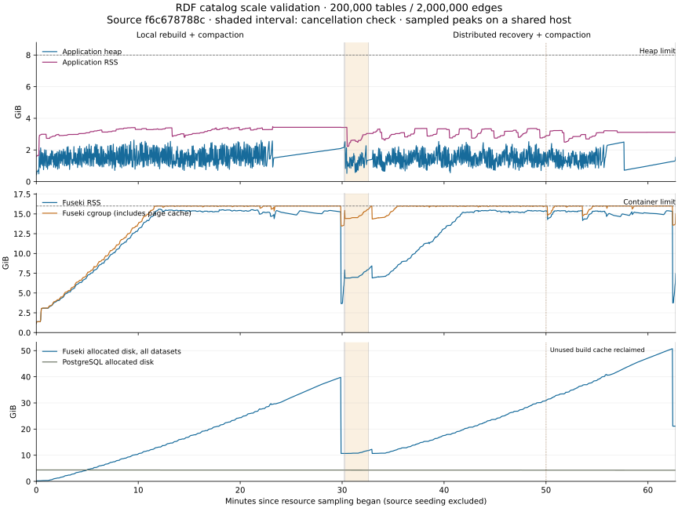

# RDF catalog scale validation

`scripts/rdf-catalog-scale.sh` exercises the full OpenMetadata application, PostgreSQL, and the
shipped Apache Jena Fuseki image. It measures the acceptance criteria in
[#32057](https://github.com/open-metadata/OpenMetadata/issues/32057).

## Validated result (2026-09-08)

The complete scenario passed on revision
[`f6c678788c`](https://github.com/open-metadata/OpenMetadata/commit/f6c678788c12c79763f5b72723d6df5dbbf707b6),
from 22:25:46 to 23:37:59 UTC. The fixture contained 200,000 tables, 2,386,000 columns, and
2,000,000 lineage edges. Source seeding took 547.036 seconds and is excluded from rebuild timings.

Both rebuilds processed **200,555 records with zero failures**. Independent graph counts verified
200,000 tables, 2,000,000 triples for each of the three lineage predicates, 20,000 detailed edges,
400 extension entries, and **26,952,284 total triples**. These counts matched after local rebuilding,
distributed recovery, and Fuseki restart. The column count describes the source fixture; the graph
assertions are the counts listed above.

Cancellation stopped a distributed job after 5,067 successful records and zero failures. The
serving pointer remained `openmetadata_a`, and the served graph counts remained unchanged.
The entire interruption scenario took 139.066 seconds, including starting work, cancellation,
verification, and worker shutdown; this is not a measurement of stop-request latency.
Recovery promoted `openmetadata_b` and completed **63 partitions with zero retries**. Worker
samples peaked at three coordinator workers and zero participant workers. Fuseki restart and
verification took 10.045 seconds and preserved the promoted dataset and graph counts.

### Rebuild and resource measurements

Wall-clock time includes compaction, promotion, and waiting for worker shutdown. Application time
is the terminal run record's duration. Resource figures are sampled peaks in GiB.

| Measurement | Local rebuild | Distributed recovery |
|---|---:|---:|
| Observed wall clock | 1,796.651 s (29m 57s) | 1,794.809 s (29m 55s) |
| Application time | 1,794.111 s | 1,792.858 s |
| Successful records / second, including compaction | 111.6 | 111.7 |
| Application heap | 2.624 | 2.537 |
| Application RSS | 3.481 | 3.364 |
| Fuseki RSS | 15.591 | 15.482 |
| Fuseki cgroup memory, including page cache | 16.000 | 16.000 |
| Fuseki allocated disk, all datasets | 39.771 | 50.731 |
| PostgreSQL cgroup memory | 4.267 | 4.330 |
| PostgreSQL allocated disk | 4.356 | 4.310 |

After compaction, Fuseki occupied **10.665 GiB after local rebuilding** and **21.122 GiB after
recovery**, when both complete blue/green datasets coexisted. Provision for the **50.731 GiB
observed peak**, additional database storage, and free-space headroom, rather than using the
compacted graph size as the rebuild storage requirement. The run retained at least 17.913 GiB
of free host disk, above the harness's 12 GiB reserve.



The chart contains 1,769 resource samples. Sampling starts after source seeding and ends after
recovery queries, before Fuseki restart. The shaded interval is the cancellation check. The
dotted marker records the host build-cache cleanup described below.

### Populated-store query latency

All **2,624 queries returned nonempty results without errors** through the authenticated
OpenMetadata SPARQL API. Values below are milliseconds. Each type has 100 samples after each
completed phase and 356 while recovery runs, including compaction and promotion.

| Phase | Query | Samples | p50 | p95 | p99 | Maximum |
|---|---|---:|---:|---:|---:|---:|
| After local rebuild | Entity lookup | 100 | 10.29 | 12.69 | 14.79 | 20.04 |
| After local rebuild | One-hop lineage | 100 | 9.06 | 11.28 | 12.03 | 12.18 |
| After local rebuild | Three-hop lineage | 100 | 10.36 | 13.01 | 15.49 | 30.70 |
| After local rebuild | Text search | 100 | 12.15 | 16.53 | 18.85 | 311.69 |
| During recovery | Entity lookup | 356 | 7.42 | 10.87 | 20.01 | 66.60 |
| During recovery | One-hop lineage | 356 | 8.08 | 11.62 | 26.41 | 110.30 |
| During recovery | Three-hop lineage | 356 | 8.98 | 12.34 | 20.18 | 347.12 |
| During recovery | Text search | 356 | 11.05 | 17.11 | 43.52 | 142.67 |
| After recovery | Entity lookup | 100 | 7.99 | 11.40 | 13.18 | 13.61 |
| After recovery | One-hop lineage | 100 | 7.21 | 10.69 | 11.96 | 17.26 |
| After recovery | Three-hop lineage | 100 | 8.12 | 11.72 | 45.75 | 48.13 |
| After recovery | Text search | 100 | 10.20 | 13.11 | 40.82 | 43.36 |
| After restart | Entity lookup | 100 | 9.20 | 11.86 | 13.05 | 15.66 |
| After restart | One-hop lineage | 100 | 8.98 | 11.41 | 12.57 | 13.95 |
| After restart | Three-hop lineage | 100 | 10.18 | 13.07 | 19.47 | 38.30 |
| After restart | Text search | 100 | 14.80 | 21.84 | 30.42 | 107.08 |

These are bounded interactive queries with a warm store, as described below. The maximum during
recovery was 347.12 ms; low percentiles do not eliminate these outliers. Integrity counts warm the
store before each completed-phase measurement, including after restart.

### Measured configuration and evidence

The host was an Apple M4 Max with 16 cores and 128 GiB RAM, running native Microsoft Java 21.0.11.
Docker had 10 CPUs and 65,197,199,360 bytes (60.72 GiB) of memory available. Application, Fuseki,
and PostgreSQL limits were the defaults listed below. The Fuseki image used Apache Jena 6.2.0
with the shipped write extension and Lucene assemblers:

- Fuseki image ID: `sha256:7a92a910c295f21e770b52768f2b901f01accd8fc307f7702e9cec54f435e8da`.
- PostgreSQL 15 image ID: `sha256:1659a1a994f204ed0397ff17a73d72d27128bfa7d420bd7288ad5e8eb28fa588`.

The successful run used larger batches than the launcher's defaults. With the measured revision
and its artifacts already built, the command was:

```bash
BUILD=false BUILD_IMAGE=false \
RDF_SCALE_FUSEKI_IMAGE=rdf-review-minnetonka:fuseki \
RDF_SCALE_BATCH_SIZE=5000 \
RDF_SCALE_APPEND_PAYLOAD_BYTES=67108864 \
RDF_SCALE_APPEND_ENTITY_BATCH_SIZE=5000 \
RDF_SCALE_LINEAGE_EDGE_BATCH_SIZE=10000 \
RDF_SCALE_OUTPUT=.context/rdf-scale-200k-2m-lease-fixed-20260908 \
scripts/rdf-catalog-scale.sh
```

`JAVA_HOME` pointed to the native Java 21 runtime. Build the corresponding sources and Fuseki
image before reusing artifacts; omit `BUILD=false BUILD_IMAGE=false` to build through the launcher.
The configuration retained two producers, three consumers, a 5,000-record queue, and a configured
10,000-record partition size.

This was a shared host: sampled load averaged 39.46 and peaked at 75.58, free host memory reached
0.082 GiB, and 18.934 GiB of swap was already in use. At 23:24:54 UTC during recovery, unused Docker
build cache last accessed more than seven days earlier was pruned to restore compaction headroom;
Docker reported 8.287 GB reclaimed. The elapsed time and all resource/query samples include this
operation. Its command and observed completion are retained in the environment-events artifact.
These measurements establish a successful scenario for this workload and configuration. They do
not quantify speedup against `main`, multi-node scaling, or live-ingestion throughput.

The [raw evidence and SHA-256 manifest](artifacts/rdf-scale/2026-09-08-200k-validated/manifest.json)
contain the unchanged report, compressed resource/progress/query samples, and environment events.
All eight published files were checked against their source hashes and decompressed contents;
query sample counts, percentiles, maxima, nonempty results, snapshots, and claim counters were
also checked independently. Earlier unsuccessful attempts and the run that exposed worker bugs
remain published in the findings sections below.

Validation accompanying the fixes passed: 136 focused service unit tests, one resource-sampler
unit test, nine partition-lease integration cases on each of PostgreSQL and MySQL, and three
live-projection integration tests covering durable recovery and glossary-tag patches. The
2,000-table / 20,000-edge smoke scenario also passed with no retries or duplicate workers.
[CI for the measured revision](https://github.com/open-metadata/OpenMetadata/pull/32262/checks?sha=f6c678788c12c79763f5b72723d6df5dbbf707b6)
finished with 154 successful checks, 21 skipped checks, and no failures, including the RDF
Playwright workflow. Migration corrections remain in the unreleased **2.0.2** migration.

## Reproduce

Run from a configured Java 21 development checkout with Docker available:

```bash
scripts/rdf-catalog-scale.sh
```

Set `JAVA_HOME` to a Java 21 runtime matching the host architecture. Both Maven and the launcher
use it; `JAVA_BIN` overrides the launch executable when needed.

The script builds the Maven dependencies and Fuseki image, starts isolated containers, and writes
the application log, report, resource samples, and individual query timings under
`.context/rdf-catalog-scale/`. It removes its containers when the test finishes. Existing local
services are separate. The test requires the dedicated launcher and is disabled in ordinary
integration-test runs. The script enables it explicitly with `rdfCatalogScale=true`.

For a smaller verification run:

```bash
RDF_SCALE_TABLES=2000 RDF_SCALE_EDGES=20000 RDF_SCALE_QUERY_SAMPLES=10 \
  RDF_SCALE_OUTPUT=.context/rdf-scale-pilot scripts/rdf-catalog-scale.sh
```

After building, `BUILD=false BUILD_IMAGE=false` reuses the compiled artifacts, classpath file, and
image. Rebuild after source changes. `RDF_SCALE_FUSEKI_IMAGE` selects an existing image built from
`docker/rdf-store`; it must include the OpenMetadata write extension and text dataset assemblers.
The restart test reserves host port 43030; set `RDF_SCALE_FUSEKI_PORT` if it is already in use.

## Workload and measurements

The default fixture contains 200,000 tables and 2,000,000 distinct, acyclic lineage edges. Normal
tables have seven columns; every hundredth table has 500. Every hundredth lineage edge has SQL,
provenance metadata, and column lineage. Every thousandth table also has custom properties.
Parents and custom-property definitions are created through the API. Tables, relationships, and
extension values are streamed into the initialized PostgreSQL database with `COPY`, then sampled
through the table API. This separates source seeding
time from RDF rebuild time and avoids including Elasticsearch construction in the measurement.

The current ontology writes **three direction/provenance triples per edge**: `om:upstream`,
`om:downstream`, and `prov:wasDerivedFrom`. Two million edges therefore contribute six million
triples before their detail resources. The harness asserts all three counts independently, the
detail count, and the table count. It also records the complete knowledge-graph triple count.

The scenario executes these steps:

1. Rebuild all entity types through the local RDF indexing application with blue/green promotion.
2. Measure entity lookup, one-hop lineage, three-hop lineage, and Lucene text-search latency through
   the authenticated OpenMetadata SPARQL API.
3. Start a distributed rebuild, wait for at least 100 successfully processed records, and cancel it
   through the application API. Assert `stopped`, an unchanged serving pointer, and unchanged graph
   counts. Wait for the cancelled workers to finish releasing their rebuild lease before retrying.
4. Run a complete distributed recovery rebuild while querying the serving dataset every five
   seconds. Verify promotion, zero failed records, exact counts, and successful query responses.
5. Restart Fuseki and verify the serving pointer, counts, and all four query types again.

Each completed query phase contains 100 samples per type by default. Concurrent sampling runs
until the rebuild ends, bounded at 2,000 samples per type. Queries return at most 100 rows, and
text search returns at most 20. These are bounded interactive queries; the three-hop query does
not compute unrestricted transitive closure. Integrity counts run before the query phases and
warm the store, including after restart. Latencies are end-to-end API measurements, with no
claimed cold-cache result. Entity and lineage queries rotate through deterministic table IDs
across the catalog; text search repeats the fixture's description term.

Resources are sampled approximately every two seconds, plus collection overhead. The JSONL file
records application heap and RSS, Fuseki RSS and cgroup memory, PostgreSQL cgroup memory, allocated
disk under both data directories, remaining host disk and memory, swap usage, and host load average.
Cgroup memory includes page cache.
Reported peaks are sampled peaks, not instantaneous high-water marks. Sampling covers target
clearing/compaction, rebuilds, cancellation, and coexistence of serving and target datasets.
Observed rebuild time includes waiting for compaction and worker shutdown. The report
also records when the application first reported a terminal status. TDB2 copies index pages even
during append-only transactions, so full rebuilds compact after loading as well as after clearing
the previous generation. Blue/green runs compact the target before promotion while the previous
dataset continues serving live writes.
The sampler fails the run if host free disk falls below 12 GiB.

## Correctness checks added during validation

The pilot exposed differences between live projection and batch rebuilding. The tested revision
uses stable custom-property definition IDs and removes owned definition triples during replacement
and deletion. Batch reads now include role members, team children and inherited roles, and type
custom-property definitions. Existing stores require a full rebuild to remove already orphaned
definition nodes.

`RdfCustomPropertyProjectionTest` exercises real Jena updates, repeated projection, legacy linked
nodes, and isolation between types. `RdfBatchFieldsIT` and the custom-property case in
`TypeResourceIT` compare database-backed batch reads with entity API responses. The catalog
scenario additionally requires identical table, lineage, extension, and total-triple counts after
local rebuilding, distributed recovery, and Fuseki restart.

## Storage-pressure findings (2026-09-08)

The following attempts used the complete 200,000-table / 2,000,000-edge source fixture. None
completed the full validation scenario. They establish storage constraints, not successful
full-catalog timings or a controlled comparison between configurations.

| Application batch | Lineage batch | Append budget | Last observed successful records | Peak Fuseki disk (GiB) | Outcome |
|---:|---:|---:|---:|---:|---|
| 100 | 50 | 16 MiB | 27,156 | 17.671 | Operator stopped for projected disk growth |
| 1,000 | 1,000 | 16 MiB | 78,356 | 22.828 | Operator stopped for projected disk growth |
| 1,000 | 10,000 | 16 MiB | 200,441 | 57.343 | Free-disk reserve reached during compaction |

The first two runs reported `stopped`, zero failed records, and an unchanged serving pointer.
Their observed durations through worker shutdown were 572.128 and 623.044 seconds. The third
entered post-load compaction 1,422.900 seconds after the local rebuild started, then the harness
failed when host free disk crossed its 12 GiB reserve. Its last persisted progress counter was
200,441 of 200,555 records with zero failed records; promotion, graph counts, query latency,
cancellation, recovery, and restart were not validated in that attempt. Its sampled application
heap peaked at 1.583 GiB, application RSS at 2.422 GiB, and Fuseki cgroup memory at its 16 GiB cap.
The disk figure includes the unfinished compaction generation and is not the final graph size.

Raw evidence, source revisions, and SHA-256 manifests are retained for the
[100-record attempt](artifacts/rdf-scale/2026-09-08-aborted-batch-100/manifest.json),
[1,000-edge attempt](artifacts/rdf-scale/2026-09-08-aborted-lineage-1000/manifest.json), and
[compaction reserve failure](artifacts/rdf-scale/2026-09-08-failed-compaction-reserve/manifest.json).
JSON reports are unchanged; JSONL resource and progress samples use reproducible gzip compression.
Failure metadata distinguishes manual cancellation from an actual resource-guard failure.

## Distributed worker findings (2026-09-08)

Revision `a3e202811e4f57f8592bf3def8cdd6754a734274` completed the full scenario with application and
append batches of 5,000, a 64 MiB append budget, and 10,000-edge lineage batches. Local rebuilding
took 1,895.633 seconds and distributed recovery took 1,808.323 seconds, including compaction.
Both processed 200,555 records with zero failed records. Each verified graph contained 200,000
tables, all three sets of 2,000,000 lineage triples, 20,000 detailed edges, 400 extension entries,
and 26,952,284 triples in total. Cancellation preserved the serving graph, and restart preserved
the promoted dataset and its counts.

That run also exposed duplicate participation: three participant workers joined the three
coordinator workers in the same process while partition cursors were being prepared. Participant
workers lacked heartbeats, and four active partitions were reclaimed. These timings therefore
do not establish performance for the intended three-worker configuration. The
[report and raw measurements](artifacts/rdf-scale/2026-09-08-200k-lease-findings/manifest.json)
retain these findings alongside the successful scenario assertions.

The fixes reserve the coordinator's job before partition initialization, renew claims throughout
both coordinator and participant execution, interrupt workers even after graceful shutdown has
started, and require the original server and claim timestamp for progress, heartbeat, completion,
and failure updates. Reassignment to the same server also invalidates the old claim. Claim fencing
uses existing database columns.

The MySQL integration run additionally exposed missing timing columns. The 2.0.2 migration reused
identical `PREPARE`, `EXECUTE`, and `DEALLOCATE` statements for three conditional column additions.
The migration runner deduplicates statements by text, so only the first addition executed. Each
column now uses a distinct prepared statement name. This correction remains in the unreleased
2.0.2 migration; the equivalent PostgreSQL columns already migrate correctly.

`DistributedRdfIndexExecutorTest` reproduces the initialization and shutdown races.
`RdfPartitionHeartbeatTest` exercises the real scheduler with the database boundary stubbed.
`RdfPartitionLeaseIT` checks stale writes and active heartbeats against a real database, including
the coordinator and worker paths. The scale harness now records platform worker counts in each
resource sample and fails distributed recovery if it observes local participant workers, exceeds
three coordinator workers, or finds a partition retry.

## Runtime configuration and scope

Defaults are an 8 GiB OpenMetadata heap; a 4 GiB Fuseki heap inside a 16 GiB, six-CPU container;
and an 8 GiB, two-CPU PostgreSQL 15 container. Both databases use disk-backed container storage,
not tmpfs. PostgreSQL durability is enabled (`fsync`, `synchronous_commit`, `full_page_writes`).
The integration bootstrap retains its other PostgreSQL settings, including 128 MiB shared
buffers, 32 MiB work memory, minimal WAL, and a 30-second checkpoint timeout.

Indexing uses batch size 1,000, two producer threads, three consumer threads, queue size 5,000, and
10,000-record distributed partitions. All entity types are requested, including the system
entities created at startup. Scheduled RDF indexing and inference jobs are paused during the
scenario so their independent writes do not alter the workload. On-demand rebuilds remain enabled.
The report records image identity, source revision, settings, job statistics, timestamps, and
resource limits.

`RDF_SCALE_BATCH_SIZE` overrides the indexing batch size. `RDF_SCALE_LINEAGE_EDGE_BATCH_SIZE`
sets the server's existing `bulkLineageEdgeBatchSize` configuration, also to 1,000 by default for
this workload. Lineage transactions have their own limit; increasing the application batch size
alone leaves the server's default 50-edge chunks unchanged. `RDF_SCALE_APPEND_PAYLOAD_BYTES`
and `RDF_SCALE_APPEND_ENTITY_BATCH_SIZE` override the server's existing append limits (defaults:
16 MiB and 1,000 entities). The report records these effective settings even if a run fails before
promotion. The shipped Fuseki extension additionally enforces a 64 MiB upload cap and a write
deadline. Larger batches reduce TDB2 transaction churn; the storage layer still splits appends
at its entity-count and payload limits. The first
200,000-table attempt used batches of 100 and was stopped for persistent index growth before
exhausting the host disk. That attempt is not a completed scale result. See
[Jena's storage FAQ](https://jena.apache.org/documentation/tdb/faqs.html) for the copy-on-write
storage model and the extra disk space required during compaction.

This is a synthetic table-heavy catalog on one application process, one metadata database, and
one Fuseki instance. Distributed mode exercises the partition coordinator and workers within that
application process; it does not establish multi-node scaling. Restart persistence and rebuild
isolation do not provide Fuseki high availability. Live ingestion throughput, long-running
inference, mixed-asset production distributions, and a controlled comparison against `main`
require separate measurements. Run the same harness on the intended storage and network before
using these results as a production capacity guarantee.
