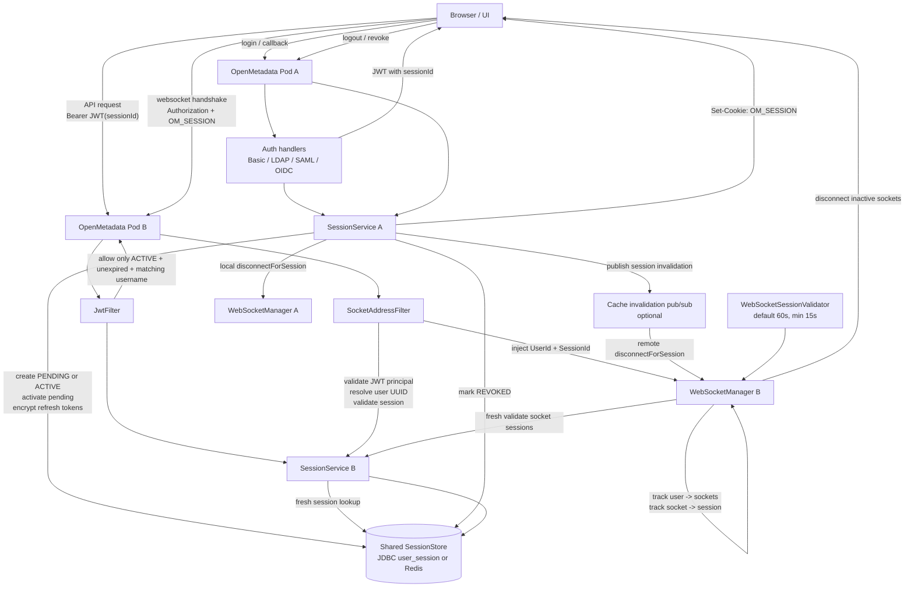

# Multi-Node Session and WebSocket Session Management Design

## 1. Status

This document describes the current server-side session and websocket session design for
OpenMetadata issue [#21971](https://github.com/open-metadata/OpenMetadata/issues/21971).

The implementation is centered on these files:

- `openmetadata-service/src/main/java/org/openmetadata/service/security/session/SessionService.java`
- `openmetadata-service/src/main/java/org/openmetadata/service/security/session/SessionStore.java`
- `openmetadata-service/src/main/java/org/openmetadata/service/security/session/JdbcSessionStore.java`
- `openmetadata-service/src/main/java/org/openmetadata/service/security/session/RedisSessionStore.java`
- `openmetadata-service/src/main/java/org/openmetadata/service/security/session/SessionStoreFactory.java`
- `openmetadata-service/src/main/java/org/openmetadata/service/security/JwtFilter.java`
- `openmetadata-service/src/main/java/org/openmetadata/service/security/jwt/JWTTokenGenerator.java`
- `openmetadata-service/src/main/java/org/openmetadata/service/socket/SocketAddressFilter.java`
- `openmetadata-service/src/main/java/org/openmetadata/service/socket/WebSocketManager.java`
- `openmetadata-service/src/main/java/org/openmetadata/service/OpenMetadataApplication.java`
- `openmetadata-service/src/main/java/org/openmetadata/service/cache/CacheBundle.java`

## 2. Problem

Server-managed login state used to depend on pod-local servlet state. That breaks in a multi-node
deployment because login, callback, refresh, logout, and websocket reconnects can land on different
pods.

The key failure modes are:

- A login or OIDC/SAML callback starts on one node and completes on another.
- Refresh state is unavailable when the request is routed to a different node.
- Logout or session revocation is not visible to all nodes.
- A websocket can remain connected after the browser session is revoked.
- A secure websocket handshake can be spoofed if the server trusts a client-supplied `userId`.

## 3. Goals

1. Store server-managed user sessions in a shared, authoritative backend.
2. Support both JDBC-backed sessions and Redis-backed sessions.
3. Bind newly issued browser access JWTs to the server-side session that issued them.
4. Keep provider refresh tokens and OpenMetadata refresh tokens server-side.
5. Make refresh safe under cross-node concurrency.
6. Make logout and revocation visible to API and websocket paths.
7. Reject websocket handshakes whose token principal, cookie session, or requested socket user do not match.
8. Close websocket connections for revoked or expired sessions.

## 4. Non-Goals

1. Changing personal access token or bot token semantics.
2. Replacing the browser-managed public OIDC flow.
3. Making legacy JWTs without a `sessionId` claim retroactively session-bound.
4. Guaranteeing instant cross-node websocket disconnect without pub/sub. Without pub/sub, remote
   sockets are closed by periodic validation.

## 5. Architecture

### 5.1 Component Model

| Component | Responsibility |
| --- | --- |
| `SessionService` | Creates, activates, refreshes, revokes, expires, and prunes sessions. Owns the Caffeine near-cache and revocation listeners. |
| `SessionStore` | Shared persistence contract used by both JDBC and Redis stores. |
| `JdbcSessionStore` | Default store backed by the `user_session` table through `SessionRepository`. |
| `RedisSessionStore` | Optional Redis store with key TTLs, per-user status indexes, and Lua compare-and-set on `version` plus index maintenance. |
| `SessionStoreFactory` | Selects Redis when Redis cache is configured and available; otherwise uses JDBC. Refuses Redis-to-JDBC fallback when Redis is configured but unavailable. |
| `SessionCookieUtil` | Reads, writes, validates, and clears the opaque `OM_SESSION` cookie. |
| `JWTTokenGenerator` | Issues OpenMetadata JWTs and can include the `sessionId` claim for session-backed auth flows. |
| `JwtFilter` | Validates JWTs. If the JWT has `sessionId`, it reloads the session from the store and requires an active, unexpired, username-matching session. |
| `SocketAddressFilter` | Validates websocket handshake identity and session state before Socket.IO sees the connection. |
| `WebSocketManager` | Tracks sockets by user and by session, sends events, and disconnects revoked or inactive session sockets. |
| `OpenMetadataApplication` | Wires `SessionService` into auth handlers, websockets, revocation listeners, and the websocket session validator. |
| `CacheBundle` | Handles cache invalidation pub/sub. Session invalidation messages also disconnect sockets on remote pods. |

### 5.2 Storage Selection

`SessionStoreFactory` chooses the store at application startup:

- If `cache.provider = redis` and Redis is available, sessions use `RedisSessionStore`.
- If Redis is configured but unavailable, startup fails closed.
- If Redis is not configured, sessions use `JdbcSessionStore`.

The system does not fail over live from Redis to JDBC. Mixing stores would split active sessions
across backends and make revocation unpredictable.

### 5.3 Session Cache

Each pod keeps a local Caffeine near-cache:

- maximum size: `10_000`
- expire after access: `10s`

The cache is a performance optimization, not a correctness boundary. Security-sensitive checks use
fresh reloads where revocation must be observed immediately.

## 6. User Session Management

### 6.1 Session ID

`UserSession.id` is an opaque bearer secret carried in the `OM_SESSION` cookie.

It is generated by `SessionIdGenerator` from secure random bytes and base64url encoded without
padding. It is not a UUID.

### 6.2 Session Types

Current session types:

- `AUTH`: browser or interactive user auth session.
- `MCP`: reserved for future interactive MCP session support.

### 6.3 Session Status

`SessionStatus` values:

- `PENDING`: login started, callback not completed.
- `ACTIVE`: usable session.
- `REFRESHING`: one node holds the refresh lease.
- `REVOKED`: logout or session-limit revocation.
- `EXPIRED`: timeout reached.

### 6.4 Session Fields

The important logical fields are:

```json
{
  "id": "opaque-session-id",
  "type": "AUTH",
  "provider": "openmetadata",
  "status": "ACTIVE",
  "userId": "uuid",
  "username": "alice",
  "email": "alice@example.com",
  "omRefreshToken": "fernet:encrypted-token",
  "providerRefreshToken": "fernet:encrypted-provider-token",
  "redirectUri": "https://ui.example.com/callback",
  "state": "oidc-state",
  "nonce": "oidc-nonce",
  "pkceVerifier": "pkce-verifier",
  "version": 7,
  "refreshLeaseUntil": 1741300000000,
  "createdAt": 1741200000000,
  "updatedAt": 1741200005000,
  "lastAccessedAt": 1741200005000,
  "expiresAt": 1743792000000,
  "idleExpiresAt": 1741804800000
}
```

Refresh tokens are encrypted before persistence with `Fernet.encryptIfApplies(...)`. If the Fernet
key is not configured, session creation fails instead of writing plaintext refresh tokens.

### 6.5 Session Creation

Basic, LDAP, and OpenMetadata login create an `ACTIVE` session directly:

1. Validate credentials.
2. Resolve the provisioned OpenMetadata user.
3. Persist or receive the OpenMetadata refresh token.
4. Create an `ACTIVE` `AUTH` session.
5. Encrypt and store the refresh token in the session.
6. Write the `OM_SESSION` cookie.
7. Return an OpenMetadata-signed JWT with a `sessionId` claim.

If user lookup or session creation fails after a refresh token is created, the refresh token is
deleted.

### 6.6 Pending Session Activation

SAML and confidential OIDC use pending sessions:

1. Login creates a `PENDING` `AUTH` session containing redirect state, OIDC state, nonce, and PKCE
   verifier when applicable.
2. The callback loads the pending session from the shared store.
3. The user is created or updated.
4. The OpenMetadata refresh token is inserted.
5. `activatePendingSession` expires the pending session.
6. A brand-new active session ID is generated and stored.
7. The active session cookie replaces the pending cookie.
8. The browser receives an OpenMetadata-signed JWT with the active session ID.

Issuing a new active session ID during activation is the session fixation defense. The pre-auth
cookie value is never reused for the authenticated session.

If activation fails, the newly inserted refresh token is deleted and no JWT is issued.

### 6.7 Refresh

Refresh is guarded by an optimistic lease:

1. Load the session from `OM_SESSION`.
2. Reject missing, expired, pending, revoked, or already expired sessions.
3. If another node holds a non-stale `REFRESHING` lease, return retry guidance through
   `SessionRefreshInProgressException`.
4. Acquire the lease by writing `REFRESHING`, setting `refreshLeaseUntil`, and incrementing
   `version` with compare-and-set.
5. The winning node decrypts the stored refresh token.
6. The provider or OpenMetadata refresh token is rotated as needed.
7. `completeRefresh` writes the refreshed session back to `ACTIVE`, clears the lease, updates idle
   expiry without extending beyond the absolute session expiry, and increments `version`.
8. The response contains a new OpenMetadata-signed JWT bound to the same session ID.

Lease duration is currently `15s`.

### 6.8 Logout and Revocation

Logout calls `SessionService.revokeSession(request, response)`:

1. Read `OM_SESSION`.
2. Reload the session from the authoritative store.
3. Write `REVOKED` with compare-and-set.
4. Clear `refreshLeaseUntil`.
5. Clear the `OM_SESSION` cookie.
6. Notify local revocation listeners.

Session limit enforcement also uses `revokeSession` for least-recently-used active sessions.

The limit is configured by `authenticationConfiguration.maxActiveSessionsPerUser`, exposed through
`AUTHENTICATION_MAX_ACTIVE_SESSIONS_PER_USER` in `openmetadata.yaml`. The default is `5`; values
below `1` fall back to the default.

### 6.9 Expiration and Cleanup

`SessionService` runs cleanup every `15m`:

- mark expired sessions as `EXPIRED`
- prune `REVOKED` and `EXPIRED` rows after `7d`
- process in bounded batches

For Redis, primary keys have TTLs and cleanup methods are no-ops. Session correctness still relies
on in-process status and expiry checks.

Default timeouts:

- pending session timeout: `10m`
- authenticated session expiry: `authenticationConfiguration.sessionExpiry`, default `7d`
- refresh lease: `15s`
- cleanup retention: `7d`

The `OM_SESSION` cookie max age is rewritten during refresh lease acquisition and is capped at the
remaining effective session lifetime.

## 7. Session-Bound JWTs

Server-managed auth flows return OpenMetadata-signed access JWTs with:

```json
{
  "sub": "alice",
  "tokenType": "OM_USER",
  "sessionId": "opaque-session-id"
}
```

`JwtFilter` handles the claim as follows:

1. Validate the JWT signature, expiry, token type, principal, and token-specific rules.
2. If there is no `sessionId` claim, preserve existing stateless behavior.
3. If `sessionId` exists, call `SessionService.getFreshSessionById(sessionId)`.
4. Require:
   - session exists
   - status is `ACTIVE`
   - session is not expired
   - session username matches the JWT principal
5. Reject the token when any check fails.

This means session-backed browser API requests now consult the shared session store. That is an
intentional tradeoff in the current implementation: revocation is observed on the next request
instead of waiting for access-token expiry. PATs, bot tokens, and legacy JWTs without `sessionId`
remain stateless.

## 8. WebSocket Session Management

### 8.1 Handshake Validation

`SocketAddressFilter` runs before the Socket.IO server receives the connection.

When secure websocket connections are enabled:

1. Extract and validate the `Authorization` header.
2. Resolve the token principal from JWT claims.
3. Resolve the principal's user UUID server-side.
4. Reject the request if the query `userId` is present and does not match the resolved user UUID.
5. Inject the server-resolved `UserId` header for `WebSocketManager`.
6. If the JWT has `sessionId`, inject a `SessionId` header.
7. Validate `OM_SESSION` when present:
   - reload the session fresh
   - require `ACTIVE`
   - require not expired
   - require session username to match the token principal
   - require cookie session ID to match token `sessionId` when both are present

If no `OM_SESSION` cookie is present:

- session-bound JWTs are accepted because `JwtFilter` has already validated the session ID
  against `SessionService`
- legacy secure JWTs without `sessionId` are rejected with `401 Session is required`
- non-secure websocket mode remains compatible with existing query-based behavior

The filter no longer forwards trust from the user-supplied `userId` query parameter when secure
mode is enabled.

### 8.2 Socket Tracking

`WebSocketManager` maintains two local maps per pod:

- `activityFeedEndpoints`: `userId -> socketId -> SocketIoSocket`
- `socketSessionIds`: `socketId -> sessionId`

On connection:

1. Read `UserId` from the injected header, falling back to query only for legacy/non-secure paths.
2. Read `SessionId` from the injected header, falling back to query `sessionId` only for legacy
   paths.
3. Store the socket in the user's local socket map.
4. Store the socket-to-session mapping when a session ID is available.

On disconnect, both maps are cleaned up.

The connection log records user and remote address only. It does not log initial headers, so bearer
tokens are not written to logs.

### 8.3 Revocation-Driven Disconnect

`SessionService` exposes revocation listeners. `OpenMetadataApplication` registers a listener that:

1. Converts the revoked session's `userId` to UUID.
2. Calls `WebSocketManager.disconnectForSession(userId, sessionId)` on the local pod.
3. Publishes a `"session"` invalidation message through cache invalidation pub/sub when available.

`CacheBundle` handles remote `"session"` invalidation messages:

- if the message has a session ID, call `disconnectForSession(userId, sessionId)`
- if no session ID is present, fall back to `disconnectAllForUser(userId)` for backward
  compatibility

This gives targeted disconnects. Logging out one browser session does not force-close other
sessions for the same user.

### 8.4 Periodic WebSocket Validation

`OpenMetadataApplication.WebSocketSessionValidator` runs every `60s` by default. Operators can tune
the interval with the `openmetadata.websocketSessionValidationIntervalSeconds` system property or
the `WEBSOCKET_SESSION_VALIDATION_INTERVAL_SECONDS` environment variable. Values below `15s` are
clamped to `15s`.

Each run calls `WebSocketManager.disconnectInactiveSessions(sessionService, intervalMillis)`, which:

1. Iterates local sockets with known `sessionId`.
2. Reloads a socket's session fresh through `SessionService.getFreshSessionById` only when that
   socket's revalidation interval is due.
3. Disconnects sockets whose session is missing, not `ACTIVE`, expired, or owned by a different
   user.

This is the fallback when there is no cross-pod pub/sub. With JDBC and no pub/sub, a socket on a
remote node is closed within the validator interval instead of immediately.

## 9. End-to-End Flow



## 10. Consistency Model

### 10.1 API Requests

For tokens with `sessionId`, the session store is authoritative. A revoked or expired session is
rejected on the next API request that uses that token.

For tokens without `sessionId`, existing stateless behavior is preserved.

### 10.2 Refresh

Refresh uses optimistic compare-and-set on `version`, so only one node can hold the refresh lease
for a session at a time.

JDBC implements this through the session repository update path. Redis implements it with a Lua CAS
script over the stored session JSON. The Redis script also removes the session ID from all
non-terminal per-user status indexes and adds it to the target non-terminal index before returning,
so the JSON write and index movement succeed or fail together.

### 10.3 WebSockets

Websocket consistency has two layers:

- event-driven disconnect through local revocation listeners and optional cache invalidation pub/sub
- polling-based validation with a `60s` default interval and `15s` minimum

The event path is immediate when revocation occurs on the same pod or pub/sub delivers the remote
event. The polling path bounds staleness when pub/sub is unavailable, and each socket is fresh
loaded at most once per validation interval.

## 11. Operational Characteristics

| Path | Store behavior |
| --- | --- |
| Login | create active or pending session |
| OIDC/SAML callback | fresh load pending session, expire pending session, create active session |
| Session-bound API request | fresh load session by `sessionId` |
| Refresh | load session, acquire CAS lease, complete CAS update |
| Logout | fresh load session, CAS revoke, clear cookie |
| WebSocket handshake | validate JWT, optionally fresh load cookie session |
| WebSocket validator | throttled fresh load for each tracked socket with `sessionId` |

Redis deployments should monitor Redis availability as auth-critical infrastructure. When Redis is
configured for sessions, the service refuses to start without it.

## 12. Security Properties

1. `OM_SESSION` is opaque and high entropy.
2. `OM_SESSION` is written as an HTTP-only cookie.
3. Provider refresh tokens and OpenMetadata refresh tokens are encrypted at rest.
4. Refresh tokens are not returned to the browser by server-managed auth flows.
5. Pending-session activation issues a brand-new active session ID.
6. Session-bound JWTs are invalid once the backing session is revoked, expired, deleted, or owned by
   a different user.
7. Secure websocket mode derives socket user identity from the JWT principal, not from query params.
8. Websocket logs do not include initial headers or bearer tokens.
9. Revocation targets the revoked session instead of disconnecting every socket for the user.

## 13. Test Coverage

Relevant unit coverage includes:

- `SessionServiceTest`
- `SessionCookieUtilTest`
- `SessionTimeoutResolverTest`
- `SessionStoreContractTest`
- `RedisSessionStoreTest`
- `JwtFilterTest`
- `BasicAuthServletHandlerTest`
- `LdapAuthServletHandlerTest`
- `SamlAuthServletHandlerTest`
- `AuthenticationCodeFlowHandlerTest`
- `SocketAddressFilterTest`
- `WebSocketManagerTest`

Relevant integration coverage includes:

- `SessionMultiNodeIT`
- `SessionRedisMultiNodeIT`
- `SessionMultiNodeCluster`

Important scenarios covered or expected from this suite:

- login on one node and refresh/logout on another
- pending OIDC/SAML callback state loaded from shared session storage
- refresh lease contention
- stale cache behavior after revocation
- Redis-backed cross-node sessions
- websocket principal binding
- per-session websocket disconnect
- session-bound JWT rejection for revoked sessions

## 14. Tradeoff Resolutions

1. Session-bound browser API requests intentionally reload session state on JWT validation. This is
   the chosen correctness boundary: logout and revocation are observed on the next browser API
   request instead of waiting for access-token expiry.
2. Tokens without `sessionId` remain on existing JWT semantics. This preserves PAT, bot, public OIDC,
   and rolling-upgrade compatibility. New server-managed auth responses include `sessionId`.
3. Non-secure websocket mode remains query-param based only for backward compatibility. Production
   deployments should keep secure websocket connections enabled so `SocketAddressFilter` derives the
   socket user from the JWT principal and records the session ID.
4. The active-session cap is now configurable with
   `authenticationConfiguration.maxActiveSessionsPerUser` and
   `AUTHENTICATION_MAX_ACTIVE_SESSIONS_PER_USER`; the default remains `5`.
5. Secure, session-managed websocket handshakes now record a session ID from the JWT claim or
   `OM_SESSION` cookie. The validator checks those sockets on a configurable interval with a `60s`
   default and `15s` minimum; sockets without session IDs are legacy/non-secure compatibility cases.
6. Cross-pod websocket revocation has two paths: cache invalidation pub/sub for immediate targeted
   disconnects when available, and the configurable websocket validator as the bounded-staleness
   fallback for JDBC-only deployments.
