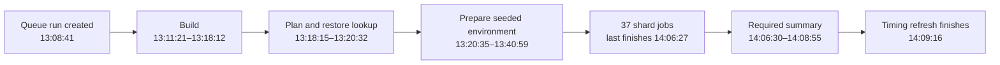

# OpenMetadata Playwright and merge queue audit

Audited on **9 September 2026**, at repository commit **`44823acde1c85ccc20d9f62c588169567fc28c90`**. This is an assessment with reproducible evidence and proposed changes. Application code, tests, workflows, branch rules, and external issues were not changed.

## 1. Decision

**Keep Playwright for browser integration tests. Change the test portfolio and the merge gate.** The evidence does not justify a migration to another browser framework. It does justify reducing repeated full-application work, repairing unreliable tests, making setup reuse effective, and separating trustworthy test verdicts from report production.

The current suite protects substantial real behavior: discovery, metadata editing, lineage interactions, governance, role-dependent UI, ingestion administration, and data quality. It also runs many entity/role/validation combinations through the complete application. Those combinations are candidates for API and component tests, with representative browser journeys retained. A large browser suite is not inherently wrong; its cost and residual failure rate are incompatible with the present queue arrangement.

The strongest findings are:

1. **Queue damage is measurable.** The repository's daily report showed a median total queue wait of **18.6 hours**, a **41% first-pass rate**, and `playwright-summary` associated with **18 dequeued commits**. A separate history query found **598 failed Playwright workflows among 1,331 completed merge-group runs**, or **44.9%**, in the observed September 2–9 window. That is a workflow failure rate, not a test flake rate or a count of unique blocked PRs.
2. **Recent fixes have helped, but current test failures remain.** In the latest 30 completed runs sampled, 25 gates passed and 5 failed. Each failure had a reported test failure; none was an infrastructure-only gate failure. Every run also had at least one test that failed an attempt and passed on retry: **210 retry-rescued cases in total**.
3. **Provisioning is a large, repeated serial cost.** All 30 runs executed seeded-environment preparation. That job took a median **17.05 minutes**, before the shard matrix could run. Median queue-run creation to required Playwright verdict was **61.14 minutes**.
4. **There are reproducible process defects.** Boolean workflow inputs cannot be set to false; the budget-alert expression interprets false as true; its issue lookup also has invalid CLI arguments. A documentation-only change selects the full suite, while a shared lineage helper change omits an actual consumer. The committed generated impact map is stale.
5. **A green run has fidelity limits.** Shared setup disables the application's ETag conditional reads. The default CI bundle also differs from the ordinary build. These are deliberate optimizations/workarounds that need a small test lane exercising normal application behavior.

The first intervention should be targeted reliability and orchestration work. Broadly disabling retries, extending every timeout, adding workers, or moving everything to nightly would leave important problems unresolved.

## 2. What was validated

This audit combines four kinds of evidence:

| Evidence | Scope | What it establishes |
|---|---|---|
| Repository inspection | Main configuration, fixtures, selectors, planner, reporters, workflows, representative specs, lower-level test configuration | Intended execution paths and concrete implementation behavior |
| Live GitHub configuration | Effective rules for `main`, including merge queue and required checks | What actually gates merging, independently of comments and documentation |
| Hosted execution evidence | 1,336 queue workflow records; detailed jobs and artifacts for 30 recent completed runs; three historical incident runs | Observed latency, results, retries, provisioning, and execution accounting |
| Local behavioral checks | 154 Python CI-tooling tests; selector probes; impact-map regeneration; shell-expression reproductions | Several current defects reproduced without changing application code |

The 30-run sample is the latest completed sample at collection time, with start times **2026-09-09 11:04:49–13:08:41 UTC**. It is a short, overlapping operational sample, not 30 independent randomly selected commits. The wider history covers run start times **2026-09-02 00:35:56 through 2026-09-09 14:09:16 UTC**. Five runs were still in progress at that snapshot. Recent workflow changes mean the whole-window rate must not be presented as the unchanged current rate.

The full browser suite was **not rerun locally**. UI dependencies and the full service stack were not installed for this audit. Actual hosted results were inspected instead. A static inventory of all specs is not a line-by-line proof that every assertion is correct, and this report does not claim that.

Evidence is preserved in analysis.json (original local evidence: `analysis.json`), the complete queue history (original local evidence: `queue-runs-complete.json`), [recent run measurements](evidence/recent-queue-runs.csv), [per-spec cost measurements](evidence/representative-spec-costs.csv), and the `runs/` directory. Source links below refer to the audited commit where possible.

## 3. How Playwright is currently used

### 3.1 The principal test system

The application pins `@playwright/test` **1.57.0**. The main configuration uses desktop Chromium, enables parallel execution, normally gives CI three workers per common shard, and retries a failed test once. Defaults are a 60-second test timeout and a 15-second assertion timeout. Dedicated projects reduce concurrency or isolate tests that mutate global settings or perform expensive stateful operations. Traces are normally captured on the first retry and screenshots on failure. The nearby comment promises more than the default configuration actually records; video is not enabled there. [Configuration][config]

This is substantial integration testing: the browser talks to a real OpenMetadata server, backed by PostgreSQL and OpenSearch in the principal queue lane. CI builds the application, prepares a seeded environment, restores/clones that environment into multiple runner jobs, and executes the selected projects. API helpers create much of the prerequisite data. Separate server instances isolate shards, while tests within a shard still need their own entity and user state. [Reusable workflow][reusable]

There are **394 `.spec.ts` files** in the inventoried Playwright tree: 251 under Features, 87 Pages, 34 Flow, 7 Auth, 6 VersionPages, 3 VisualRegression, 3 nightly, 2 Search, and 1 Http2. These are source file counts. They are neither the count of executed tests nor a measure of business coverage.

A representative current green run, [34355232120][representative], reported **4,490 results**: 4,485 passed, 4 passed after retry, and 1 was skipped. Its coverage verifier accounted for **4,488 distinct planned product test IDs**. Some cases are API-only tests run by the Playwright runner. The run used **37 shard jobs**. The timing history breaks the distinct product cases down as follows:

| Project | Cases in this run | Main responsibility |
|---|---:|---|
| chromium | 3,579 | Most feature, page, entity, role, and workflow tests |
| Basic | 345 | Basic-project specs; this is larger than the six-spec PR smoke selection |
| ImportExport | 150 | Import/export behavior, with constrained concurrency |
| AdvancedSearch | 130 | Search query construction and application behavior |
| Ingestion | 86 | UI administration and ingestion-related workflows |
| DataAssetRulesDisabled | 34 | Behavior with global data asset rules disabled |
| DataAssetRulesEnabled | 31 | Behavior with rules enabled |
| SearchRBAC | 29 | Search visibility under access controls |
| Reindex | 28 | Reindex-related behavior |
| IntakeForm | 20 | Intake-form behavior |
| DomainIsolation | 16 | Domain-scoped isolation |
| Data Insight | 14 | Data insight behavior |
| search-nightly | 12 | Search tests that are also included in this full run |
| GlobalSettings | 11 | Global-setting behavior |
| SystemCertificationTags | 3 | System certification settings and tags |

There is a small accounting inconsistency: two invocations of the `data-insight-application` setup test appear in the reporter's product totals. The coverage verifier correctly excludes that lifecycle project, leaving 4,488 planned IDs and 4,488 accounted IDs. Eight other lifecycle entries are reported separately. These counts should remain explicitly named rather than conflated into a single “coverage” number; the product/lifecycle classification should also be made consistent across reporters.

### 3.2 PR selection and queue selection

On pull requests, the selector combines six Basic smoke specs, directly changed specs, a manually maintained impact map, and a generated impact map. Shared infrastructure changes add canaries. Unmapped paths under recognized code roots fall back to the full suite. Merge-group events select the full suite. [Selector][selector], [manual impact map][impact-map]

The six smoke specs cover Login, Navbar, Dashboards, LineageControls, DataMarketplace, and Policies. They are files containing multiple cases, not six individual tests. The shared-infrastructure canary is also substantial: it includes the 353-case Entity spec and dedicated project coverage.

The dispatcher handles both regular PR and fork-PR event paths, along with label-based eligibility. Some workflow records are intentionally skipped/no-op successes. Mixing all event types into one pass-rate calculation would therefore produce a misleading result. This audit's history analysis filters to `merge_group`. [Dispatcher][dispatcher]

### 3.3 Other coverage exists, but “full Playwright” does not mean all of it

| Test system | Observed execution arrangement | Required by the current main rules? |
|---|---|---|
| Main PostgreSQL Playwright suite | PR selection; full merge-group matrix | **Yes**, through `playwright-summary` |
| App Jest tests | 1,419 app `.test` files in the inventory; `ui-coverage` workflow | **Yes**, job-result check; separate Sonar verdict is not required |
| Core component tests | 10 test/spec files; Vitest configuration and Storybook tooling | No separate required core-test check found |
| Java API/integration tests | 347 `*IT.java` files, including 34 `*UIIT.java` files | Main database/search integration checks are required |
| Java Playwright UIITs | PR/merge-group workflow with internal path selection; workflow filename still says nightly | `java-ui-it` is **not** currently required |
| RDF / knowledge graph Playwright | Separate workflow and summary | `playwright-rdf-summary` is **not** required |
| Visual regression | Three spec files; pinned Playwright container for rendering parity; UI-path PR trigger | No required visual check |
| External-provider SSO | Scheduled SSO login workflow | No required SSO check |
| Mock OIDC Playwright config | Separate Chromium/WebKit config exists | No in-repository workflow reference to that config found |
| MySQL/PostgreSQL “nightly” E2E workflows | `workflow_dispatch` in the inspected files | Not evidence of a functioning daily schedule |
| Search “nightly” workflow | Manual trigger, with its project also present in the full main suite | Covered in part by the main suite |

The main suite is not a browser compatibility matrix. There is no broad Firefox, WebKit, or mobile matrix in this gate. Existing isolated WebKit/SSO configuration should not be mistaken for general Safari coverage. I did not find an integrated axe-based accessibility pass in the inspected main Playwright setup. Some locale-specific regressions exist; locale coverage is not completely absent.

The visual workflow's PR paths include `openmetadata-ui/**` but omit `openmetadata-ui-core-components/**`. A component-library-only edit can therefore miss this visual trigger. Its pinned rendering container is a good practice to retain. [Visual workflow][visual]

`ui-coverage` passes on successful or legitimately skipped test jobs. The separate Sonar gate reports its own result. The current rules require the former, not `ui-sonar-gate`; there is no local Jest `coverageThreshold`. Thus a documented 90% new-code target should not be described as an enforced merge requirement without correcting that configuration. A percentage would still not establish that the right behaviors are asserted. [Coverage workflow][yarn-coverage], effective rules (original local evidence: `effective-main-rules.json`)

## 4. What is happening to the merge queue

### 4.1 The actual queue contract

The active [main ruleset][ruleset] allows **five concurrent merge-group builds**, merges between **one and three entries**, requires `ALLGREEN`, and waits up to **240 minutes** for checks. The configured 30-minute minimum-batch wait is not a compulsory extra 30 minutes for every PR: the minimum batch size is one.

Required checks are `java-checkstyle`, `py-checkstyle`, `integration-tests-mysql-elasticsearch`, `integration-tests-postgres-opensearch`, `py-tests-status`, `playwright-summary`, `ui-checkstyle`, and `ui-coverage`.

GitHub builds temporary commits incorporating queued changes. A failed required check can remove an entry and force affected downstream groups to be rebuilt. Merge limits and build concurrency are different controls; increasing the merge batch limit does not simply combine all those test builds into one. [GitHub merge queue documentation](https://docs.github.com/en/repositories/configuring-branches-and-merges-in-your-repository/configuring-pull-request-merges/managing-a-merge-queue)

At the observed 33–38 Playwright shards per full run, five simultaneous queue groups can offer **165–190 shard jobs**, before PR runs and other workflows. This is potential demand, not measured runner saturation. Runner limits, CPU utilization, and billed cost were not available in this audit.

### 4.2 Measured queue health

The repository's [September 9 daily report][daily-run], emitted at 07:31 UTC for the preceding 24 hours, reported:

| Metric | Reported value |
|---|---:|
| Queue depth | 45 |
| Projected drain time at recent throughput | 37 hours |
| Throughput | 1.21 merges/hour |
| Median total wait | 18.6 hours |
| Reported “first-pass” median latency | 7.5 hours |
| First-pass rate | 41% |
| Merged via queue / inferred bypasses | 29 / 7 |
| Wasted passes | 32 |
| Non-merge removals | 24: 18 failed checks, 4 manual, 2 conflicts |
| `playwright-summary` occurrences among failed checks on dequeued commits | 18 |

This establishes that Playwright was a major associated blocker. It does not establish that every one of those removals was caused solely by a flaky browser test. Checks can fail together.

The wider merge-group workflow query produced:

| Run start date, UTC | Success | Failure | Cancelled | In progress at snapshot |
|---|---:|---:|---:|---:|
| September 2 | 88 | 83 | 0 | 0 |
| September 3 | 82 | 140 | 1 | 0 |
| September 4 | 114 | 114 | 0 | 0 |
| September 5 | 82 | 74 | 0 | 0 |
| September 6 | 10 | 6 | 0 | 0 |
| September 7 | 126 | 49 | 1 | 0 |
| September 8 | 109 | 98 | 0 | 0 |
| September 9, partial | 120 | 34 | 0 | 5 |
| **Total** | **731** | **598** | **2** | **5** |

Among 1,331 completed workflows, **44.9% failed**. Workflow creation-to-update duration had a median of 56.92 minutes and p95 of 71.90 minutes. That duration can include post-verdict timing-baseline work; the recent sample below uses the required summary job's completion time instead.

Only three records had `run_attempt=2`. That does not imply little retrying: a newly synthesized queue commit creates a different workflow run, and Playwright's internal test retry does not increment GitHub's workflow attempt counter.

### 4.3 The recent sample separates current problems from old incidents

| Measure | Recent 30 completed runs |
|---|---:|
| Required Playwright verdicts | 25 success, 5 failure |
| Infrastructure-only failed verdicts | 0 |
| Runs with at least one retry-rescued test | 30 / 30 |
| Retry-rescued test cases | 210; median 7/run |
| Required gate latency | Median 61.14 min; p95 71.60 min |
| Seed preparation executed | 30 / 30 |
| Preparation job | Median 17.05 min; p95 21.86 min |
| Build job | Median 6.26 min |
| Summary job | Median 2.44 min |
| Shard count | Median 36; range 33–38 |
| Sum of job execution time | Median 699.97 runner-min/run, about 11.7 runner-hours |
| Total job execution time across sample | About 349.7 runner-hours |

Runner time is the sum of job start-to-completion durations. It is not wall time, dollar cost, or automatically wasted compute. Parallel Playwright worker durations are another measure again and should not be added to runner hours.

The representative run's critical path makes the serial costs visible:



The measured HTML/report-upload phase was 17 seconds in that run, but the entire summary job took 2.42 minutes. Similarly, the shard environment metric excludes the separate 20.4-minute preparation job. Current budget names and phase metrics can look healthy while the complete gate still takes an hour.

### 4.4 Confirmed historical incidents, with current status

**Report infrastructure made a fully executed green matrix red.** In [run 34312746335][report-incident], all 37 shard jobs passed, and timing coverage accounted for all 4,483 planned tests. The summary could not download native JSON results; it reported zero test failures and 75 infrastructure issues, and failed the required gate. The audited HEAD already includes the relaxation from PR #33010 / commit `dfa612d9dd`: merge-group verdicts now require a successful shard matrix and no reported failed tests, while allowing reporting infrastructure problems. This should not be presented as an unfixed current bug.

**Earlier shard terminations lost real execution coverage.** In September 4 runs [33862281607][timeout-incident-1] and [33869395948][timeout-incident-2], 584 of 4,464 planned IDs were missing from reported execution, about 13.1%. Three common shards failed. The current workflow has a 60-minute hang wrapper and 75-minute job timeout, with performance budgets advisory. Those timeout changes mitigate the earlier cutoff, but do not repair test or setup cost. Missing IDs must not be described as successful tests.

**One recent green run correctly tolerated a report dependency failure.** Run [34350084849][report-advisory] recorded a summary dependency-installation issue but passed with a green matrix. That is the intended effect of the reporting-policy change.

## 5. Current failures and why retries are not a strategy

The five failed runs in the recent sample reduce to three test variants:

| Variant | Observed final failures | Evidence and next investigation |
|---|---:|---|
| TestSuitePipelineRedeploy: redeploy all test-suite pipelines | 1 | [Run 34354609470][redeploy-failure] expected deployment statuses `[200, 200]`, received `[400, 200]`. Investigate the specific pipeline and response body. The test creates two pipelines but selects the first two rows in a global listing, not those pipeline IDs. |
| GlobalPageSize: page size persists across pages | 2 | [Run 34350081016][page-size-failure] and [34343844656][page-size-failure-2] exhausted the 60-second test limit. Inspected first-attempt evidence also contains a predicate-wait timeout. Separate slow navigation, state readiness, and incorrect expectations before adjusting a budget. |
| DomainDataProductsWidgets: domain asset count after removal | 2 | [Run 34349824126][widget-failure] and [34349258398][widget-failure-2] exhausted the test limit. Inspected first-attempt evidence includes an expected containment value being null. Review indexing/readiness, server state, and the serial suite's prior mutations. |

These are failed test assertions or timeouts after retries, not proven product defects and not automatically proven flakes. The redeploy 400 may represent a real application/environment failure. The global-row selection is independently visible test fragility regardless of that response's root cause. [Redeploy test][redeploy-spec]

The most repetitive unstable variant was **“Create and resolve description task for Pipeline via UI”**: it failed an attempt and passed on retry in **21 of 30 runs**, or 70% of this sample. A sampled attempt timed out at roughly 60 seconds and the retry passed in roughly 31 seconds. The shared task helper opens the first task card, creating another reason to bind selection to the task created by the test. That is an investigation lead, not proof of this timeout's cause. [Task flow][tasks-spec], [failure frequency data](evidence/repeated-test-failures.csv)

The domain widget suite also has serial dependencies, repeated home-page initialization, and some loader waits whose errors are discarded. A serial journey should either be one coherent test or establish each test's own prerequisites. Broadly swallowing readiness failures delays a useful error until a later timeout. [Widget test][widget-spec]

Playwright starts a fresh worker after a failure; `beforeAll` can run again, and serial groups have group-level retry behavior. Fresh browser state does not undo application database changes. Unique entities, specific selectors, and cleanup remain necessary. [Playwright retry documentation](https://playwright.dev/docs/test-retries)

Recommended handling:

- Keep the current retry allowance during stabilization. Under the observed first-attempt outcomes, every run in this sample would have encountered a failure without retry recovery. This does not predict the exact behavior of a differently scheduled zero-retry run.
- Preserve first-attempt error, response, and trace evidence for identified unstable variants. The default first-retry trace can show a passing retry while missing the original failure.
- Assign a repair owner to each stable test ID and distinguish product regression, test state collision, selector/readiness failure, service failure, and reporting failure.
- Quarantine narrowly, with a linked issue, owner, expiry, replacement protection for critical behavior, and a regularly executed recovery lane.
- Record both final gate success and first-attempt stability. A retry-rescued test remains useful, but its green final result is not evidence of reliability.

The repository already supports `@quarantine` and a `PLAYWRIGHT_RUN_QUARANTINED` opt-in. I found no workflow setting that variable to run the recovery lane. A quarantine facility without an exercised return path can silently reduce coverage. [Quarantine configuration][config]

The current 0.5% flaky-case budget can permit about 22 retry-rescued cases in a 4,490-case run. All recent runs can stay below that threshold while the queue is still unreliable. Gate reliability needs its own target. As an illustrative independent-failure model, `P(all pass) = (1 - q)^4490`; achieving 99% suite success would require residual per-case failure probability near 2.24 parts per million. Real service failures are correlated, so this is an explanation of aggregation sensitivity, not an estimate of actual failure probability.

## 6. Test portfolio: retain the behavior, change where combinations run

Playwright is a strong fit for actual browser behavior: DOM interaction, browser navigation, downloads, canvas operations, focus, and application-to-server integration. Its own guidance emphasizes observable behavior, isolated state, and retrying assertions. Switching browser frameworks would not remove OpenMetadata's setup time, shared backend state, or the number of combinations currently placed in browser tests. [Playwright best practices](https://playwright.dev/docs/best-practices)

The goal should be **a small set of explicit browser contracts, backed by broad cheaper coverage**, with full regression retained during migration. Browser and API assertions complement each other: UI visibility does not prove server authorization; an HTTP 200 does not prove that the user saw the correct result.

| Behavior | Browser coverage to retain | Broader combinations to test elsewhere |
|---|---|---|
| Login, logout, route protection | Normal login, protected navigation, expiry/refresh, representative SSO callback, role switching | Token validation and authorization policy in backend tests; callback parsing and error states in component tests |
| Entity metadata editing | Search/open entity, edit description/owner/tag, save, reload and verify persistence | Entity type × field × permission combinations through API integration tests and component tests |
| Steward/consumer/admin behavior | Representative visible controls and an attempted prohibited action | Complete permission enforcement matrix through API tests; role-dependent component affordances with real components |
| Lineage | Drag/connect, pan/zoom, expand/collapse, modal interactions, persistence across reload | Graph transformation/layout helpers and edge validation with focused tests; server lineage traversal and authorization through API ITs |
| Advanced search | Compose representative filters, submit, navigate result, confirm visible semantics | Operator/type/null/escaping truth tables in parser, component, and search-engine integration tests |
| Custom properties | Each materially different editor interaction, save/error/reload behavior | Property type/entity/validation combinations in component and schema/API tests |
| Data contracts and semantic rules | Create/edit contract through the form, execute, show pass/fail/error state | Semantic rule truth tables, missing fields, bounds, and type errors below the browser layer |
| Widgets and page size | Placement, user preference persistence, cross-page integration, useful empty/error states | Widget state combinations and rendering using Jest/Vitest/Testing Library; counts and propagation through backend integration tests |
| Import/export | Browser upload/download, progress and error feedback, a successful round trip | File parsing, encoding, malformed rows, limits, and large datasets through direct API/processing tests |
| Ingestion and connectors | Configure one representative service, deploy, display status, inspect logs | Connector pagination/schema/types/error handling in Python tests; source-specific integration tests; deployment API checks |
| Reindex and search availability | Start operation and show completion/error feedback | Long-running lifecycle, consistency and engine-specific guarantees through Java integration tests |
| Visual quality and accessibility | Stable visual snapshots, keyboard/focus journeys, accessibility checks on representative screens | Component stories and state variations, with explicit supported-browser coverage |

This does not require converting all API checks to Java. Playwright's `APIRequestContext` supports direct API testing without launching a browser, and is useful for setup and postconditions. An API-only project can be separated from browser provisioning. [Playwright API testing](https://playwright.dev/docs/api-testing)

The repository already has a substantial Jest suite and an emerging Vitest/core-component suite. Extend those tools and existing component stories. Tests should exercise rendered behavior using real core components, with external boundaries mocked where appropriate; replacing the entire component tree with mocks only proves wiring. [Testing Library principles](https://testing-library.com/docs/guiding-principles/)

### 6.1 Where to start, using measured cost

The eight most expensive files in the representative run account for **520.3 test-worker minutes**, **38.4%** of the reporter's product-worker time, and **1,411 logical cases**:

| Spec | Cases | Worker minutes, including observed test lifecycle work |
|---|---:|---:|
| Pages/Entity.spec.ts | 353 | 131.7 |
| Pages/Lineage/DataAssetLineage.spec.ts | 85 | 98.8 |
| Pages/ExplorePageRightPanel.spec.ts | 234 | 53.3 |
| Pages/CustomProperties.spec.ts | 173 | 50.1 |
| Pages/EntityDataSteward.spec.ts | 158 | 49.3 |
| Pages/EntityDataConsumer.spec.ts | 143 | 46.6 |
| Features/AdvancedSearch.spec.ts | 130 | 45.5 |
| Pages/ServiceEntity.spec.ts | 135 | 45.2 |

This is a prioritization list, not a claim that 38.4% of work can be deleted. In particular, lineage interactions can justify real browser cost. Review each file's matrix dimensions: retain every distinct browser interaction and move repetitive backend or validation combinations only after equivalent lower-layer assertions exist.

Additional useful candidates are DataContractsSemanticRules, with 41 cases and 21.0 worker-minutes, and BulkImport, with only 6 cases but 24.9 worker-minutes. Test count alone is a poor optimization target. Conversely, an API-only Tasks case took 61 milliseconds in the timing data: merely finding API calls inside a Playwright file does not establish that it is a major cost problem.

Static pattern counts provide review leads, not a quality score. The inventory found `test.slow()` in 171 files, custom test timeouts in 50, serial declarations in 58, literal hard waits in 10, and request routing in 38. Hard sleeps are therefore not a sufficient explanation for the observed queue problem. Some timeout extensions, serialization, and route fixtures are legitimate. Review their purpose and observed cost. Static inventory (original local evidence: `static-inventory.json`)

## 7. Coverage fidelity and blind spots

### 7.1 Shared setup disables a normal application cache path

`disableEtagConditionalReads()` writes `OM_DISABLE_ETAG_CONDITIONAL_READS=true`. Role-page fixtures, home navigation, and persisted authentication setup install the opt-out. The production interceptor explicitly explains that entity version/updatedAt does not cover every relationship/child mutation. [Shared helper][common], [role fixtures][pages-fixture], [production ETag interceptor][etag]

This creates an important limit: the main suite predominantly verifies fresh unconditional reads, while normal users exercise conditional reads. The production client already invalidates its local cache on non-GET responses, so this finding is **not** proof that every ordinary edit is broken. Cross-session changes, background updates, and relationship-dependent representations still need an integration contract under normal caching.

Add a small production-behavior lane that explicitly leaves the opt-out unset. For example: session A reads an entity; session B changes a relationship or child state; session A refetches the relevant fields and must display the new state. Add a backend assertion that the ETag/representation contract is correct for that change. Keep this protection until the underlying semantics permit removing the workaround.

### 7.2 Other optimizations need explicit boundaries

The shared server-load helper caches selected bootstrap responses in a bounded, identity-aware worker cache and stubs analytics by default. It deliberately excludes important dynamic endpoints such as permissions and the logged-in user. That is thoughtful existing work, and should be retained where it does not mask the contract under test. Tests specifically about analytics can opt in to collection. [Server-load helper][server-load]

CI also defaults to an alternate coarse bundle, and raises the server's active-session limit to 10,000. These choices help the workload run but do not test ordinary bundle behavior or normal session-limit enforcement. Include a small default-build/auth/cache lane rather than multiplying the entire 4,490-case suite across every configuration.

Browser contexts remain useful isolation. Sharing all contexts or one mutable server entity across tests to save startup time would trade away reproducibility. Reduce unnecessary app boots within a scenario, use browser-free API setup where possible, and give server-side mutable resources explicit ownership.

### 7.3 Execution accounting is not requirement coverage

`verify_playwright_coverage.py` reconciles planned IDs with timing/results and detects missing or duplicate execution. That is valuable infrastructure protection. It does not determine whether the selector chose the right tests, whether quarantined requirements remain protected, or whether a passing assertion checks the right result. [Coverage verifier][coverage-verifier]

A useful coverage ledger should track: requirement/risk, owner, browser contract, API/component/connector coverage, entity/role/engine dimensions, excluded variants, and the evidence required to retire or relocate a test. For high-risk behavior, validate a representative deliberate defect: the wrong permission result, stale count, omitted persistence, or incorrect search operator should cause the intended test to fail. Use focused mutation or negative-case checks, not another test that mirrors internal method calls.

## 8. Reproduced process defects

### 8.1 Budget alerts silently treat a breach as success

The workflow computes:

```sh
met=$(jq -r '.budgetTargetsMet // true' "$performance")
```

In jq, `//` substitutes its right side for both null and false. The local reproduction `jq -n '{budgetTargetsMet:false} | .budgetTargetsMet // true'` prints `true`. Consequently this step exits with “All Playwright budget targets met” when the boolean is explicitly false. One of the recent sampled runs has a false shard-duration budget, so the false state is not merely hypothetical input. [Budget signal, line 366][budget-signal]

Use an explicit missing/null check that preserves false, and test true, false, absent, and malformed payloads. Keep performance reporting advisory to merge correctness, but make alert delivery observable and tested.

There is a second defect on the alert path: `gh issue list ... --jq --arg t ...` treats jq's `--arg` as arguments to `gh`. The equivalent read-only command fails argument parsing. Pipe JSON to a separate `jq --arg ...` invocation or use a valid `gh --jq` expression. Otherwise fixing the boolean alone still leaves issue publication broken. No issue was created or commented on during this audit.

### 8.2 Manual experiment switches cannot be turned off

The dispatcher passes both `full_suite` and `coarse_bundle` using the pattern:

```yaml
full_suite: ${{ github.event_name == 'workflow_dispatch' && inputs.full_suite || true }}
```

An explicitly false input reaches `|| true`, producing true. The same bug affects `coarse_bundle`. This makes the declared A/B controls misleading and prevents an actual false dispatch from reaching the reusable workflow. Use boolean logic that preserves an explicit false while applying the intended default only for other event types. Cover all event/input combinations. [Dispatcher, line 108][dispatch-flags], [GitHub expression semantics](https://docs.github.com/en/actions/reference/workflows-and-actions/expressions)

### 8.3 Selection has both over-selection and missed dependencies

The selector was executed locally on real individual paths:

| Changed path | Actual selection | Assessment |
|---|---|---|
| `playwright/utils/lineage.ts` | 22 targeted spec files | Omits `Pages/Lineage/DataAssetLineage.spec.ts`, an actual helper consumer |
| `playwright/utils/common.ts` | Same 22-file canary selection | Shared-helper change does not select all consumers |
| `playwright/PLAYWRIGHT_DEVELOPER_HANDBOOK.md` | Full | Documentation is treated as unmapped code because path classification is too broad |
| `src/rest/etagInterceptor.ts` | Full | Sensible conservative behavior for a shared production path |
| `src/components/common/Table/Table.tsx` | Full | Conservative fallback for broad UI impact |
| Snowflake ingestion `metadata.py` | 23 targeted browser specs | Exercises some UI/ingestion administration; does not establish source-specific extraction correctness |

These are selector outputs, not estimates. Probe results (original local evidence: `selection-probes/summary.json`)

The generated map uses bounded import/test-ID heuristics, not a sound graph of all production and helper dependencies. Unmapped-code fallback is valuable, but it cannot detect incomplete mappings for a path that already has at least one edge.

Locally, **153 CI-tooling tests passed and one failed**: `test_committed_generated_impact_map_matches_the_generator_output`. The generator reports the committed map is out of date by four added lines. Regeneration to an ignored output file confirmed drift without modifying the committed file. Test output (original local evidence: `pytest-results.log`), regenerated map (original local evidence: `impact-map.regenerated.json`)

Improve selection in this order:

1. Add reliable reverse dependencies for test helpers and fixtures; a changed helper must select its consumers or fall back conservatively.
2. Distinguish documentation from executable/configuration changes using explicit rules, while retaining broad fallback for unknown production code.
3. Generate and validate the impact data deterministically. Consider computing it for the current tree at runtime instead of requiring bot commits to keep a derived file synchronized.
4. Shadow-test selection against full runs on the same commits across UI, backend, schema, helper, rename, deletion, and documentation changes. Measure missed failures before relying on a smaller queue gate.

The automatic drift workflow does not replace that validation: it has restricted event/path behavior and cannot prove that a partially populated map is correct. I did not find an in-repository workflow invoking this Python CI-planning test collection as a test suite; occurrences in path filters do not execute tests.

### 8.4 Budget and documentation names have drifted from behavior

Current code uses a 19-minute common planning budget, at most 28 common shards, a 60-minute hang wrapper, and a 75-minute job limit. The Playwright README still describes 21 minutes, 24 common shards, a 25-minute wrapper, and a 35-minute job clock. It also describes coarse bundling as opt-in despite the current default. [Planner][planner], [reusable workflow][reusable], [README][ci-readme]

The metric named `environmentAtMostFiveMinutes` currently allows 480 seconds during a documented transition. Actual end-to-end setup additionally includes the separate seed-preparation job. Names should expose what is measured and the real threshold. Otherwise optimization discussions compare different clocks. [Performance evaluation][performance]

## 9. Provisioning, packing, reporting, and queue mechanics

### 9.1 Make compatible asset reuse effective

The golden-fixture mechanism and duration-aware planner are worthwhile foundations. The fixture fingerprint currently spans about 2,880 tracked inputs, including schemas, server code, migrations, ingestion code, and transitive UI seed dependencies. Broad invalidation can be correct, but its hit rate must be measured by asset and by compatibility reason. [Fingerprint implementation][fingerprint]

All 30 sampled runs executed seeded-environment preparation. This proves complete reuse was unavailable; preparation can be triggered by either the database fixture or the ingestion image being absent. The inspected representative restore log explicitly missed both assets. It would be incorrect to infer 30 database-cache misses solely from the preparation-job count. Restore log (original local evidence: `fixture-restore.log`)

The warmer runs on main pushes and a six-hour schedule. In a separate recent 15-run snapshot, eight warmer workflows were cancelled, six succeeded, and one was still running. This is consistent with cancellation pressure, but does not prove that every useful cache asset was lost. A main-only warmer also cannot prewarm a novel compatibility key introduced by an unmerged queue candidate. [Warmer workflow][warmer], warmer history (original local evidence: `cache-warmer-runs.json`)

Recommended changes:

- Record hit/miss separately for DB seed, ingestion image, UI bundle, and dependencies, including the input category that invalidated each key.
- Reuse immutable assets only when their compatibility fingerprints match. Preserve isolation and validate cold versus warm behavior, including migrations and data reset.
- Coalesce production of the same asset by fingerprint. Avoid cancelling useful work simply because another main push arrived; equally avoid building the same missing asset independently for every queue group.
- Give queue jobs safe read access to compatible completed assets across intended workflow scopes. Do not assume a PR artifact is compatible with a synthesized merge commit without verifying inputs.
- Let non-ingestion test lanes start without waiting for an ingestion image when their declared dependencies permit it.
- Review whether build, test discovery/planning, and reusable asset preparation can overlap. The current plan waits for the build before restore/preparation can progress.

Expected savings should be measured in a warm/cold comparison; the 17-minute median preparation job is an opportunity bound, not a promised 17-minute reduction for every change.

### 9.2 Optimize total work and tail latency together

The planner uses recent successful full-run timing history and isolated lanes for stateful suites. This is preferable to blind equal-file sharding. Keep the duration and execution accounting, but investigate large atomic suites and imbalanced lanes. [Planner][planner]

In the representative run, the reporter observed **981,104 requests**, including **324,756 API requests**, and **10,919 app boots** for 4,733 recorded UI scenarios, or **2.31 boots per scenario**. Reported static response bytes total roughly 65.6 GB; that is a reporter measure, not billed transfer. These counts support reducing repeated app initialization and unnecessary navigation within scenarios.

Three browser workers share a runner with server/search processes. CPU, memory, search indexing, and connection pressure are plausible contributors to timeouts, but this audit did not measure resource saturation. Compare one/two/three workers with the same test set, runner class, bundle, and seed state. Optimize p95 completion and stable verdicts, not the greatest worker count.

Experiment with queue build concurrency only after instrumenting demand. Five concurrent groups may reduce throughput if they contend with each other and active PR jobs; reducing it may also reduce useful parallelism. Compare two/three/five with reserved capacity, and measure merges/hour, p95 wait, obsolete work, and runner-hours per successful merge. Cancel demonstrably obsolete group builds, while preserving other valid queue groups.

### 9.3 Keep a small trusted verdict separate from rich reports

The current merge-group policy fails if the shard matrix is not successful or reported tests failed, while ignoring aggregate reporting infrastructure issues. PRs retain a stricter policy. This solves a real class of false red gates, but aggregate result/coverage downloads can now fail without blocking an otherwise green matrix. [Summary decision, line 870][summary-decision]

The stronger design is a small per-shard receipt, produced and verified inside the shard before it reports success: source SHA, project/shard identity, planned IDs, executed IDs, unexpected outcomes, and explicit skips. The final required check reconciles those small receipts against the expected matrix. Rich HTML, traces, request metrics, historical timing exports, and comments can run separately and report operational failures without making passed tests fail.

Do not solve artifact unreliability by allowing an unsuccessful test matrix to become green. Conversely, an HTML merge failure should not invalidate a trustworthy completed test verdict. Reuse the existing coverage verifier's logic in the trustworthy path where possible.

### 9.4 Timing history should not need direct pushes to main

The successful full-run workflow attempts to commit a materially changed timing baseline directly to main. In the inspected run, GitHub rejected the push with `GH013`; the job emitted a warning and passed. Automatic baseline refresh therefore did not succeed in that run. Refresh log (original local evidence: `baseline-refresh.log`), [refresh job][refresh-job]

Granting a bypass is not the preferred repair. Timing observations are operational data, and additional main commits can invalidate speculative queue work even when tagged to skip ordinary CI. The planner already consumes recent successful timing artifacts. Use immutable artifact/object storage as the normal source, retain a bootstrap fallback, and update that fallback infrequently through a controlled process.

## 10. The merge gate to aim for

Use explicit risk contracts rather than treating the current project name `Basic` as a sufficient definition of smoke coverage.

| Stage | Proposed responsibility | Failure consequence |
|---|---|---|
| Local / fast PR checks | Changed component/unit/API tests, formatting, CI-planning tests | Author fixes before queue entry |
| PR browser checks | Critical browser contracts plus validated impacted coverage; full coverage for high-risk or uncertain changes | Required before entering queue where that coverage is part of the change contract |
| Exact merge-group candidate | Critical browser contracts and necessary integration/compatibility tests for the actual combined commit | Blocks merge for real failures or incomplete execution |
| Full regression on main and release candidates | Broad entity/role matrices during migration; engine, SSO, connector, visual and browser compatibility coverage | Owned response; release blocking for relevant failures; prompt revert/fix for regressions |
| Recovery and operational checks | Quarantine soak, performance, reporting, cache and selection audits | Tracked ownership and repair deadlines; separate from product verdict |

A smaller exact-candidate queue gate is an architectural destination, not an immediate recommendation to drop today's full gate. First preserve the migrated cases below the browser layer, validate selection in shadow, and establish a reliable full-regression response. A green PR run alone does not validate the combined merge candidate.

A possible starting operating target is **p95 required-gate latency of 15–20 minutes**, setup around **five minutes**, and **at least 99% noise-free full-gate success on unchanged known-good candidates**. These are proposed pilot goals, not measured capabilities or industry guarantees. Distinguish real defect detection from noise when measuring that success target. The exact budget should follow a measured pilot and the team's risk requirements.

## 11. Prioritized work packages and acceptance criteria

| Priority | Work package | Why first | Acceptance evidence |
|---|---|---|---|
| P0 | Diagnose/repair the three currently failing variants and the repeatedly retrying Pipeline task flow | These account for all sampled final failures and the most persistent retry | Specific owned entities; captured failing response/state; repeated isolated and concurrent runs; no dropped assertions |
| P0 | Fix budget false handling, CLI argument parsing, and manual boolean inputs | Reproducible defects break visibility and experiments | Fast tests for false/true/missing inputs and event combinations; dry-run alert payload, without requiring issue writes in tests |
| P0 | Run CI-planning checks and repair generated-map drift | An existing useful test already detects a current defect | Current 154-test collection green; drift/selection checks executed on relevant changes |
| P0 | Add trusted completion receipts while retaining report-only failure tolerance | Prevents both false red and incomplete green results | Deliberately missing execution fails; deliberate HTML failure leaves a complete passing matrix green |
| P1 | Measure and repair cache/seed reuse and preparation dependencies | Repeated median 17-minute serial work | Per-asset hit rates, fingerprint reasons, cold/warm correctness, reduced setup and gate p95 |
| P1 | Fix helper dependencies and documentation classification | Avoids both missed consumers and unnecessary full PR runs | Probe regressions covered; helper/rename/deletion cases verified; same-SHA selection shadow results |
| P1 | Move expensive repetitive matrices to appropriate lower layers | Eight specs account for 38.4% of measured worker time | Requirement ledger shows every relocated case; representative browser interactions retained; measured cost reduction |
| P1 | Add default-cache/default-bundle behavior and an owned quarantine recovery lane | Current green results omit important normal paths and excluded variants | Cross-session ETag regression test; dispatch false controls exercised; quarantines have owner/expiry and repeated recovery evidence |
| P1 | Pilot a bounded critical queue suite and runner/concurrency settings | Targets queue throughput without blindly reducing assurance | Compare equivalent commits and workload; report first-pass stability, p95 verdict, total wait, regressions, and runner-hours/merge |
| P2 | Align actual branch checks, schedules, visual paths, and documentation | Removes mistaken assumptions about protection | Machine-readable check contract agrees with effective rules and trigger tests |
| P2 | Store timing history outside source commits; improve queue accounting | Avoids needless main changes and misleading measurements | No operational-data pushes to main; complete attribution and stable dashboards |

Use small, separately reviewable changes for control-plane fixes, individual unstable tests, provisioning, and portfolio migration. A single large “Playwright optimization” rewrite makes it difficult to tell which change improved reliability or reduced coverage.

## 12. Improve the measurements before declaring the queue fixed

The existing daily queue report is valuable and exposed the problem. A few definitions need correction or clearer labels. [Queue metrics implementation][queue-metrics]

- “Total wait” measures first enqueue to merge. “First-pass latency” actually measures **last enqueue to merge for every merged PR**, not browser execution time and not only PRs that succeeded on their first enqueue.
- “Wasted passes” derives from enqueue counts and misses automatic group rebuilds that do not produce a new enqueue event.
- “Bypassed” is inferred from the absence of enqueue events; a PR previously queued and then bypassed can be misclassified.
- Failure attribution requests the first 100 check runs without pagination or filtering to required checks. It examines available check state, not necessarily an immutable snapshot from the moment of removal.
- Reported requeue penalty subtracts medians rather than taking the median of each PR's actual added delay.

Track a stable test-ID ledger and a queue-group ledger. For each group, record source/base SHAs, included PRs, start/end of each stage, asset reuse, expected/executed tests, first-attempt outcomes, final failures, runner delay, and why the group became obsolete. Join failed checks to the actual required-check configuration and paginate all results.

Publish separate measures for: real regressions caught, noise failures, retry-rescued tests, incomplete execution, setup latency, runner wait, total gate latency, reporting health, and total runner-hours per merged PR. Keep an absolute healthy operating target alongside a rolling baseline; being 26% better than a degraded previous week is not evidence of acceptable service.

## 13. Reproduction and audit limits

This is the original audit snapshot, preserved for follow-up. Selected public summary CSVs are included under `evidence/`. References labeled “original local evidence” identify collection files that are not published here; raw logs and result payloads may contain session details. All source/run links and conclusions refer to the audited commit and collection window, not a fresh verification of this PR.

The local check was run in an activated Python 3.11 virtual environment:

```sh
source env/bin/activate
python -m pytest -q \
  .github/scripts/tests/test_playwright_ci_planning.py \
  .github/scripts/tests/test_playwright_performance_gate.py \
  .github/scripts/tests/test_playwright_pr_comment.py \
  .github/scripts/tests/test_playwright_custom_properties_selection.py \
  .github/scripts/tests/test_playwright_cache_assets.py \
  .github/scripts/test_classify_playwright_outcome.py
```

Result: **153 passed, 1 failed in 11.53 seconds**. The failure is the committed generated impact-map drift guard. It was not repaired because the requested deliverable is an audit. This is not a claim that the CI tooling is fully green.

Additional evidence files:

- Effective branch rules (original local evidence: `effective-main-rules.json`) and ruleset snapshot (original local evidence: `main-ruleset.json`).
- Daily queue report log (original local evidence: `daily-report-2026-09-09.log`) and [daily workflow counts](evidence/queue-daily-outcomes.csv).
- Detailed calculations (original local evidence: `analyze-evidence.cjs`), table exporter (original local evidence: `export-tables.cjs`), and collection helper (original local evidence: `collect-evidence.cjs`).
- Selection probes (original local evidence: `selection-probes/summary.json`), with individual input/output files alongside them.
- [Repeated failing variants](evidence/repeated-test-failures.csv), with original hosted timing/result artifacts under `runs/`.
- Redacted first-attempt failure extracts under `raw-results/`; raw local result payloads are not intended for publication.

Run counts are not independent PR counts. Retry-rescued cases are not established product bugs. Completed workflow failures are not all flakes. Timing accounting does not establish business coverage. Resource contention, the exact cause of the deployment 400, and the counterfactual throughput of a smaller gate need controlled follow-up experiments.

[config]: https://github.com/open-metadata/OpenMetadata/blob/44823acde1c85ccc20d9f62c588169567fc28c90/openmetadata-ui/src/main/resources/ui/playwright.config.ts#L206
[reusable]: https://github.com/open-metadata/OpenMetadata/blob/44823acde1c85ccc20d9f62c588169567fc28c90/.github/workflows/playwright-e2e-reusable.yml
[dispatcher]: https://github.com/open-metadata/OpenMetadata/blob/44823acde1c85ccc20d9f62c588169567fc28c90/.github/workflows/playwright-postgresql-e2e.yml
[selector]: https://github.com/open-metadata/OpenMetadata/blob/44823acde1c85ccc20d9f62c588169567fc28c90/.github/scripts/select_playwright_tests.py
[impact-map]: https://github.com/open-metadata/OpenMetadata/blob/44823acde1c85ccc20d9f62c588169567fc28c90/.github/playwright/impact-map.json
[representative]: https://github.com/open-metadata/OpenMetadata/actions/runs/34355232120
[visual]: https://github.com/open-metadata/OpenMetadata/blob/44823acde1c85ccc20d9f62c588169567fc28c90/.github/workflows/playwright-visual.yml#L27
[yarn-coverage]: https://github.com/open-metadata/OpenMetadata/blob/44823acde1c85ccc20d9f62c588169567fc28c90/.github/workflows/yarn-coverage.yml#L205
[ruleset]: https://github.com/open-metadata/OpenMetadata/rules/6520078
[daily-run]: https://github.com/open-metadata/OpenMetadata/actions/runs/34324239537
[report-incident]: https://github.com/open-metadata/OpenMetadata/actions/runs/34312746335
[timeout-incident-1]: https://github.com/open-metadata/OpenMetadata/actions/runs/33862281607
[timeout-incident-2]: https://github.com/open-metadata/OpenMetadata/actions/runs/33869395948
[report-advisory]: https://github.com/open-metadata/OpenMetadata/actions/runs/34350084849
[redeploy-failure]: https://github.com/open-metadata/OpenMetadata/actions/runs/34354609470
[page-size-failure]: https://github.com/open-metadata/OpenMetadata/actions/runs/34350081016
[page-size-failure-2]: https://github.com/open-metadata/OpenMetadata/actions/runs/34343844656
[widget-failure]: https://github.com/open-metadata/OpenMetadata/actions/runs/34349824126
[widget-failure-2]: https://github.com/open-metadata/OpenMetadata/actions/runs/34349258398
[redeploy-spec]: https://github.com/open-metadata/OpenMetadata/blob/44823acde1c85ccc20d9f62c588169567fc28c90/openmetadata-ui/src/main/resources/ui/playwright/e2e/Features/TestSuitePipelineRedeploy.spec.ts#L65
[tasks-spec]: https://github.com/open-metadata/OpenMetadata/blob/44823acde1c85ccc20d9f62c588169567fc28c90/openmetadata-ui/src/main/resources/ui/playwright/e2e/Pages/TasksUIFlow.spec.ts#L132
[widget-spec]: https://github.com/open-metadata/OpenMetadata/blob/44823acde1c85ccc20d9f62c588169567fc28c90/openmetadata-ui/src/main/resources/ui/playwright/e2e/Features/LandingPageWidgets/DomainDataProductsWidgets.spec.ts#L203
[common]: https://github.com/open-metadata/OpenMetadata/blob/44823acde1c85ccc20d9f62c588169567fc28c90/openmetadata-ui/src/main/resources/ui/playwright/utils/common.ts#L169
[pages-fixture]: https://github.com/open-metadata/OpenMetadata/blob/44823acde1c85ccc20d9f62c588169567fc28c90/openmetadata-ui/src/main/resources/ui/playwright/e2e/fixtures/pages.ts#L35
[etag]: https://github.com/open-metadata/OpenMetadata/blob/44823acde1c85ccc20d9f62c588169567fc28c90/openmetadata-ui/src/main/resources/ui/src/rest/etagInterceptor.ts#L46
[server-load]: https://github.com/open-metadata/OpenMetadata/blob/44823acde1c85ccc20d9f62c588169567fc28c90/openmetadata-ui/src/main/resources/ui/playwright/support/fixtures/serverLoad.ts
[coverage-verifier]: https://github.com/open-metadata/OpenMetadata/blob/44823acde1c85ccc20d9f62c588169567fc28c90/.github/scripts/verify_playwright_coverage.py
[budget-signal]: https://github.com/open-metadata/OpenMetadata/blob/44823acde1c85ccc20d9f62c588169567fc28c90/.github/workflows/playwright-postgresql-e2e.yml#L366
[dispatch-flags]: https://github.com/open-metadata/OpenMetadata/blob/44823acde1c85ccc20d9f62c588169567fc28c90/.github/workflows/playwright-postgresql-e2e.yml#L108
[planner]: https://github.com/open-metadata/OpenMetadata/blob/44823acde1c85ccc20d9f62c588169567fc28c90/.github/scripts/build_playwright_shards.py
[ci-readme]: https://github.com/open-metadata/OpenMetadata/blob/44823acde1c85ccc20d9f62c588169567fc28c90/.github/playwright/README.md#L12
[performance]: https://github.com/open-metadata/OpenMetadata/blob/44823acde1c85ccc20d9f62c588169567fc28c90/.github/scripts/evaluate_playwright_performance.py#L139
[fingerprint]: https://github.com/open-metadata/OpenMetadata/blob/44823acde1c85ccc20d9f62c588169567fc28c90/.github/scripts/playwright_cache_fingerprint.py
[warmer]: https://github.com/open-metadata/OpenMetadata/blob/44823acde1c85ccc20d9f62c588169567fc28c90/.github/workflows/populate-playwright-caches.yml
[summary-decision]: https://github.com/open-metadata/OpenMetadata/blob/44823acde1c85ccc20d9f62c588169567fc28c90/.github/scripts/render_playwright_summary.cjs#L870
[refresh-job]: https://github.com/open-metadata/OpenMetadata/blob/44823acde1c85ccc20d9f62c588169567fc28c90/.github/workflows/playwright-postgresql-e2e.yml#L569
[queue-metrics]: https://github.com/open-metadata/OpenMetadata/blob/44823acde1c85ccc20d9f62c588169567fc28c90/.github/scripts/merge_queue_metrics.py#L307
