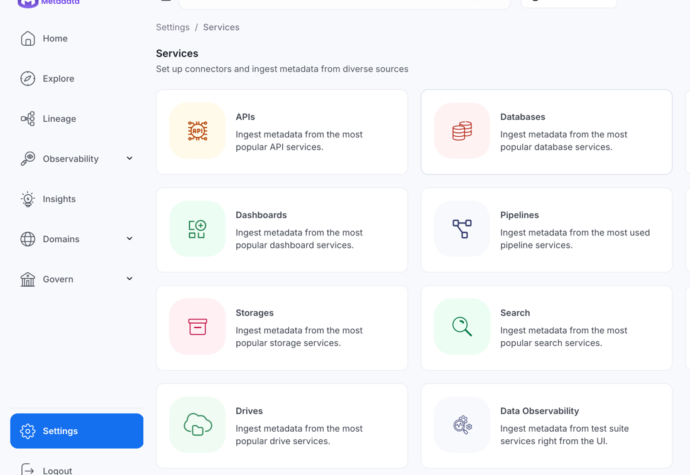
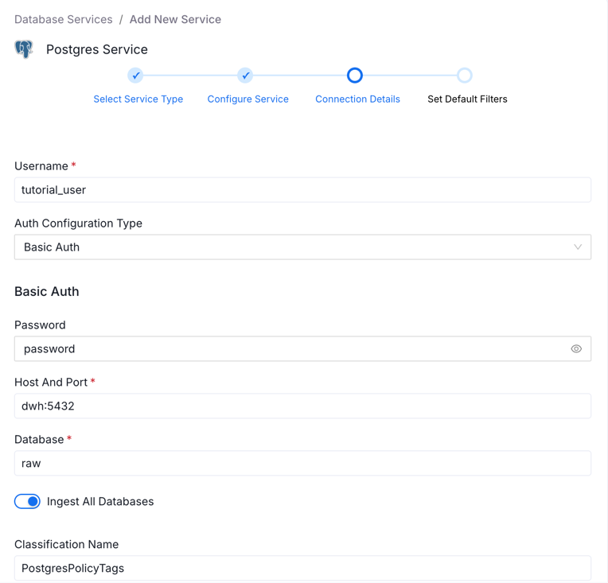
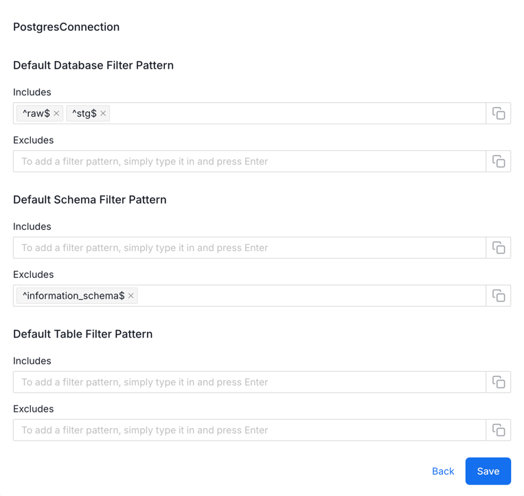
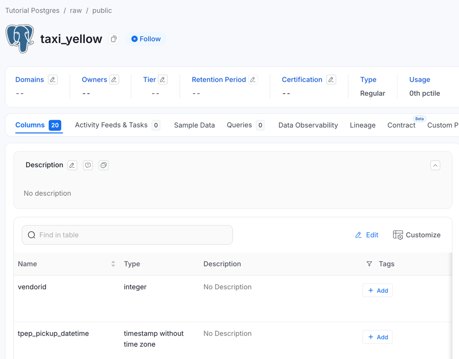
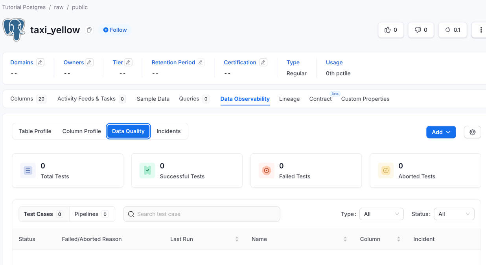
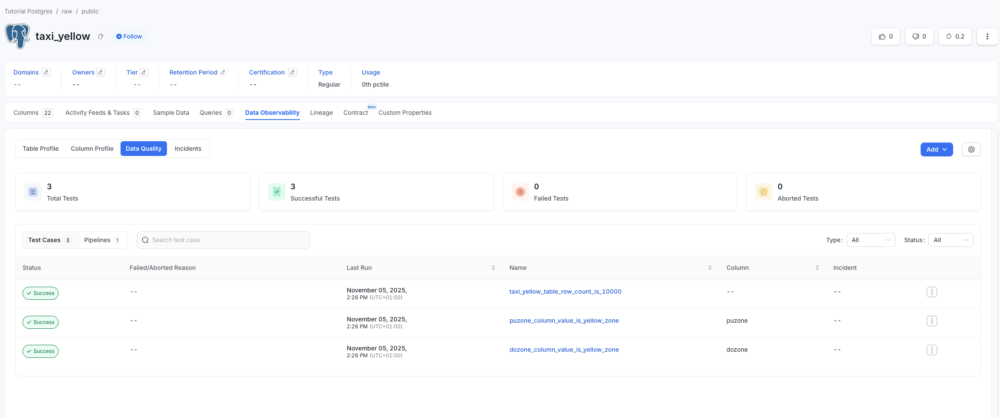
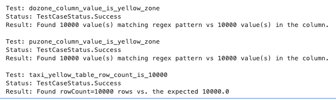
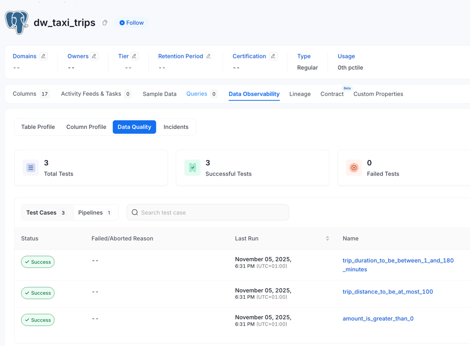
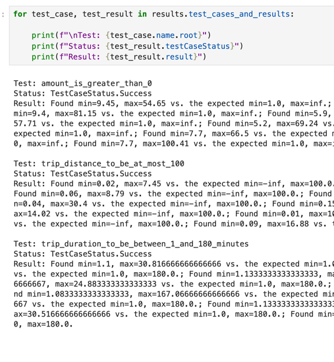

# Data Quality as Code examples

Hi! Here you will find a couple of Jupyter notebook examples describing how to use OpenMetadata's Python SDK to run the data quality tests you already know directly from your ETLs.

We're using Docker to run OpenMetadata's stack locally. The jupyter notebooks in `notebooks` will be injected in the jupyter server so you can run the examples in that self-contained environment.

We're going to use the [NYC Yellow Taxi Ride Data](https://www.nyc.gov/site/tlc/about/tlc-trip-record-data.page) dataset for these examples. Using docker we will work on a Postgres database where we will load the initial data and run our ETL against it. 

We will be working with these two files:
- Yellow Taxi Ride for September 2025 ([link to parquet file](https://python-sdk-resources.s3.eu-west-3.amazonaws.com/data-quality/yellow_tripdata_2025-09.parquet)) 
- Taxi Zones Lookup ([link to csv file](https://python-sdk-resources.s3.eu-west-3.amazonaws.com/data-quality/taxi_zone_lookup.csv))

## Table of Contents
1. [Setup](#setup)
2. [Running Data Quality tests for tables in OpenMetadata](#running-data-quality-tests-for-tables-in-openmetadata)
3. [Running Data Quality tests for pandas DataFrames](#running-data-quality-tests-for-pandas-dataframes)

## Setup

The initial setup will require that you run `./start [-v <version>]`. It will fetch OpenMetadata's docker compose for the `<version>` release and will boot the full stack plus instances of `jupyter` and `postgres` for this tutorial.

Once the whole system is running, you can start following these instructions:

1. Go to your [OpenMetadata](http://localhost:8585/) instance and login
   - Email: admin@open-metadata.org
   - Password: admin
2. Create a database service to our Postgres Database
   1. Navigate to [Databases](http://localhost:8585/settings/services/databases) (Settings -> Services -> Databases)
      
   2. Add a New Service
   3. Select Postgres
   4. Give it a name. We're using `Tutorial Postgres` for it.
   5. Fill up the form with the following data:
      - Username: tutorial_user
      - Password: password
      - Host And Port: dwh:5432
      - Database: raw
      
   6. Configure the metadata ingestion to target only the metadata relevant to the tutorial
      
   7. Verify the ingestion is done and our `taxi_yellow` table appears in our `raw` database.
      

Now go back to the console where you ran `./start` and check the logs. You should find a line saying "You can access `jupyter` instance at http://localhost:8888/?token=9e3bba6aba264fa8d4d476730f5fa1c03292598499d72513". Follow the link, and you'll be ready to move on to the next steps.

## Running Data Quality tests for tables in OpenMetadata

In this example, we're going to run data quality tests against our `taxi_yellow` table from an ETL that simply takes the data from a parquet file in an S3 bucket and loads it into our `raw` database.

For this we will be working on the `notebooks/test_workflows.ipynb` notebook, which will be using the `metadata.sdk.data_quality` to showcase how we leverage OpenMetadata and the Python SDK to trigger test case workflows directly from the ETL.

The ultimate goal is to make every stakeholder an owner of the data quality. So while engineers just need to make sure their ETLs work, data stewards can update their Data Quality tests on the fly and have the ETL pick them up in the next run.

But first, let's make sure we have some tests in place. Follow these steps:

1. Go to the table's `Data Observability` tab and move to [`Data Quality`](http://localhost:8585/table/Tutorial%20Postgres.raw.public.taxi_yellow/profiler/data-quality)
   
2. Click on `Add` and choose the `Test Case` option
3. Set up the test. The data we will be pushing to the table in each ETL run should have 10,000 rows. Let's set that up.
   1. Select `Table Row Count To Equal` as Test Type
   2. Set `Count` to 10000
   3. Name the test `taxi_yellow_table_row_count_is_10000`
   4. If prompted, scroll down to the pipeline section and click on the `On Demand` button
   5. Create it
4. Let's add a couple more tests. Our ETL will keep taxi rides that start and end in a Yellow Zone location, so let's add tests that verify that `PUZone` and `DOZone` equal `Yellow Zone` and nothing more:
   1. Indicate the test should be performed at `Column Level`
   2. Select the column `PUZone`
   3. Select the test type `Column Values To Match Regex Pattern`
   4. Add the following RegEx Pattern: `^Yellow Zone$`.
   5. Create it and repeat for column `DOZone`

Check it out in [Jupyter](http://localhost:8888/lab/tree/notebooks/test_workflow.ipynb)

> **NOTE**: the link above takes you to Jupyter running on localhost. It requires that you follow the [previous steps](#setup) and access Jupyter with the login token beforehand

By the end of the notebook, you should have the following results:

### Results
#### OpenMetadata page of the `taxi_yellow` data quality

#### Jupyter notebook with success reports for each test

## Running Data Quality tests for pandas DataFrames

In this example we're going to use `pandas` to transform the data from the `taxi_yellow` table we prepared in the previous step.

For this we will be working on the `notebooks/test_dataframe.ipynb` notebook, which will be using the `metadata.sdk.data_quality.dataframes` package to showcase how we leverage OpenMetadata and the Python SDK to run validations right between transforming and loading data in our ETLs.

But first, let's make sure we have some tests in place. Follow these steps:

1. Go to the table's `Data Observability` tab and move to [`Data Quality`](http://localhost:8585/table/Tutorial%20Postgres.stg.public.dw_taxi_rides/profiler/data-quality)
2. Click on `Add` and choose the `Test Case` option
3. Set up the first test. Let's make sure all rows have a `total_amount` greater than 0.
   1. Indicate the test should be performed at `Column Level`
   2. Select `Column Values To Be Between` as Test Type
   3. Let's set a sensible minimum count of 1 and leave maximum blank
   4. Name the test `amount_is_greater_than_0`
   5. If prompted, scroll down to the pipeline section and click on the `On Demand` button
   6. Create it
4. Let's add a test that ensures we're removing outliers in duration:
   1. Indicate the test should be performed at `Column Level`
   2. Select the column `trip_duration_min`
   3. Select the test type `Column Values To Be Between`
   4. Set 1 and 180 as minimum and maximum values.
   5. Name the test `trip_duration_to_be_between_1_and_180_minutes`
5. Now let's do the same for outliers in distance:
   1. Indicate the test should be performed at `Column Level`
   2. Select the column `trip_distance`
   3. Select the test type `Column Values To Be Between`
   4. Leave `Min` unfilled and set 100 as `Max`.
   5. Name the test `trip_distance_to_be_at_most_100`

Check it out in [Jupyter](http://localhost:8888/lab/tree/notebooks/test_dataframe.ipynb)

By the end of the notebook, you should have the following results:

### Results
#### OpenMetadata page of the `dw_taxi_trips` data quality

#### Jupyter notebook with success reports for each test

