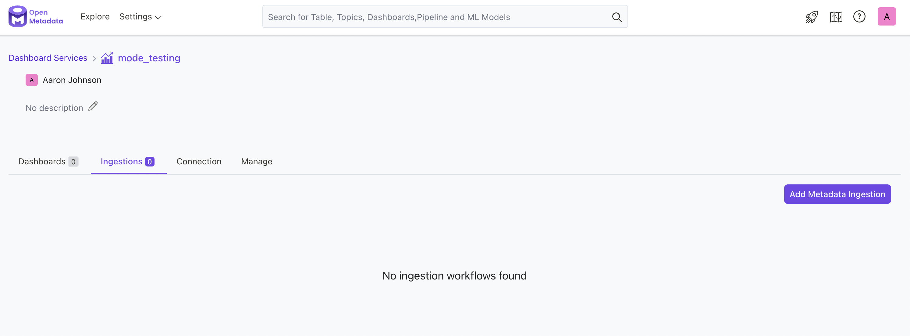

# Mode

Configure and schedule [Mode](https://mode.com/) **metadata** workflows from the OpenMetadata UI.

* [Requirements](./#requirements)
* [Metadata Ingestion](./#metadata-ingestion)

If you don't want to use the OpenMetadata Ingestion container to configure the workflows via the UI, then you can check the following docs to connect using Airflow SDK or with the CLI.


[run-superset-connector-with-the-airflow-sdk.md](run-superset-connector-with-the-airflow-sdk.md)



[run-superset-connector-with-the-cli.md](run-superset-connector-with-the-cli.md)


## **Requirements**

#### **OpenMetadata (version 0.11.0 or later)**

Mode Business Plan or higher is required to access the APIs which are used by OpenMetadata for metadata ingestion. Click [here](https://mode.com/compare-plans/) for a list of all the plans for mode.

To deploy OpenMetadata, follow the procedure [Try OpenMetadata in Docker](../../../overview/run-openmetadata.md) or follow the [OpenMetadata & Prefect](../../../overview/run-openmetadata-with-prefect.md) guide.

To run the Ingestion via the UI you'll need to use the OpenMetadata [Ingestion Container](https://hub.docker.com/r/openmetadata/ingestion), which comes shipped with custom Airflow plugins to handle the workflow deployment.

## Metadata Ingestion

### 1. Visit the _Services_ Page

The first step is ingesting the metadata from your sources. Under Settings, you will find a **Services** link an external source system to OpenMetadata. Once a service is created, it can be used to configure metadata, usage, and profiler workflows.

To visit the _Services_ page, select _Services_ from the _Settings_ menu.

### 2. Create a New Service

Click on the _Add New Service_ button to start the Service creation.

.png>)

### 3. Select the Service Type

Select Mode as the service type and click _Next_.

### 4. Name and Describe your Service

Provide a name and description for your service as illustrated below.

#### Service Name

OpenMetadata uniquely identifies services by their _Service Name_. Provide a name that distinguishes your deployment from other services, including the other Mode services that you might be ingesting metadata from.

.png>)

### 5. Configure the Service Connection

In this step, we will configure the connection settings required for this connector. Please follow the instructions below to ensure that you've configured the connector to read from your Mode service as desired.

 (2).png>)

Connection Options

**Host and Port**

Enter the fully qualified hostname and port number for your Mode deployment in the _Host and Port_ field.

**Access Token and Access Token Password**

Enter the access token for the Mode workspace. Click [here](https://mode.com/developer/api-reference/authentication/) for the documentation regarding generation of _access token_ and _access token password_.

**Workspace Name**

Enter the workspace name of your Mode environment.

.png>)

### 6. Configure the Metadata Ingestion

Once the service is created, we can add a **Metadata Ingestion Workflow**, either directly from the _Add Ingestion_ button in the figure above, or from the Service page:

Metadata Ingestion Options

**Include (Dashboard Filter Pattern)**

Use to dashboard filter patterns to control whether or not to include dashboards as part of metadata ingestion.

Explicitly include dashboards by adding a list of comma-separated regular expressions to the _Include_ field. OpenMetadata will include all dashboards with names matching one or more of the supplied regular expressions. All other dashboards will be excluded.

**Exclude (Dashboard Filter Pattern)**

Explicitly exclude dashboards by adding a list of comma-separated regular expressions to the _Exclude_ field. OpenMetadata will exclude all dashboards with names matching one or more of the supplied regular expressions. All other dashboards will be included.

**Include (Chart Filter Pattern)**

Use to chart filter patterns to control whether or not to include charts as part of metadata ingestion and data profiling.

Explicitly include charts by adding a list of comma-separated regular expressions to the _Include_ field. OpenMetadata will include all charts with names matching one or more of the supplied regular expressions. All other charts will be excluded.

**Exclude (Chart Filter Pattern)**

Explicitly exclude charts by adding a list of comma-separated regular expressions to the _Exclude_ field. OpenMetadata will exclude all charts with names matching one or more of the supplied regular expressions. All other charts will be included.

### 7. Schedule the Ingestion and Deploy

Scheduling can be set up at an hourly, daily, or weekly cadence. The timezone is in UTC. Select a Start Date to schedule for ingestion. It is optional to add an End Date.

Review your configuration settings. If they match what you intended, click _Deploy_ to create the service and schedule metadata ingestion.

If something doesn't look right, click the _Back_ button to return to the appropriate step and change the settings as needed.

<strong>Scheduling Options</strong>

**Every**

Use the _Every_ drop down menu to select the interval at which you want to ingest metadata. Your options are as follows:

* _Hour_: Ingest metadata once per hour
* _Day_: Ingest metadata once per day
* _Week_: Ingest metadata once per week

**Minute**

The _Minute_ dropdown is only active when ingesting metadata once per hour. Use the _Minute_ drop down menu to select the minute of the hour at which to begin ingesting metadata.

After configuring the workflow, you can click on _Deploy_ to create the pipeline.

.png>)

### 8. View the Ingestion Pipeline

Once the workflow has been successfully deployed, you can view the Ingestion Pipeline running from the Service Page.

 (3).png>)

### 9. Workflow Deployment Error

If there were any errors during the workflow deployment process, the Ingestion Pipeline Entity will still be created, but no workflow will be present in the Ingestion container.

You can then edit the Ingestion Pipeline and _Deploy_ it again.

From the _Connection_ tab, you can also _Edit_ the Service if needed.

.png>)

## Run using Airflow SDK

You can learn more about how to host and run the different workflows on your own Airflow instances below:


[run-superset-connector-with-the-airflow-sdk.md](run-superset-connector-with-the-airflow-sdk.md)


## One-time ingestion with the CLI

You can learn more about how to run a one-time ingestion of the different workflows using the `metadata` CLI below:


[run-superset-connector-with-the-cli.md](run-superset-connector-with-the-cli.md)

