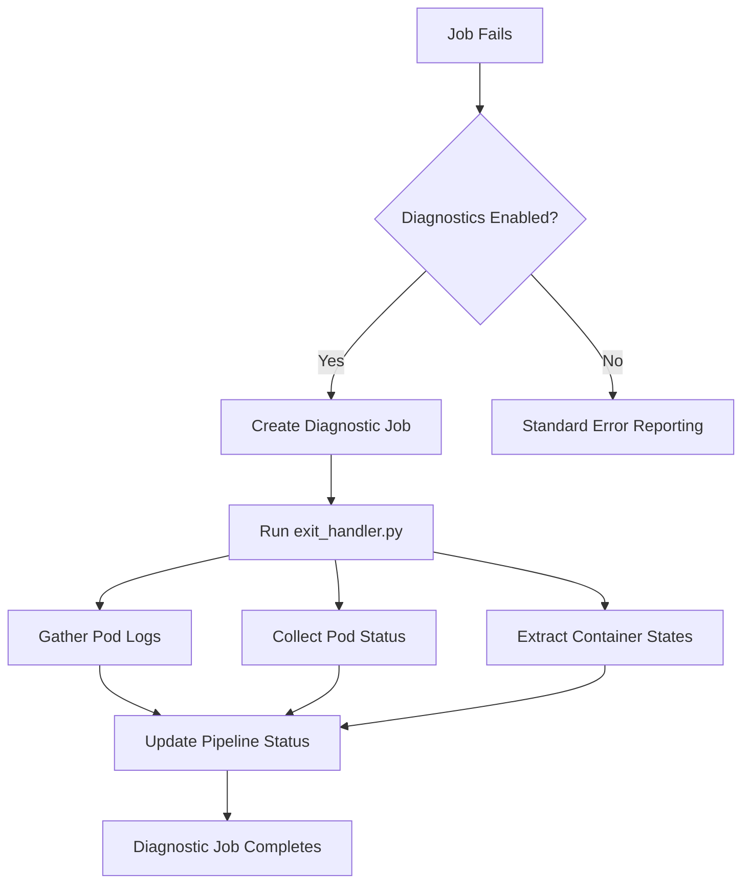

# Kubernetes Pipeline Service Client

This module provides Kubernetes-native pipeline execution for OpenMetadata ingestion pipelines. It implements the `PipelineServiceClient` interface to run ingestion workflows as Kubernetes Jobs instead of using external orchestrators like Airflow.

## Architecture Overview

The K8s Pipeline Client consists of three main components:

```
┌─────────────────────────────────────────────────────────────┐
│                   K8sPipelineClient                        │
├─────────────────────────────────────────────────────────────┤
│ • Pipeline lifecycle management                            │
│ • Job creation and monitoring                              │
│ • Status tracking and reporting                            │
│ • Integration with K8s APIs                                │
└─────────────────────────────────────────────────────────────┘
                              │
                              ▼
┌─────────────────────────────────────────────────────────────┐
│                K8sPipelineClientConfig                     │
├─────────────────────────────────────────────────────────────┤
│ • Configuration parsing and validation                     │
│ • Default value management                                 │
│ • Resource specifications                                  │
│ • Security context settings                               │
└─────────────────────────────────────────────────────────────┘
                              │
                              ▼
┌─────────────────────────────────────────────────────────────┐
│                K8sFailureDiagnostics                       │
├─────────────────────────────────────────────────────────────┤
│ • Failure detection and analysis                          │
│ • Diagnostic job execution                                 │
│ • Pod logs and status collection                          │
│ • Error reporting integration                              │
└─────────────────────────────────────────────────────────────┘
```

## Components

### 1. K8sPipelineClient

The main client class that implements the OpenMetadata `PipelineServiceClient` interface for Kubernetes environments.

#### Key Features:
- **Pipeline Deployment**: Creates CronJobs for scheduled pipelines with ConfigMaps and Secrets for configuration
- **On-Demand Execution**: Runs Jobs for immediate pipeline execution
- **Status Monitoring**: Tracks job status and maps to OpenMetadata pipeline states
- **Resource Management**: Handles cleanup of Jobs, CronJobs, ConfigMaps, and Secrets
- **Failure Diagnostics**: Automatically gathers detailed failure information when jobs fail

#### Lifecycle Management:
1. **Deploy**: `deployPipeline()` → Creates CronJob + ConfigMap + Secret
2. **Run**: `runPipeline()` → Creates Job for immediate execution
3. **Monitor**: `getQueuedPipelineStatusInternal()` → Tracks job status
4. **Cleanup**: `deletePipeline()` → Removes all resources

### 2. K8sPipelineClientConfig

Centralized configuration management with validation and type-safe parsing.

#### Configuration Parameters:

| Parameter | Default                                              | Description                           |
|-----------|------------------------------------------------------|---------------------------------------|
| `namespace` | `openmetadata-pipelines`                             | Kubernetes namespace for resources    |
| `ingestionImage` | `docker.getcollate.io/openmetadata/ingestion:latest` | Container image for ingestion jobs    |
| `imagePullPolicy` | `IfNotPresent`                                       | Image pull policy                     |
| `serviceAccountName` | `openmetadata-ingestion`                             | Service account for pods              |
| `ttlSecondsAfterFinished` | `86400`                                              | Time to keep completed jobs (24h)     |
| `activeDeadlineSeconds` | `7200`                                               | Maximum job runtime (24h)             |
| `backoffLimit` | `1`                                                  | Maximum retry attempts                |
| `runAsUser` | `1000`                                               | Pod security context user ID          |
| `runAsGroup` | `1000`                                               | Pod security context group ID         |
| `fsGroup` | `1000`                                               | Pod security context filesystem group |
| `runAsNonRoot` | `true`                                               | Require non-root execution            |
| `enableFailureDiagnostics` | `false`                                              | Enable automatic failure analysis     |

#### Resource Configuration:
```yaml
resources:
  limits:
    cpu: "2"
    memory: "4Gi"
  requests:
    cpu: "500m"
    memory: "1Gi"
```

#### Environment Variables:
```yaml
extraEnvVars:
  - "DATABASE_URL:postgresql://localhost:5432/om"
  - "LOG_LEVEL:INFO"
```

### 3. K8sFailureDiagnostics

Advanced failure analysis system that provides detailed diagnostic information when pipeline jobs fail, implementing the same proven pattern used in Argo Workflows' `onExit` handlers.

#### How Failure Diagnostics Work

When a pipeline job fails and diagnostics are enabled, the system automatically:



#### Diagnostic Job Execution

1. **Detection**: `mapJobToPipelineStatus()` detects `FAILED` job status
2. **Job Creation**: Creates a diagnostic job that runs `exit_handler.py` with environment variables:
   - `jobName`: Name of the failed job
   - `namespace`: Kubernetes namespace
   - `pipelineRunId`: Unique run identifier
   - `pipelineStatus`: "Failed"
   - `config`: Basic pipeline configuration YAML

3. **exit_handler.py Execution**:
   - **Pod Discovery**: Finds the main ingestion pod using job-name label selector
   - **Log Collection**: Last 500 lines from the ingestion container
   - **Status Analysis**: Pod phase, reason, message, and container states
   - **Event Gathering**: Related Kubernetes events (if permissions allow)
   - **Error Reporting**: Container exit codes and termination reasons

4. **Direct Status Update**: The exit_handler.py script directly updates the pipeline status in OpenMetadata with:
   - Complete failure diagnostics
   - Pod logs and descriptions
   - Structured error information
   - No additional Java processing required

5. **Automatic Cleanup**: TTL settings automatically clean up the diagnostic job

#### exit_handler.py Features

The Python exit handler provides comprehensive failure analysis:

```python
class FailureDiagnostics(BaseModel):
    pod_logs: Optional[str] = None          # Container logs (last 500 lines)
    pod_description: Optional[str] = None   # Pod status, events, container states
    
    @property
    def has_diagnostics(self) -> bool       # Check if any data available
    
    @property  
    def summary(self) -> str                # Human-readable summary
```

**Key Capabilities:**
- **Fault-tolerant**: Never fails the diagnostic process due to K8s API errors
- **Comprehensive logging**: Pod status, container states, exit codes, events
- **Direct integration**: Updates OpenMetadata pipeline status directly
- **Proven reliability**: Same codebase as Argo Workflows implementation

## Configuration

### Basic Configuration

```yaml
pipelineServiceClientConfiguration:
  className: "org.openmetadata.service.clients.pipeline.k8s.K8sPipelineClient"
  parameters:
    namespace: "openmetadata-pipelines"
    ingestionImage: "docker.getcollate.io/openmetadata/ingestion:1.4.0"
    enableFailureDiagnostics: true
```

### Advanced Configuration

```yaml
pipelineServiceClientConfiguration:
  className: "org.openmetadata.service.clients.pipeline.k8s.K8sPipelineClient"
  parameters:
    # Basic settings
    namespace: "data-platform-ingestion"
    ingestionImage: "my-registry.com/openmetadata/ingestion:latest"
    imagePullPolicy: "Always"
    imagePullSecrets: "registry-secret"
    serviceAccountName: "data-ingestion-sa"
    
    # Resource limits
    resources:
      limits:
        cpu: "4"
        memory: "8Gi"
      requests:
        cpu: "1"
        memory: "2Gi"
    
    # Job configuration
    ttlSecondsAfterFinished: 3600  # 1 hour
    activeDeadlineSeconds: 10800   # 3 hours
    backoffLimit: 5
    successfulJobsHistoryLimit: 5
    failedJobsHistoryLimit: 10
    
    # Security context
    runAsUser: 1001
    runAsGroup: 1001
    fsGroup: 1001
    runAsNonRoot: true
    
    # Node selection
    nodeSelector: "workload-type=data-processing,zone=us-west1-a"
    
    # Pod annotations
    podAnnotations: "prometheus.io/scrape=true,prometheus.io/port=8080"
    
    # Extra environment variables
    extraEnvVars:
      - "DATABASE_URL:postgresql://postgres.data.svc.cluster.local:5432/metadata"
      - "LOG_LEVEL:DEBUG"
      - "JAVA_OPTS:-Xmx2g -XX:+UseG1GC"
    
    # Failure diagnostics
    enableFailureDiagnostics: true
```

### Environment Variable Overrides

All configuration parameters can be overridden using environment variables:

```bash
export K8S_NAMESPACE="custom-namespace"
export K8S_INGESTION_IMAGE="custom-image:latest"
export K8S_ENABLE_FAILURE_DIAGNOSTICS="true"
export K8S_LIMITS_CPU="4"
export K8S_LIMITS_MEMORY="8Gi"
```

## Kubernetes Resources

### Job Template

```yaml
apiVersion: batch/v1
kind: Job
metadata:
  name: om-pipeline-{name}-{runId}
  namespace: openmetadata-pipelines
  labels:
    app.kubernetes.io/name: openmetadata
    app.kubernetes.io/component: ingestion
    app.kubernetes.io/pipeline: {pipelineName}
    app.kubernetes.io/run-id: {runId}
spec:
  backoffLimit: 3
  activeDeadlineSeconds: 7200
  ttlSecondsAfterFinished: 86400
  template:
    spec:
      serviceAccountName: openmetadata-ingestion
      restartPolicy: Never
      securityContext:
        runAsUser: 1000
        runAsGroup: 1000
        fsGroup: 1000
        runAsNonRoot: true
      containers:
      - name: ingestion
        image: docker.getcollate.io/openmetadata/ingestion:latest
        imagePullPolicy: IfNotPresent
        command: ["python", "main.py"]
        resources:
          requests:
            cpu: "500m"
            memory: "1Gi"
          limits:
            cpu: "2"
            memory: "4Gi"
        securityContext:
          runAsNonRoot: true
          allowPrivilegeEscalation: false
          readOnlyRootFilesystem: false
          capabilities:
            drop: ["ALL"]
```

### CronJob Template

```yaml
apiVersion: batch/v1
kind: CronJob
metadata:
  name: om-pipeline-{name}
  namespace: openmetadata-pipelines
spec:
  schedule: "0 2 * * *"
  timeZone: "UTC"
  concurrencyPolicy: Forbid
  successfulJobsHistoryLimit: 3
  failedJobsHistoryLimit: 3
  suspend: false
  jobTemplate:
    # Same as Job template above
```

### Required RBAC

```yaml
apiVersion: v1
kind: ServiceAccount
metadata:
  name: openmetadata-ingestion
  namespace: openmetadata-pipelines
---
apiVersion: rbac.authorization.k8s.io/v1
kind: Role
metadata:
  name: openmetadata-ingestion
  namespace: openmetadata-pipelines
rules:
- apiGroups: [""]
  resources: ["pods", "pods/log", "configmaps", "secrets"]
  verbs: ["get", "list", "create", "update", "patch", "delete"]
- apiGroups: ["batch"]
  resources: ["jobs", "cronjobs"]
  verbs: ["get", "list", "create", "update", "patch", "delete"]
---
apiVersion: rbac.authorization.k8s.io/v1
kind: RoleBinding
metadata:
  name: openmetadata-ingestion
  namespace: openmetadata-pipelines
subjects:
- kind: ServiceAccount
  name: openmetadata-ingestion
  namespace: openmetadata-pipelines
roleRef:
  kind: Role
  name: openmetadata-ingestion
  apiGroup: rbac.authorization.k8s.io
```

## Pipeline Status Mapping

| Kubernetes Job Status | OpenMetadata Status | Description |
|----------------------|-------------------|-------------|
| `Pending` | `QUEUED` | Job created but not scheduled |
| `Running` | `RUNNING` | Job pods are executing |
| `Succeeded` | `SUCCESS` | Job completed successfully |
| `Failed` | `FAILED` | Job failed (with diagnostics if enabled) |
| `Unknown` | `QUEUED` | Status cannot be determined |

## Failure Diagnostics Output

When a job fails with diagnostics enabled, the exit_handler.py script automatically adds a "Pod Diagnostics" step to the pipeline status with comprehensive failure information:

```json
{
  "name": "Pod Diagnostics",
  "records": 0,
  "errors": 1,
  "failures": [
    {
      "name": "Main Container Diagnostics", 
      "error": "Kubernetes job failed - check logs for details",
      "stackTrace": "Pod Description:\nPod: om-pipeline-postgres-abc123\nNamespace: openmetadata-pipelines\nStatus: Failed\nReason: Error\nContainer Statuses:\n  ingestion: Ready=false, RestartCount=0\n    State: Terminated - Reason: Error, ExitCode: 1\n\nEvents (3 found):\n  2024-01-07T16:30:15Z - Normal: Scheduled\n  2024-01-07T16:30:16Z - Normal: Pulled\n  2024-01-07T16:30:45Z - Warning: Failed\n\nPod Logs:\n2024-01-07 16:30:15,123 INFO Starting ingestion pipeline...\n2024-01-07 16:30:16,456 ERROR Failed to connect to database\nTraceback (most recent call last):\n  File \"main.py\", line 123, in connect\nConnectionError: Unable to connect to postgresql://localhost:5432/postgres"
    }
  ]
}
```

## Best Practices

### Security
- Use dedicated service accounts with minimal required permissions
- Set `runAsNonRoot: true` and appropriate user/group IDs
- Use image pull secrets for private registries
- Enable pod security policies or admission controllers

### Resource Management
- Set appropriate resource requests and limits
- Configure `ttlSecondsAfterFinished` to clean up completed jobs
- Use `activeDeadlineSeconds` to prevent runaway jobs
- Monitor resource usage and adjust limits accordingly

### Monitoring
- Enable failure diagnostics for better error visibility
- Use pod annotations for Prometheus scraping
- Monitor job completion rates and failure patterns
- Set up alerts for failed jobs

### Configuration
- Use environment variable overrides for environment-specific settings
- Keep sensitive data in Kubernetes Secrets
- Use ConfigMaps for non-sensitive configuration
- Validate configuration changes in staging environments

## Troubleshooting

### Common Issues

1. **Jobs not starting**:
   - Check RBAC permissions
   - Verify namespace exists
   - Check image pull secrets and registry access
   - Review resource quotas

2. **Jobs timing out**:
   - Increase `activeDeadlineSeconds`
   - Review resource limits
   - Check database connectivity
   - Monitor node capacity

3. **Permission errors**:
   - Verify service account permissions
   - Check pod security policies
   - Review security context settings
   - Validate namespace access

4. **Image pull failures**:
   - Check image name and tag
   - Verify registry credentials
   - Review image pull policy
   - Check network connectivity

### Diagnostic Commands

```bash
# Check pipeline client pods
kubectl get pods -n openmetadata-pipelines -l app.kubernetes.io/name=openmetadata

# View job logs
kubectl logs -n openmetadata-pipelines job/om-pipeline-{name}-{runId}

# Check job status
kubectl describe job -n openmetadata-pipelines om-pipeline-{name}-{runId}

# View pipeline configuration
kubectl get configmap -n openmetadata-pipelines om-config-{name} -o yaml

# Check service account permissions
kubectl auth can-i create jobs --as=system:serviceaccount:openmetadata-pipelines:openmetadata-ingestion -n openmetadata-pipelines
```

### Debug Mode

Enable debug logging by setting environment variables:

```yaml
extraEnvVars:
  - "LOG_LEVEL:DEBUG"
  - "PYTHONPATH:/opt/openmetadata"
  - "DEBUG_ENABLED:true"
```

## Migration from Airflow

When migrating from Airflow to K8s Pipeline Client:

1. **Configuration**: Map Airflow connection parameters to K8s configuration
2. **Scheduling**: CronJobs replace Airflow DAG scheduling
3. **Monitoring**: Use Kubernetes-native monitoring instead of Airflow UI
4. **Secrets**: Migrate Airflow Variables/Connections to Kubernetes Secrets
5. **Logs**: Access logs via `kubectl logs` instead of Airflow log viewer

The K8s Pipeline Client provides equivalent functionality with cloud-native benefits like better resource isolation, simpler scaling, and integration with Kubernetes ecosystem tools.