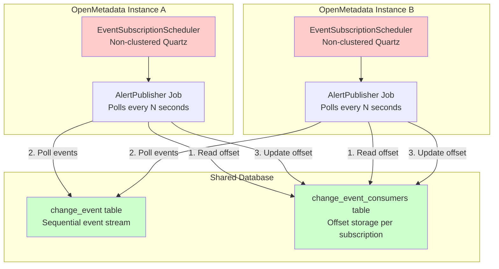

# ChangeEvent Processing in High Availability Environments

## Executive Summary

This document analyzes OpenMetadata's ChangeEvent processing mechanism in high availability (HA) deployments, identifies potential risks of duplicate alert notifications, and proposes a solution using distributed locking to ensure exactly-once delivery semantics.

**Related Issue**: [#22878 - Centralize Scheduling in OpenMetadata](https://github.com/open-metadata/OpenMetadata/issues/22878)

## Current Architecture

### Event Processing Flow

1. **ChangeEvent Generation**: Entity modifications generate ChangeEvents stored in the `change_event` table
2. **Event Subscription Scheduling**: Each EventSubscription creates a Quartz job that polls for events
3. **Polling Mechanism**: AlertPublisher jobs run periodically (default: every few seconds) to:
   - Read events from the database starting at a stored offset
   - Process matching events and send notifications
   - Update the offset in the database

### Key Components



**Diagram Analysis**: This architecture inherently creates a race condition. Both instances independently read from the same offset position, process the same events, and update the offset without coordination. The diagram shows the problematic flow where both Instance A and B can simultaneously execute steps 1-3 on the same data, resulting in duplicate notifications.

### Current Offset Management

```java
// AbstractEventConsumer.java - Simplified flow
public void execute(JobExecutionContext context) {
    // 1. Load offset from database
    EventSubscriptionOffset offset = loadInitialOffset(context);
    
    // 2. Poll events from change_event table
    List<ChangeEvent> events = dao.changeEventDAO().list(batchSize, offset);
    
    // 3. Process events and send notifications
    publishEvents(events);
    
    // 4. Update offset in database
    dao.eventSubscriptionDAO().upsertSubscriberExtension(
        subscriptionId, "eventSubscription.Offset", newOffset);
}
```

## High Availability Configuration

### Scheduler Setup

OpenMetadata uses **two different Quartz schedulers** with distinct responsibilities:

1. **AppScheduler** (`AppScheduler.java`)
   - **Purpose**: Manages system-wide scheduled operations that must execute exactly once across the cluster, including native application lifecycle (data profiler, data quality), search index maintenance, pipeline health monitoring, and custom scheduled applications
   - **Clustered**: `org.quartz.jobStore.isClustered = true`
   - Ensures single execution across instances through database-level job coordination

2. **EventSubscriptionScheduler** (`EventSubscriptionScheduler.java`)
   - **Purpose**: Handles real-time alert processing by continuously polling the ChangeEvent stream, evaluating subscription rules, and dispatching notifications through various channels (email, Slack, Teams, webhooks)
   - **Non-clustered**: Simple in-memory scheduler
   - Each instance runs independently, leading to potential duplicate processing

```java
// EventSubscriptionScheduler.java
static {
    Properties properties = new Properties();
    properties.setProperty(PROP_SCHED_INSTANCE_NAME, SCHEDULER_NAME);
    properties.setProperty(PROP_THREAD_POOL_PREFIX + ".threadCount", "5");
    // Note: No clustering configuration
    alertsScheduler = factory.getScheduler();
}
```

## Race Condition Analysis

### The Problem

In HA deployments with multiple OpenMetadata instances, the following race condition can occur:

```
Time    Instance A                Instance B
────────────────────────────────────────────────
T1      Read offset: 100          
T2                                Read offset: 100
T3      Poll events 100-110       
T4                                Poll events 100-110
T5      Send notifications
T6                                Send notifications
T7      Update offset: 110
T8                                Update offset: 110
```

**Result**: Duplicate notifications sent to users

### Root Causes

1. **Non-clustered Scheduler**: Each instance has its own EventSubscriptionScheduler
2. **No Distributed Locking**: No mechanism prevents concurrent event processing
3. **Read-Modify-Write Gap**: Time window between reading offset and updating it
4. **Last-Write-Wins**: Database updates use `ON DUPLICATE KEY UPDATE` without version checking

### Why Duplicates May Not Always Occur

Despite the race condition, duplicates might be rare due to:

1. **Timing Variations**: Natural drift in scheduler execution times
2. **Processing Duration**: Time to process events creates spacing
3. **Database Transaction Timing**: Commit timing may naturally separate instances
4. **Network Latency**: Different instances may have varying database response times

However, **relying on timing is not a reliable strategy** for production systems.

## Risk Assessment

### High Risk Scenarios

1. **Clock Synchronization**: When instances have synchronized clocks (NTP)
2. **High Load**: When processing is fast, reducing natural spacing
3. **Network Optimization**: Low-latency database connections increase collision probability
4. **Scaling Up**: More instances increase the probability of collisions

### Impact of Duplicate Notifications

- **User Experience**: Multiple emails/Slack messages for same event
- **Alert Fatigue**: Users may ignore alerts if they receive duplicates
- **Resource Waste**: Unnecessary network and compute resources

## Proposed Solution: Enable Quartz Clustering for EventSubscriptionScheduler

### Implementation Strategy

Align EventSubscriptionScheduler with AppScheduler by enabling Quartz clustering, ensuring only one instance processes each alert job at any given time.

### Option 1: Reuse Existing Clustered Scheduler

```java
// EventSubscriptionScheduler.java - Modified to use AppScheduler's clustered instance
public class EventSubscriptionScheduler {
    private static EventSubscriptionScheduler instance;
    private static volatile boolean initialized = false;
    
    // Reuse the existing clustered scheduler instead of creating a new one
    private final Scheduler alertsScheduler;
    
    private EventSubscriptionScheduler() {
        // Use the already configured clustered scheduler from AppScheduler
        this.alertsScheduler = AppScheduler.getInstance().getScheduler();
    }
    
    // Rest of the implementation remains the same
    // Jobs will now be automatically coordinated across instances
}
```

#### How Clustered Quartz Solves the Problem

When Quartz runs in clustered mode:

1. **Job Execution Coordination**: Quartz uses database row locks on `QRTZ_TRIGGERS` table to ensure only one instance executes each job
2. **Atomic Job Claiming**: The trigger acquisition is atomic at the database level:
   ```sql
   UPDATE QRTZ_TRIGGERS 
   SET TRIGGER_STATE = 'ACQUIRED', SCHED_NAME = :instanceId
   WHERE TRIGGER_STATE = 'WAITING' 
     AND TRIGGER_NAME = :triggerName
     AND NEXT_FIRE_TIME <= :now
   ```
3. **Automatic Failover**: If an instance crashes, other instances detect it via `QRTZ_SCHEDULER_STATE` and recover its jobs
4. **No Code Changes Required**: The existing `AbstractEventConsumer.execute()` method works as-is

#### Benefits of the Clustered Quartz Approach

1. **Proven Solution**: Already working successfully for AppScheduler
2. **Zero Custom Code**: Quartz handles all distributed coordination internally
3. **Automatic Failover**: Built-in instance failure detection and job recovery
4. **Database Agnostic**: Works with any database Quartz supports
5. **Minimal Code Changes**: Only requires modifying scheduler initialization
6. **Built-in Monitoring**: Quartz provides job execution history and metrics via `QRTZ_*` tables
7. **No Race Conditions**: Database row-level locking ensures exactly-once execution

### Option 2: Refactor to Modern Job Scheduling Provider

Consider refactoring the entire job scheduling architecture to use a modern distributed job processing framework:

**JobRunr** - A distributed background job scheduler for Java:
- Built-in clustering without manual configuration
- Dashboard for monitoring and management
- Automatic retries and failure handling
- Lambda-based job definitions
- Support for long-running jobs with progress tracking

```java
// Example with JobRunr - automatic clustering out of the box
public class UnifiedJobScheduler {
    @PostConstruct
    public void initialize() {
        JobRunr.configure()
            .useStorageProvider(dataSource)  // Automatic clustering via database
            .useBackgroundJobServer()
            .useDashboard()  // Built-in monitoring UI
            .initialize();
    }
    
    // Schedule alert processing - no manual cluster coordination needed
    public void scheduleAlertJob(EventSubscription subscription) {
        BackgroundJob.scheduleRecurrently(
            subscription.getId().toString(),
            Duration.ofSeconds(subscription.getPollInterval()),
            () -> processEventsForSubscription(subscription)
        );
    }
}
```

