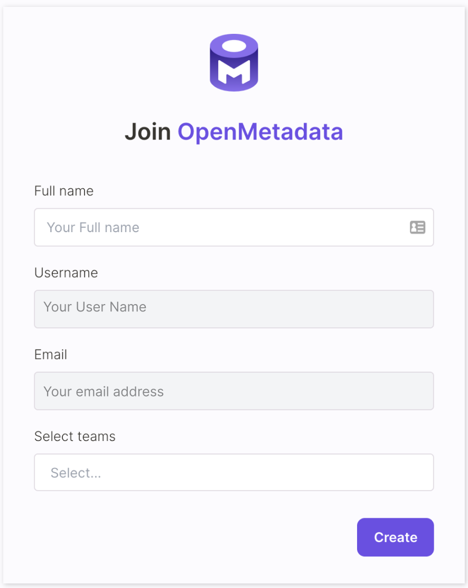
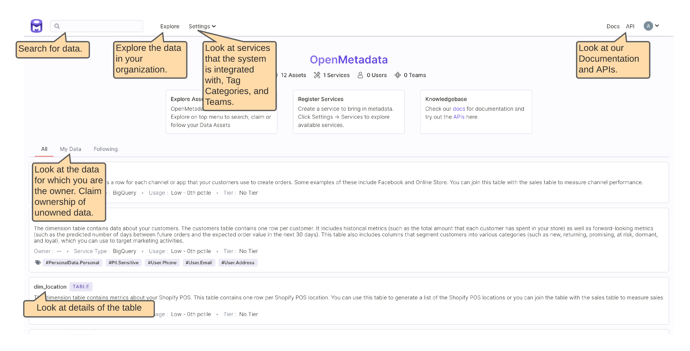

# Try OpenMetadata in our Public Sandbox

We want our users to get the experience of OpenMetadata with the least effort 😁. That is why we have set up a [sandbox](https://sandbox.open-metadata.org) that mimics a real production setup. Please take it for a spin and let us know your feedback in the [general](https://openmetadata.slack.com/archives/C02AZGN0WKY) channel on [Slack](https://slack.open-metadata.org).

## To set up your sandbox account:

### 1. Login using your Google credentials

### 2. Add yourself as a user. Pick a few teams to be part of because data is a team game.

### 3. Try out few things

Don't limit yourself to just the callouts. Try other things too. We would love to get your feedback.

